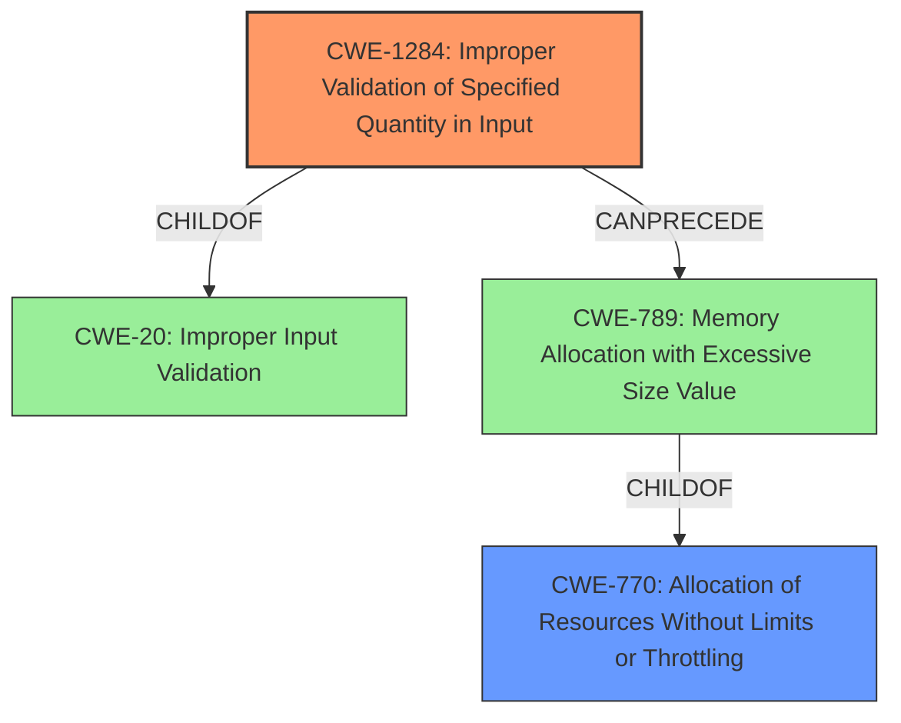

# Raw Analyzer Response for CVE-2021-39193

# Summary
| CWE ID | CWE Name | Confidence | CWE Abstraction Level | CWE Vulnerability Mapping Label | CWE-Vulnerability Mapping Notes |
|---|---|---|---|---|---|
| CWE-1284 | Improper Validation of Specified Quantity in Input | 0.9 | Base | Allowed | Primary CWE |
| CWE-770 | Allocation of Resources Without Limits or Throttling | 0.6 | Base | Allowed | Secondary Candidate |

## Evidence and Confidence

*   **Confidence Score:** 0.9
*   **Evidence Strength:** HIGH

## Relationship Analysis
The primary CWE, CWE-1284, is a base-level CWE that accurately reflects the **lack of input validation** in the described vulnerability. It is a child of CWE-20, which signifies that it is a specific type of input validation issue. CWE-770, a parent of CWE-789, relates to resource allocation without limits, is potentially relevant as a consequence of the **missing input validation**, which could lead to excessive resource consumption.

## Vulnerability Chain
The vulnerability chain starts with the **missing input validation** (CWE-1284), which leads to the acceptance of invalid transactions. These invalid transactions are then stored, leading to potential storage bloat. A potential consequence is resource exhaustion (CWE-770), although this aspect is less emphasized in the description.

## Summary of Analysis
The initial assessment identified CWE-1284 as the primary weakness, supported by the vulnerability description, which explicitly states the **root cause** as "**not validating the input data size**." The retriever results also ranked CWE-1284 as the top match.

The analysis considered other CWEs, such as CWE-770 and CWE-789, due to the potential for resource exhaustion. However, the description focuses more on the **lack of validation** as the primary issue, making CWE-1284 the most accurate and specific classification.

The final decision is based on direct evidence from the vulnerability description and the retriever results, confirming that CWE-1284 is the most appropriate CWE to represent the vulnerability.

Relevant CWE Information:

*   **CWE-1284: Improper Validation of Specified Quantity in Input:** This CWE directly aligns with the **root cause** of the vulnerability, which is the "**not validating the input data size**." The vulnerability description states that the `pallet-ethereum` module does not properly validate the size of the input data in transactions. This lack of validation allows invalid transactions to be included in the Ethereum block state. The security implication is that an attacker could send numerous invalid transactions, leading to storage bloat. This CWE is at the Base level of abstraction, making it a suitable choice.
*   **CWE-770: Allocation of Resources Without Limits or Throttling:** This CWE is considered as a secondary candidate due to the potential for excessive resource consumption (storage bloat) as a consequence of the **missing input validation**. While the vulnerability description mentions the storage bloat, it primarily focuses on the **lack of validation** as the **root cause**. Therefore, CWE-1284 is the primary CWE, and CWE-770 is a secondary consideration.

CWEs Considered but Not Used:

*   CWE-295 (Improper Certificate Validation): This CWE is related to certificate validation issues, which are not relevant to the described vulnerability.
*   CWE-824 (Access of Uninitialized Pointer): This CWE deals with uninitialized pointers, which are not mentioned in the vulnerability description.
*   CWE-190 (Integer Overflow or Wraparound): While integer overflow is possible if the input data size is excessively large, the primary issue is the **lack of validation**, not the integer overflow itself.
*   CWE-909 (Missing Initialization of Resource): This CWE is about missing initialization of resources, which is not directly related to the described vulnerability.
*   CWE-194 (Unexpected Sign Extension): This CWE concerns sign extension issues, which are not relevant to the described vulnerability.
*   CWE-789 (Memory Allocation with Excessive Size Value): This CWE is related to allocating memory with an excessive size value. While this could be a consequence of the **lack of input validation**, the primary issue is the **missing validation** itself, making CWE-1284 a more appropriate choice.
*   CWE-1333 (Inefficient Regular Expression Complexity): This CWE is related to inefficient regular expressions, which are not relevant to the described vulnerability.
*   CWE-663 (Use of a Non-reentrant Function in a Concurrent Context): This CWE concerns the use of non-reentrant functions in concurrent contexts, which is not relevant to the described vulnerability.
*   CWE-125 (Out-of-bounds Read): This CWE is about reading data past the end of a buffer, which is not directly related to the described vulnerability.