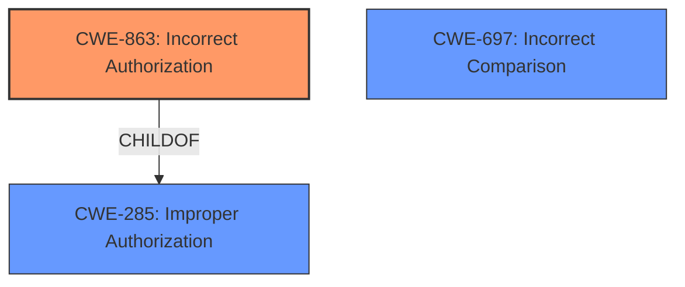

# Enhanced Analysis for CVE-2021-39206

# Summary
| CWE ID  | CWE Name                                                                                    | Confidence | CWE Abstraction Level | CWE Vulnerability Mapping Label | CWE-Vulnerability Mapping Notes |
| :-------- | :------------------------------------------------------------------------------------------ | :--------- | :---------------------- | :------------------------------ | :------------------------------ |
| CWE-863   | Incorrect Authorization                                                                     | 0.9        | Class                   | Primary CWE                     | Allowed-with-Review           |
| CWE-285   | Improper Authorization                                                                      | 0.7        | Class                   | Secondary Candidate             | Discouraged                   |
| CWE-697   | Incorrect Comparison                                                                        | 0.6        | Pillar                  | Secondary Candidate             | Discouraged                   |

## Evidence and Confidence

*   **Confidence Score:** 0.8
*   **Evidence Strength:** HIGH

## Relationship Analysis
The primary CWE selected is CWE-863 (**Incorrect Authorization**). This is a class-level CWE, with a more general parent CWE-285 (**Improper Authorization**). The choice of CWE-863 over CWE-285 is due to the fact that the authorization check is performed, but it's done incorrectly. CWE-697 (**Incorrect Comparison**) is a pillar-level CWE that represents the underlying issue of comparing URI fragments incorrectly.



## Vulnerability Chain
The vulnerability chain starts with the **incorrect URI parsing** by Envoy (the root cause). This leads to **incorrect comparison** of the URI, which subsequently causes **incorrect authorization** decisions, ultimately resulting in **privilege escalation** and **incorrect routing**.
- Root Cause: Incorrect URI parsing by Envoy.
- Weakness: Incorrect Comparison (CWE-697) of the URI.
- Weakness: Incorrect Authorization (CWE-863).
- Impact: Privilege Escalation, Incorrect Routing.

## Summary of Analysis
The initial analysis focused on identifying the root cause and the resulting impact. The **Vulnerability Description Key Phrases** indicated "incorrect routing or authorization policy decisions" as the impact. The **CVE Reference Links Content Summary** provided detailed insight into the root cause: "Envoy incorrectly handles the '#' fragment part of a URI, treating it as part of the path instead of a fragment identifier."

The **Retriever Results** suggested CWE-863 (**Incorrect Authorization**) and CWE-285 (**Improper Authorization**) as potential candidates. While CWE-285 could be considered, CWE-863 is more specific because the authorization check is happening, but it's flawed due to the URI parsing issue. CWE-697 (**Incorrect Comparison**) was also a candidate, as the incorrect URI parsing leads to an incorrect comparison.

The final decision to prioritize CWE-863 was influenced by the following:

*   The **CVE Reference Links Content Summary** clearly indicated an authorization bypass due to incorrect URI handling.
*   CWE-863's description directly aligns with the vulnerability: "The product performs an authorization check when an actor attempts to access a resource or perform an action, but it does not correctly perform the check."
*   The MITRE mapping guidance for CWE-863 suggests examining its children for a better fit, but no child CWE offers a more precise match for the described vulnerability.
*   CWE-697 is a pillar-level CWE, and while relevant to the comparison, it is too abstract.

Therefore, CWE-863 is the most specific and appropriate CWE based on the available evidence.

Relevant CWE Information:

# Enhanced Context (25 CWEs)
The following CWEs were identified as potentially relevant to this vulnerability:

## CWE-1289: Improper Validation of Unsafe Equivalence in Input
**Abstraction Level**: Base
**Similarity Score**: 0.75
**Source**: dense

**Description**:
The product receives an input value that is used as a resource identifier or other type of reference, but it does not validate or incorrectly validates that the input is equivalent to a potentially-unsafe value.

**Mapping Guidance**:
- Usage: Allowed
- Rationale: This CWE entry is at the Base level of abstraction, which is a preferred level of abstraction for mapping to the root causes of vulnerabilities.

## CWE-668: Exposure of Resource to Wrong Sphere
**Abstraction Level**: Class
**Similarity Score**: 0.75
**Source**: dense

**Description**:
The product exposes a resource to the wrong control sphere, providing unintended actors with inappropriate access to the resource.

**Mapping Guidance**:
- Usage: Discouraged
- Rationale: CWE-668 is high-level and is often misused as a catch-all when lower-level CWE IDs might be applicable. It is sometimes used for low-information vulnerability reports [REF-1287]. It is a level-1 Class (i.e., a child of a Pillar). It is not useful for trend analysis.

## CWE-404: Improper Resource Shutdown or Release
**Abstraction Level**: Class
**Similarity Score**: 0.75
**Source**: dense

**Description**:
The product does not release or incorrectly releases a resource before it is made available for re-use.

**Mapping Guidance**:
- Usage: Allowed-with-Review
- Rationale: This CWE entry is a Class and might have Base-level children that would be more appropriate

## CWE-405: Asymmetric Resource Consumption (Amplification)
**Abstraction Level**: Class
**Similarity Score**: 0.74
**Source**: dense

**Description**:
The product does not properly control situations in which an adversary can cause the product to consume or produce excessive resources without requiring the adversary to invest equivalent work or otherwise prove authorization, i.e., the adversary's influence is "asymmetric."

**Mapping Guidance**:
- Usage: Allowed-with-Review
- Rationale: This CWE entry is a Class and might have Base-level children that would be more appropriate

## CWE-212: Improper Removal of Sensitive Information Before Storage or Transfer
**Abstraction Level**: Base
**Similarity Score**: 0.74
**Source**: dense

**Description**:
The product stores, transfers, or shares a resource that contains sensitive information, but it does not properly remove that information before the product makes the resource available to unauthorized actors.

**Mapping Guidance**:
- Usage: Allowed
- Rationale: This CWE entry is at the Base level of abstraction, which is a preferred level of abstraction for mapping to the root causes of vulnerabilities.

## CWE-274: Improper Handling of Insufficient Privileges
**Abstraction Level**: Base
**Similarity Score**: 0.74
**Source**: dense

**Description**:
The product does not handle or incorrectly handles when it has insufficient privileges to perform an operation, leading to resultant weaknesses.

**Mapping Guidance**:
- Usage: Discouraged
- Rationale: This CWE entry could be deprecated in a future version of CWE.

## CWE-807: Reliance on Untrusted Inputs in a Security Decision
**Abstraction Level**: Base
**Similarity Score**: 0.74
**Source**: dense

**Description**:
The product uses a protection mechanism that relies on the existence or values of an input, but the input can be modified by an untrusted actor in a way that bypasses the protection mechanism.

**Mapping Guidance**:
- Usage: Allowed
- Rationale: This CWE entry is at the Base level of abstraction, which is a preferred level of abstraction for mapping to the root causes of vulnerabilities.

## CWE-74: Improper Neutralization of Special Elements in Output Used by a Downstream Component ('Injection')
**Abstraction Level**: Class
**Similarity Score**: 0.74
**Source**: dense

**Description**:
The product constructs all or part of a command, data structure, or record using externally-influenced input from an upstream component, but it does not neutralize or incorrectly neutralizes special elements that could modify how it is parsed or interpreted when it is sent to a downstream component.

**Mapping Guidance**:
- Usage: Discouraged
- Rationale: CWE-74 is high-level and often misused when lower-level weaknesses are more appropriate.

## CWE-41: Improper Resolution of Path Equivalence
**Abstraction Level**: Base
**Similarity Score**: 0.74
**Source**: dense

**Description**:
The product is vulnerable to file system contents disclosure through path equivalence. Path equivalence involves the use of special characters in file and directory names. The associated manipulations are intended to generate multiple names for the same object.

**Mapping Guidance**:
- Usage: Allowed
- Rationale: This CWE entry is at the Base level of abstraction, which is a preferred level of abstraction for mapping to the root causes of vulnerabilities.

## CWE-754


## CWE Relationship Analysis

Current CWEs represent these abstraction levels: .


### Vulnerability Chain Analysis

**Chain starting from CWE-41:**
- 41 (Improper Resolution of Path Equivalence) - ROOT


**Chain starting from CWE-405:**
- 405 (Asymmetric Resource Consumption (Amplification)) - ROOT


### CWE Relationship Diagram

```mermaid
graph TD
    classDef primary fill:#f96,stroke:#333,stroke-width:2px
    classDef secondary fill:#69f,stroke:#333
    classDef tertiary fill:#9e9,stroke:#333
```