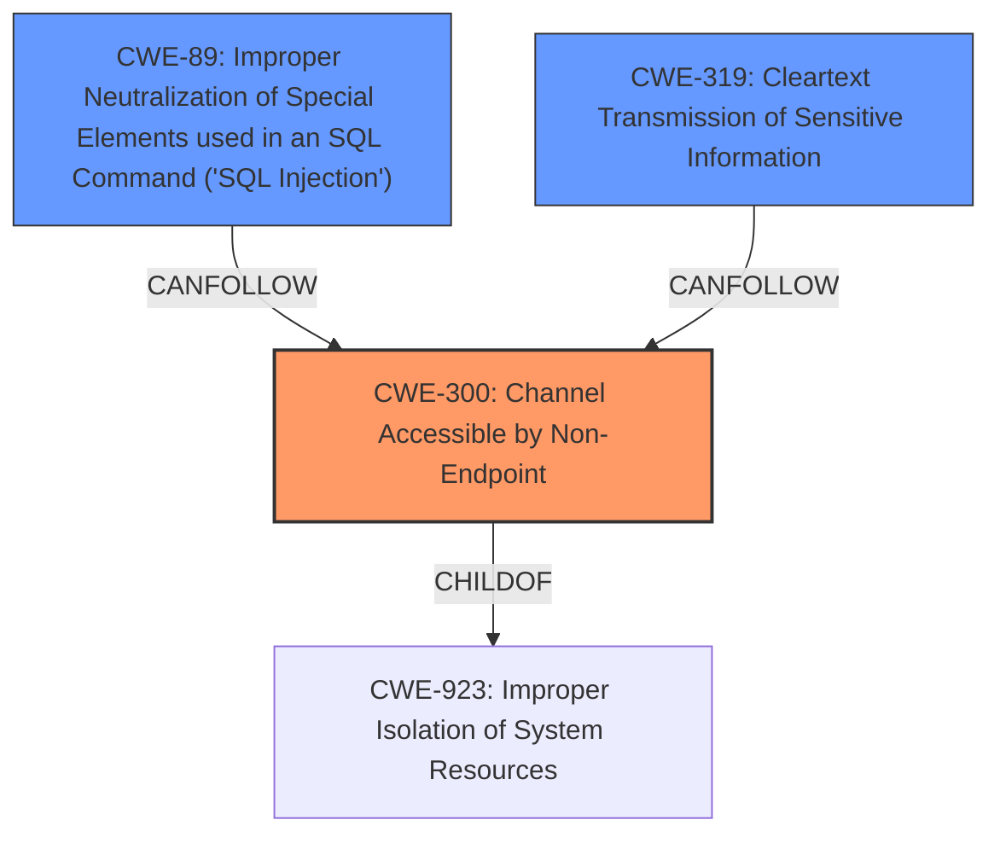

# Analysis for CVE-2021-3935

# Summary
| CWE ID  | CWE Name                                                                            | Confidence | CWE Abstraction Level | CWE Vulnerability Mapping Label | CWE-Vulnerability Mapping Notes |
| :-------- | :---------------------------------------------------------------------------------- | :---------- | :---------------------- | :------------------------------ | :------------------------------ |
| CWE-300   | Channel Accessible by Non-Endpoint                                                  | 0.9         | Class                   | Primary                         | Discouraged                    |
| CWE-89    | Improper Neutralization of Special Elements used in an SQL Command ('SQL Injection') | 0.7         | Base                    | Secondary                       | Allowed                        |
| CWE-319   | Cleartext Transmission of Sensitive Information                                     | 0.6         | Base                    | Secondary                       | Allowed                        |

## Evidence and Confidence

*   **Confidence Score:** 0.8
*   **Evidence Strength:** HIGH

## Relationship Analysis
The primary CWE is CWE-300, which is a Class-level weakness describing a communication channel accessible by a non-endpoint. The vulnerability involves a **man-in-the-middle attack** where an attacker injects SQL queries. CWE-300 is related to CWE-923 (Improper Isolation of System Resources). While CWE-300 is generally discouraged, its alternative terms, especially "Man-in-the-Middle / MITM," directly align with the vulnerability description.

Secondary CWEs include CWE-89 and CWE-319. CWE-89 represents the **SQL Injection** vulnerability resulting from the injected queries. CWE-319, Cleartext Transmission, is also relevant since the injected SQL commands are processed before the connection is fully secured.

## Vulnerability Chain
The vulnerability chain starts with the **man-in-the-middle attack** (CWE-300), leading to the injection of arbitrary SQL queries. The server processes these unencrypted bytes (CWE-319), resulting in **SQL Injection** (CWE-89).

## Summary of Analysis
The initial assessment focused on the vulnerability description indicating a **man-in-the-middle attack** that allowed injecting SQL queries. This aligned well with CWE-300 (Channel Accessible by Non-Endpoint). However, CWE-300 is generally discouraged due to frequent misuse.

The analysis then considered the retriever results and the CVE description's emphasis on **SQL Injection** and unencrypted data processing. This led to the inclusion of CWE-89 and CWE-319 as secondary CWEs.

The selection of CWE-300 is based on the vulnerability being a **man-in-the-middle attack**, as stated in the vulnerability description. The "Alternative Terms" section of CWE-300 lists "Man-in-the-Middle / MITM", further strengthening the mapping.

The supporting evidence is: "When PgBouncer is configured to use cert authentication, a **man-in-the-middle attack**er can inject arbitrary SQL queries when a connection is first established, despite the use of TLS certificate verification and encryption."

The selected CWEs are at the optimal level of specificity because they represent the root cause (MitM attack) and the immediate consequences (**SQL Injection**, unencrypted transmission) of the vulnerability.

Relevant CWE Information:

# Enhanced Context (25 CWEs)

## CWE-1391: Use of Weak Credentials
**Abstraction Level**: Class
**Similarity Score**: 0.78
**Source**: dense

**Description**:
The product uses weak credentials (such as a default key or hard-coded password) that can be calculated, derived, reused, or guessed by an attacker.

**Mapping Guidance**:
- Usage: Allowed-with-Review
- Rationale: This CWE entry is a Class and might have Base-level children that would be more appropriate

*Not selected:* This CWE is not relevant because the vulnerability does not involve weak credentials. It involves a **man-in-the-middle attack** bypassing TLS.

## CWE-345: Insufficient Verification of Data Authenticity
**Abstraction Level**: Class
**Similarity Score**: 0.78
**Source**: dense

**Description**:
The product does not sufficiently verify the origin or authenticity of data, in a way that causes it to accept invalid data.

**Mapping Guidance**:
- Usage: Discouraged
- Rationale: This CWE entry is a level-1 Class (i.e., a child of a Pillar). It might have lower-level children that would be more appropriate

*Not selected:* While there is a lack of data authenticity verification, this is a consequence of the **man-in-the-middle attack**, not the primary weakness.

## CWE-319: Cleartext Transmission of Sensitive Information
**Abstraction Level**: Base
**Similarity Score**: 0.78
**Source**: dense

**Description**:
The product transmits sensitive or security-critical data in cleartext in a communication channel that can be sniffed by unauthorized actors.

**Mapping Guidance**:
- Usage: Allowed
- Rationale: This CWE entry is at the Base level of abstraction, which is a preferred level of abstraction for mapping to the root causes of vulnerabilities.

*Selected as a Secondary CWE:* The vulnerability allows injecting SQL commands processed before the TLS connection is fully secured which could be considered cleartext transmission.

## CWE-1240: Use of a Cryptographic Primitive with a Risky Implementation
**Abstraction Level**: Base
**Similarity Score**: 0.77
**Source**: dense

**Description**:
To fulfill the need for a cryptographic primitive, the product implements a cryptographic algorithm using a non-standard, unproven, or disallowed/non-compliant cryptographic implementation.

**Mapping Guidance**:
- Usage: Allowed
- Rationale: This CWE entry is at the Base level of abstraction, which is a preferred level of abstraction for mapping to the root causes of vulnerabilities.

*Not selected:* This CWE is not applicable because the vulnerability does not involve the use of a risky cryptographic implementation.

## CWE-303: Incorrect Implementation of Authentication Algorithm
**Abstraction Level**: Base
**Similarity Score**: 0.77
**Source**: dense

**Description**:
The requirements for the product dictate the use of an established authentication algorithm, but the implementation of the algorithm is incorrect.

**Mapping Guidance**:
- Usage: Allowed
- Rationale: This CWE entry is at the Base level of abstraction, which is a preferred level of abstraction for mapping to the root causes of vulnerabilities.

*Not selected:* This CWE is not applicable because the vulnerability is not due to an incorrect implementation of an authentication algorithm.

## CWE-203: Observable Discrepancy
**Abstraction Level**: Base
**Similarity Score**: 0.76
**Source**: dense

**Description**:
The product behaves differently or sends different responses under different circumstances in a way that is observable to an unauthorized actor, which exposes security-relevant information about the state of the product, such as whether a particular operation was successful or not.

**Mapping Guidance**:
- Usage: Allowed
- Rationale: This CWE entry is at the Base level of abstraction, which is a preferred level of abstraction for mapping to the root causes of vulnerabilities.

*Not selected:* This CWE is not relevant to the vulnerability.

## CWE-330: Use of Insufficiently Random Values
**Abstraction Level**: Class
**Similarity Score**: 0.76
**Source**: dense

**Description**:
The product uses insufficiently random numbers or values in a security context that depends on unpredictable numbers.

**Mapping Guidance**:
- Usage: Discouraged
- Rationale: This CWE entry is a level-1 Class (i.e., a child of a Pillar). It might have lower-level children that would be more appropriate

*Not selected:* This CWE is not applicable to the vulnerability.

## CWE-295: Improper Certificate Validation
**Abstraction Level**: Base
**Similarity Score**: 0.76
**Source**: dense

**Description**:
The product does not validate, or incorrectly validates, a certificate.

**Mapping Guidance**:
- Usage: Allowed
- Rationale: This CWE entry is at the Base level of abstraction, which is a preferred level of abstraction for mapping to the root causes of vulnerabilities.

*Not selected:* While the vulnerability occurs during certificate authentication, it's not primarily due to improper certificate validation itself. The core issue is the failure to discard extraneous data after the TLS handshake.

## CWE-