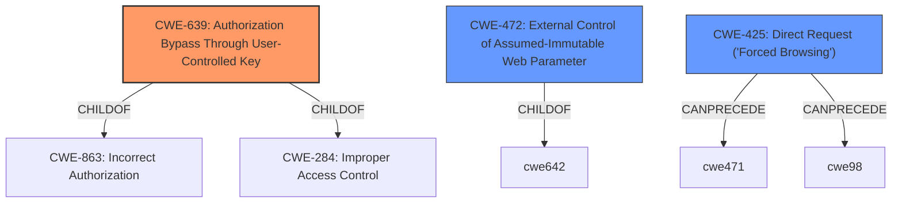

# Enhanced Analysis for CVE-2021-39409

# Summary
| CWE ID | CWE Name | Confidence | CWE Abstraction Level | CWE Vulnerability Mapping Label | CWE-Vulnerability Mapping Notes |
|---|---|---|---|---|---|
| CWE-639 | Authorization Bypass Through User-Controlled Key | 1.0 | Base | Allowed | Primary CWE |
| CWE-472 | External Control of Assumed-Immutable Web Parameter | 0.8 | Base | Allowed | Secondary Candidate |
| CWE-425 | Direct Request ('Forced Browsing') | 0.7 | Base | Allowed | Secondary Candidate |

## Evidence and Confidence

*   **Confidence Score:** 0.9
*   **Evidence Strength:** HIGH

## Relationship Analysis
The primary CWE selected is CWE-639 (Authorization Bypass Through User-Controlled Key), which is a base-level CWE. The vulnerability description clearly indicates that an attacker can gain access to administrator privileges by manipulating the `userLevelId` during signup. This aligns with the CWE description where an attacker modifies a key value to access another user's data/record. CWE-472 (External Control of Assumed-Immutable Web Parameter) and CWE-425 (Direct Request ('Forced Browsing')) are considered as secondary candidates because they describe related aspects of the vulnerability. The relationships between CWEs are as follows: CWE-639 is a child of CWE-863 (Incorrect Authorization) and CWE-284 (Improper Access Control). This hierarchical relationship indicates that CWE-639 is a more specific type of authorization issue. CWE-425 can precede CWE-471 and CWE-98.



## Vulnerability Chain
The vulnerability chain begins with the **lack of proper input validation** for the `userLevelId` during the signup process. This allows an attacker to **manipulate the `userLevelId`** to `-1`, which is associated with the administrator role. This leads to **unauthorized creation of an administrator account**, resulting in **full system access and control**.

## Summary of Analysis
The initial analysis focused on identifying the root cause of the vulnerability, which is the **ability to create an administrator account without proper authentication**. The vulnerability description clearly states that "a vulnerability exists in Online Student Rate System v1.0 that allows any user to register as an administrator without needing to be authenticated." The key phrase "register as administrator without authentication" directly points to an authorization/access control issue. The CVE reference links content summary further confirms that the system allows specification of a `userLevelId` of `-1` during signup, bypassing intended access controls.

Based on this evidence, CWE-639 (Authorization Bypass Through User-Controlled Key) was selected as the primary CWE because it accurately describes the scenario where an attacker modifies a key value (`userLevelId`) to gain unauthorized access (administrator privileges).

CWE-472 (External Control of Assumed-Immutable Web Parameter) was considered as a secondary CWE since the `userLevelId` could be considered an assumed-immutable parameter that is being externally controlled.
CWE-425 (Direct Request ('Forced Browsing')) was also considered because the attacker is directly requesting to create an admin account by manipulating the `userLevelId`.

The final selection is based on the evidence provided, relationship analysis, and mapping guidance. CWE-639 is the most specific and accurate representation of the vulnerability, while CWE-472 and CWE-425 represent related aspects. All selected CWEs are at the Base level of abstraction, which is the preferred level.

Relevant CWE Information:

# Enhanced Context (25 CWEs)
The following CWEs were identified as potentially relevant to this vulnerability:

## CWE-472: External Control of Assumed-Immutable Web Parameter
**Abstraction Level**: Base
**Similarity Score**: 0.80
**Source**: dense

**Description**:
The web application does not sufficiently verify inputs that are assumed to be immutable but are actually externally controllable, such as hidden form fields.

**Mapping Guidance**:
- Usage: Allowed
- Rationale: This CWE entry is at the Base level of abstraction, which is a preferred level of abstraction for mapping to the root causes of vulnerabilities.

## CWE-639: Authorization Bypass Through User-Controlled Key
**Abstraction Level**: Base
**Similarity Score**: 0.78
**Source**: dense

**Description**:
The system's authorization functionality does not prevent one user from gaining access to another user's data or record by modifying the key value identifying the data.

**Mapping Guidance**:
- Usage: Allowed
- Rationale: This CWE entry is at the Base level of abstraction, which is a preferred level of abstraction for mapping to the root causes of vulnerabilities.

## CWE-425: Direct Request ('Forced Browsing')
**Abstraction Level**: Base
**Similarity Score**: 6195.54
**Source**: sparse

**Description**:
The web application does not adequately enforce appropriate authorization on all restricted URLs, scripts, or files.

**Mapping Guidance**:
- Usage: Allowed
- Rationale: This CWE entry is at the Base level of abstraction, which is a preferred level of abstraction for mapping to the root causes of vulnerabilities.


## CWE Relationship Analysis

Current CWEs represent these abstraction levels: .


### Vulnerability Chain Analysis

**Chain starting from CWE-425:**
- 425 (Direct Request ('Forced Browsing')) - ROOT


**Chain starting from CWE-472:**
- 472 (External Control of Assumed-Immutable Web Parameter) - ROOT


### CWE Relationship Diagram

```mermaid
graph TD
    classDef primary fill:#f96,stroke:#333,stroke-width:2px
    classDef secondary fill:#69f,stroke:#333
    classDef tertiary fill:#9e9,stroke:#333
```