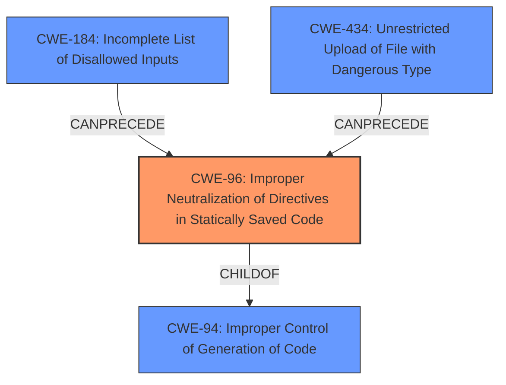

# Raw Analyzer Response for CVE-2021-39426

# Summary
| CWE ID | CWE Name | Confidence | CWE Abstraction Level | CWE Vulnerability Mapping Label | CWE-Vulnerability Mapping Notes |
|---|---|---|---|---|---|
| CWE-96 | Improper Neutralization of Directives in Statically Saved Code ('Static Code Injection') | 0.9 | Base | Allowed | Primary CWE |
| CWE-434 | Unrestricted Upload of File with Dangerous Type | 0.7 | Base | Allowed | Secondary Candidate |
| CWE-184 | Incomplete List of Disallowed Inputs | 0.6 | Base | Allowed | Secondary Candidate |

## Evidence and Confidence

*   **Confidence Score:** 0.8
*   **Evidence Strength:** HIGH

## Relationship Analysis
The primary CWE is CWE-96, which directly addresses the **improper neutralization** of directives in statically saved code, leading to code injection. CWE-96 is a child of CWE-94 (Improper Control of Generation of Code), but CWE-96 is more specific to the vulnerability.

## Vulnerability Chain
The vulnerability chain starts with the lack of proper input validation or sanitization, potentially due to an **incomplete list of disallowed inputs (CWE-184)**. This leads to the **injection of malicious code into a statically saved file (CWE-96)**, which results in arbitrary code execution. There might also be **unrestricted upload of a file with a dangerous type (CWE-434)**.

## Summary of Analysis
The initial assessment focused on the fact that the vulnerability allows attackers to execute arbitrary PHP code. The **root cause** is the **insecure handling of the `$notify1` variable**, which is directly written into the `/data/admin/notify.php` file without proper sanitization or validation.

The primary weakness is **CWE-96: Improper Neutralization of Directives in Statically Saved Code ('Static Code Injection')**. This CWE accurately describes the scenario where user-supplied input is directly written into a PHP file without proper neutralization, allowing an attacker to inject malicious PHP code.

The secondary weakness candidates, **CWE-434: Unrestricted Upload of File with Dangerous Type** and **CWE-184: Incomplete List of Disallowed Inputs**, capture the potential for a broader attack vector involving file uploads and the limitations of input validation mechanisms. These CWEs highlight the importance of proper file type restrictions and thorough input validation to prevent malicious code from being introduced into the system.

The selection of CWE-96 is based on the evidence from the "CVE Reference Links Content Summary" which states that "the `$notify1` variable, which is derived from the POST request, is directly written into the `/data/admin/notify.php` file without proper sanitization or validation." This aligns perfectly with the description of CWE-96, which involves inserting unneutralized code syntax into an executable resource.

The other CWEs listed in the "Retriever Results" were considered but deemed less appropriate. For example, CWE-78 (Improper Neutralization of Special Elements used in an OS Command) and CWE-89 (Improper Neutralization of Special Elements used in an SQL Command) were not selected because the vulnerability does not involve OS command injection or SQL injection.

The selected CWEs are at the optimal level of specificity because they accurately represent the **root cause** of the vulnerability (CWE-96) and the contributing factors (CWE-434, CWE-184).