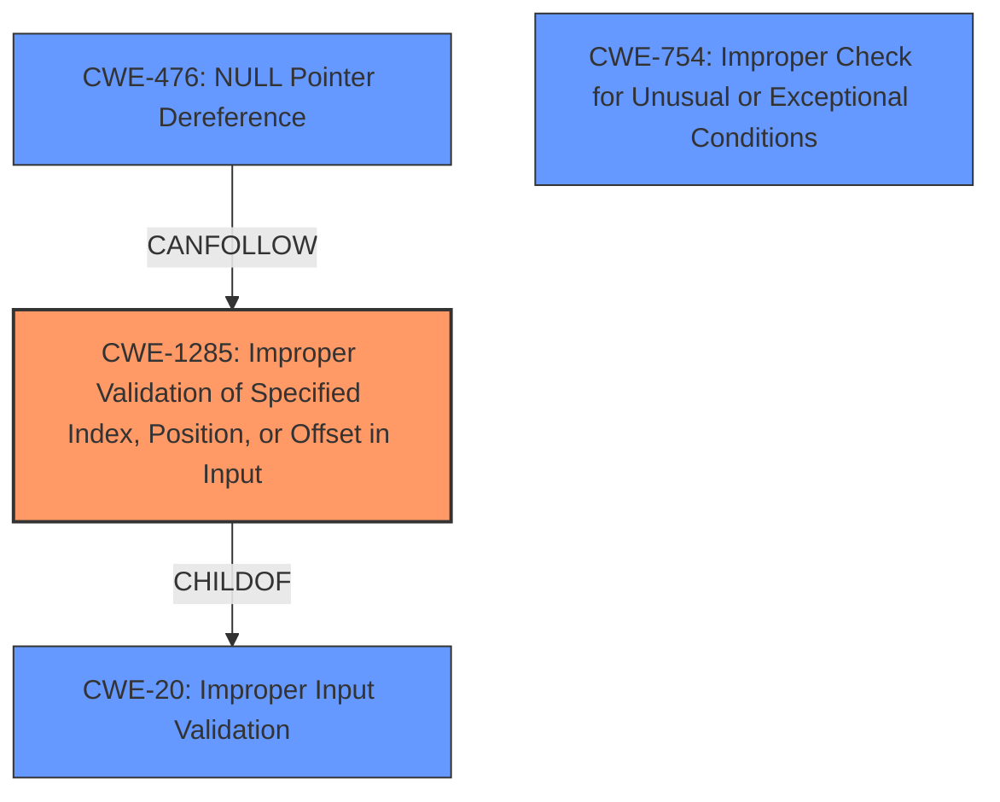

# Enhanced Analysis for CVE-2021-39633

# Summary
| CWE ID    | CWE Name                                                                           | Confidence | CWE Abstraction Level | CWE Vulnerability Mapping Label | CWE-Vulnerability Mapping Notes |
| :--------- | :--------------------------------------------------------------------------------- | :--------- | :---------------------- | :------------------------------ | :------------------------------ |
| CWE-1285 | Improper Validation of Specified Index, Position, or Offset in Input | 0.85      | Base                   | Allowed                         | Primary CWE                      |
| CWE-754  | Improper Check for Unusual or Exceptional Conditions | 0.75      | Class                   | Allowed-with-Review                   | Secondary CWE                      |
| CWE-476  | NULL Pointer Dereference                                                                         | 0.60      | Base                      | Allowed                         | Secondary CWE                      |

## Evidence and Confidence

*   **Confidence Score:** 0.80
*   **Evidence Strength:** HIGH

## Relationship Analysis
The primary relationship is between CWE-1285 and its parent CWE-20 (Improper Input Validation). There's also a potential relationship between CWE-1285 and CWE-476, where improper input validation could lead to a NULL pointer dereference if the invalid index results in accessing a null pointer. CWE-754 is a more general class that could apply if the unusual condition of an invalid index is not checked. The abstraction levels are important here: CWE-1285 is a Base CWE, offering a specific description of the flaw, while CWE-754 is a Class, which is more general.



## Vulnerability Chain
The vulnerability chain starts with the receipt of a GRE packet with a malformed `csum_start` value. This leads to **improper input validation** (CWE-1285) because the `csum_start` parameter is not validated. This **invalid memory access** can then cause a page fault, leading to local information disclosure. A potential outcome of the **invalid memory access** is a NULL pointer dereference (CWE-476), as a consequence of attempting to access memory at an invalid address.

## Summary of Analysis
Initially, the **invalid memory access** seemed indicative of a memory safety issue like CWE-119 (Improper Restriction of Operations within the Bounds of a Memory Buffer). However, the root cause lies in the lack of validation of the `csum_start` parameter. The CVE description specifically mentions the absence of a check for the validity of `csum_start` before it's used in checksum calculations. This points to CWE-1285 (Improper Validation of Specified Index, Position, or Offset in Input) as the most appropriate primary CWE, as it directly addresses the **missing input validation** of the offset.

The evidence from the "CVE Reference Links Content Summary" supports this: "The root cause is the lack of validation of the `csum_start` parameter within the `gre_handle_offloads` function." This directly relates to CWE-1285's description: "The product receives input that is expected to specify an index, position, or offset into an indexable resource... but it does not validate or incorrectly validates that the specified index/position/offset has the required properties."

CWE-754 (Improper Check for Unusual or Exceptional Conditions) was considered because the invalid `csum_start` is an unusual condition that isn't checked. However, CWE-1285 is more specific, focusing on the validation of the index/offset itself. CWE-476 (NULL Pointer Dereference) is a possible consequence of the **invalid memory access** but not the root cause. Therefore, it is included as a secondary CWE with lower confidence.

The final decision is to use CWE-1285 as the primary CWE because it directly addresses the root cause of the vulnerability: the **missing input validation** of the `csum_start` parameter. The selection is made at the Base level, which is the most specific level supported by the available evidence.

Relevant CWE Information:

# Enhanced Context (25 CWEs)

## CWE-191: Integer Underflow (Wrap or Wraparound)
**Abstraction Level**: Base
**Similarity Score**: 0.79
**Source**: dense

**Description**:
The product subtracts one value from another, such that the result is less than the minimum allowable integer value, which produces a value that is not equal to the correct result.

**Mapping Guidance**:
- Usage: Allowed
- Rationale: This CWE entry is at the Base level of abstraction, which is a preferred level of abstraction for mapping to the root causes of vulnerabilities.

## CWE-667: Improper Locking
**Abstraction Level**: Class
**Similarity Score**: 0.79
**Source**: dense

**Description**:
The product does not properly acquire or release a lock on a resource, leading to unexpected resource state changes and behaviors.

**Mapping Guidance**:
- Usage: Allowed-with-Review
- Rationale: This CWE entry is a Class and might have Base-level children that would be more appropriate

## CWE-404: Improper Resource Shutdown or Release
**Abstraction Level**: Class
**Similarity Score**: 0.77
**Source**: dense

**Description**:
The product does not release or incorrectly releases a resource before it is made available for re-use.

**Mapping Guidance**:
- Usage: Allowed-with-Review
- Rationale: This CWE entry is a Class and might have Base-level children that would be more appropriate

## CWE-754: Improper Check for Unusual or Exceptional Conditions
**Abstraction Level**: Class
**Similarity Score**: 0.77
**Source**: dense

**Description**:
The product does not check or incorrectly checks for unusual or exceptional conditions that are not expected to occur frequently during day to day operation of the product.

**Mapping Guidance**:
- Usage: Allowed-with-Review
- Rationale: This CWE entry is a Class and might have Base-level children that would be more appropriate

## CWE-131: Incorrect Calculation of Buffer Size
**Abstraction Level**: Base
**Similarity Score**: 0.77
**Source**: dense

**Description**:
The product does not correctly calculate the size to be used when allocating a buffer, which could lead to a buffer overflow.

**Mapping Guidance**:
- Usage: Allowed
- Rationale: This CWE entry is at the Base level of abstraction, which is a preferred level of abstraction for mapping to the root causes of vulnerabilities.

## CWE-226: Sensitive Information in Resource Not Removed Before Reuse
**Abstraction Level**: Base
**Similarity Score**: 0.77
**Source**: dense

**Description**:
The product releases a resource such as memory or a file so that it can be made available for reuse, but it does not clear or "zeroize" the information contained in the resource before the product performs a critical state transition or makes the resource available for reuse by other entities.

**Mapping Guidance**:
- Usage: Allowed
- Rationale: This CWE entry is at the Base level of abstraction, which is a preferred level of abstraction for mapping to the root causes of vulnerabilities.

## CWE-362: Concurrent Execution using Shared Resource with Improper Synchronization ('Race Condition')
**Abstraction Level**: Class
**Similarity Score**: 0.76
**Source**: dense

**Description**:
The product contains a concurrent code sequence that requires temporary, exclusive access to a shared resource, but a timing window exists in which the shared resource can be modified by another code sequence operating concurrently.

**Mapping Guidance**:
- Usage: Allowed-with-Review
- Rationale: This CWE entry is a Class and might have Base-level children that would be more appropriate

## CWE-909: Missing Initialization of Resource
**Abstraction Level**: Class
**Similarity Score**: 0.76
**Source**: dense

**Description**:
The product does not initialize a critical resource.

**Mapping Guidance**:
- Usage: Allowed-with-Review
- Rationale: This CWE entry is a Class and might have Base-level children that would be more appropriate

## CWE-755: Improper Handling of Exceptional Conditions
**Abstraction Level**: Class
**Similarity Score**: 0.75
**Source**: dense

**Description**:
The product does not handle or incorrectly handles an exceptional condition.

**Mapping Guidance**:
- Usage: Discouraged
- Rationale: This CWE entry is a level-1 Class (i.e., a child


## CWE Relationship Analysis

Current CWEs represent these abstraction levels: .


### Vulnerability Chain Analysis

**Chain starting from CWE-131:**
- 131 (Incorrect Calculation of Buffer Size) - ROOT


**Chain starting from CWE-476:**
- 476 (NULL Pointer Dereference) - ROOT


### CWE Relationship Diagram

```mermaid
graph TD
    classDef primary fill:#f96,stroke:#333,stroke-width:2px
    classDef secondary fill:#69f,stroke:#333
    classDef tertiary fill:#9e9,stroke:#333
```