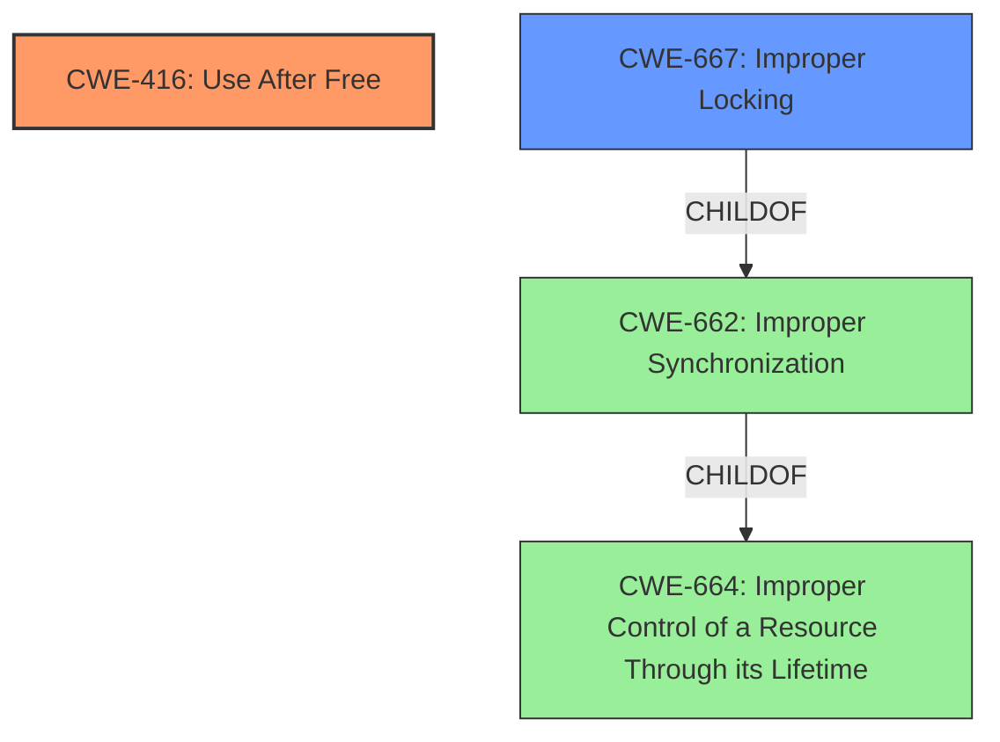

# Enhanced Analysis for CVE-2021-39649

# Summary
| CWE ID | CWE Name | Confidence | CWE Abstraction Level | CWE Vulnerability Mapping Label | CWE-Vulnerability Mapping Notes |
|---|---|---|---|---|---|
| CWE-416 | Use After Free | 1.0 | Variant | Allowed | Primary CWE |
| CWE-667 | Improper Locking | 0.8 | Class | Allowed-with-Review | Secondary CWE |

## Evidence and Confidence

*   **Confidence Score:** 0.9
*   **Evidence Strength:** HIGH

## Relationship Analysis
The primary weakness is a Use After Free (CWE-416), which is a variant-level CWE. The root cause is **improper locking**, which is a Class-level CWE. CWE-416 is related to CWE-667 in that improper locking can lead to a use-after-free condition. CWE-667 is a child of CWE-662 (Improper Synchronization), which is itself a child of CWE-664 (Improper Control of a Resource Through its Lifetime).



## Vulnerability Chain
The vulnerability chain starts with **improper locking** (CWE-667), which leads to a **use-after-free** condition (CWE-416). This can result in local escalation of privilege in the kernel.

## Summary of Analysis
The vulnerability description clearly states a **use-after-free** due to **improper locking** in `regmap_exit` of `regmap.c`. The "CVE Reference Links Content Summary" confirms that the vulnerability exists in the Audio component, leading to Elevation of Privilege (EoP).

The primary CWE is CWE-416 (Use After Free), which is a Variant-level CWE and directly matches the vulnerability description. The secondary CWE is CWE-667 (Improper Locking), which is a Class-level CWE and represents the root cause of the vulnerability.

The graph relationships highlight the connection between improper locking and use-after-free. The abstraction levels are appropriate, with CWE-416 being a specific variant and CWE-667 being a more general class representing the underlying issue.

The decision is based on the provided evidence and the relationships between CWEs. CWE-416 accurately represents the weakness, and CWE-667 explains the root cause.

Other CWEs considered but not used:

*   CWE-413 (Improper Resource Locking): While related to locking issues, CWE-667 is a more general and appropriate fit for the **improper locking** root cause described.
*   CWE-362 (Concurrent Execution using Shared Resource with Improper Synchronization ('Race Condition')): Although **improper locking** can lead to race conditions, the primary issue is the **use-after-free**, making CWE-416 more relevant.
*   CWE-662 (Improper Synchronization): This is a higher-level class, and CWE-667 is a more specific child that better describes the **improper locking** issue.
*   CWE-909 (Missing Initialization of Resource): The vulnerability is not related to missing initialization, so this CWE is not applicable.
*   CWE-364 (Signal Handler Race Condition): This CWE is specific to signal handlers, which is not the case in this vulnerability.
*   CWE-665 (Improper Initialization): The vulnerability is not related to improper initialization, so this CWE is not applicable.
*   CWE-908 (Use of Uninitialized Resource): The vulnerability is not about use of uninitialized resource, so this CWE is not applicable.
*   CWE-862 (Missing Authorization): The vulnerability is not related to missing authorization, so this CWE is not applicable.


## CWE Relationship Analysis

Current CWEs represent these abstraction levels: .


### Vulnerability Chain Analysis

**Chain starting from CWE-413:**
- 413 (Improper Resource Locking) - ROOT


**Chain starting from CWE-862:**
- 862 (Missing Authorization) - ROOT


### CWE Relationship Diagram

```mermaid
graph TD
    classDef primary fill:#f96,stroke:#333,stroke-width:2px
    classDef secondary fill:#69f,stroke:#333
    classDef tertiary fill:#9e9,stroke:#333
```