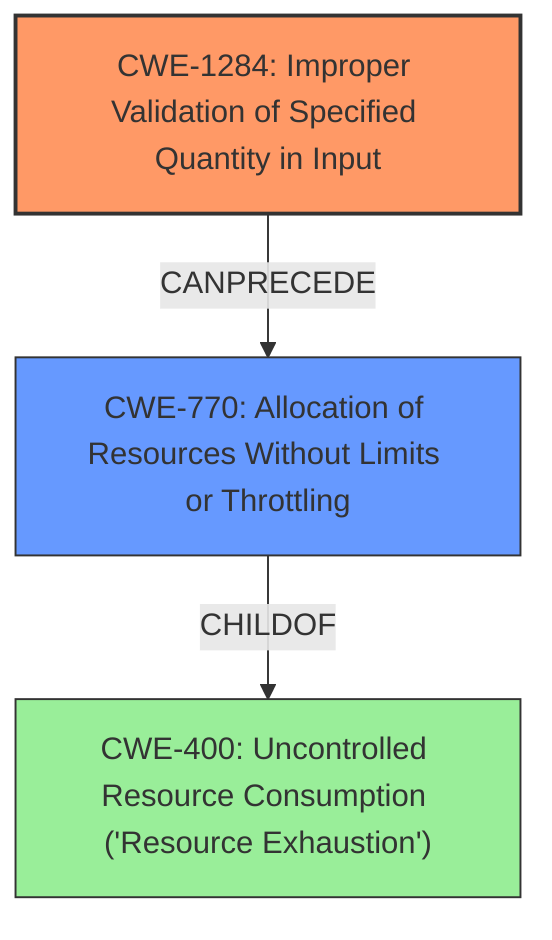

# Analysis for CVE-2021-39670

# Summary
| CWE ID  | CWE Name                       | Confidence | CWE Abstraction Level | CWE Vulnerability Mapping Label | CWE-Vulnerability Mapping Notes |
|---------|--------------------------------|------------|-----------------------|-----------------------------------|---------------------------------|
| CWE-1284 | Improper Validation of Specified Quantity in Input | 0.9  | Base                  | Allowed                         | Primary CWE                  |
| CWE-770 | Allocation of Resources Without Limits or Throttling | 0.7  | Base                  | Allowed                         | Secondary Candidate                  |
| CWE-400 | Uncontrolled Resource Consumption ('Resource Exhaustion')   | 0.5  | Class                  | Allowed with Review                         | Secondary Candidate                  |

## Evidence and Confidence

*   **Confidence Score:** 0.8
*   **Evidence Strength:** HIGH

## Relationship Analysis
The primary CWE selected is CWE-1284, which focuses on the **improper validation** of quantities specified in input, directly aligning with the vulnerability's root cause. CWE-770 (Allocation of Resources Without Limits or Throttling) is considered as a potential follow-up weakness if the **improper validation** leads to excessive resource allocation. CWE-400 (Resource Exhaustion) represents the impact of the vulnerability. The abstraction levels of Base (CWE-1284 and CWE-770) and Class (CWE-400) were considered to select the most specific and relevant classifications.

## Vulnerability Chain
The vulnerability chain starts with **improper input validation** (CWE-1284), which leads to excessive resource allocation (CWE-770), ultimately resulting in a denial-of-service through resource exhaustion (CWE-400).
  - **Root Cause:** **Improper Input Validation** (CWE-1284)
  - **Weakness:** Allocation of Resources Without Limits or Throttling (CWE-770)
  - **Impact:** Resource Exhaustion (CWE-400)

## Summary of Analysis
The analysis is primarily based on the provided vulnerability description and the CVE reference link content summary, which explicitly mentions **improper input validation** as the root cause.

The vulnerability description states "**improper input validation**. This could lead to local denial of service." This statement strongly supports the selection of CWE-1284 as the primary weakness.

The CVE reference details support this by stating that the vulnerability arises from insufficient handling of large image sizes, leading to excessive memory consumption. The fix replaces `BitmapRegionDecoder` with `ImageDecoder`, which handles large image sizes better. This reinforces the issue of **improper validation** of input size/quantity (CWE-1284), eventually leading to allocation of resources without limits (CWE-770) and ultimately causing resource exhaustion (CWE-400).

CWE-1284 is chosen because the root cause is the **improper validation** of a specified quantity. The other CWEs like CWE-20 are higher level and not as specific as CWE-1284. The abstraction level for CWE-1284 is "Base" which is the preferred level.

The selection of CWE-1284 is considered to be at the optimal level of specificity, capturing the core issue of **improperly validating** input quantities.

Relevant CWE Information:

# Enhanced Context (25 CWEs)
The following CWEs were identified as potentially relevant to this vulnerability:

## CWE-754: Improper Check for Unusual or Exceptional Conditions
**Abstraction Level**: Class
**Similarity Score**: 0.76
**Source**: dense

**Description**:
The product does not check or incorrectly checks for unusual or exceptional conditions that are not expected to occur frequently during day to day operation of the product.

**Mapping Guidance**:
- Usage: Allowed-with-Review
- Rationale: This CWE entry is a Class and might have Base-level children that would be more appropriate

## CWE-404: Improper Resource Shutdown or Release
**Abstraction Level**: Class
**Similarity Score**: 0.76
**Source**: dense

**Description**:
The product does not release or incorrectly releases a resource before it is made available for re-use.

**Mapping Guidance**:
- Usage: Allowed-with-Review
- Rationale: This CWE entry is a Class and might have Base-level children that would be more appropriate

## CWE-1289: Improper Validation of Unsafe Equivalence in Input
**Abstraction Level**: Base
**Similarity Score**: 0.76
**Source**: dense

**Description**:
The product receives an input value that is used as a resource identifier or other type of reference, but it does not validate or incorrectly validates that the input is equivalent to a potentially-unsafe value.

**Mapping Guidance**:
- Usage: Allowed
- Rationale: This CWE entry is at the Base level of abstraction, which is a preferred level of abstraction for mapping to the root causes of vulnerabilities.

## CWE-668: Exposure of Resource to Wrong Sphere
**Abstraction Level**: Class
**Similarity Score**: 0.75
**Source**: dense

**Description**:
The product exposes a resource to the wrong control sphere, providing unintended actors with inappropriate access to the resource.

**Mapping Guidance**:
- Usage: Discouraged
- Rationale: CWE-668 is high-level and is often misused as a catch-all when lower-level CWE IDs might be applicable. It is sometimes used for low-information vulnerability reports [REF-1287]. It is a level-1 Class (i.e., a child of a Pillar). It is not useful for trend analysis.

## CWE-664: Improper Control of a Resource Through its Lifetime
**Abstraction Level**: Pillar
**Similarity Score**: 0.75
**Source**: dense

**Description**:
The product does not maintain or incorrectly maintains control over a resource throughout its lifetime of creation, use, and release.

**Mapping Guidance**:
- Usage: Discouraged
- Rationale: This CWE entry is high-level when lower-level children are available.

## CWE-667: Improper Locking
**Abstraction Level**: Class
**Similarity Score**: 0.75
**Source**: dense

**Description**:
The product does not properly acquire or release a lock on a resource, leading to unexpected resource state changes and behaviors.

**Mapping Guidance**:
- Usage: Allowed-with-Review
- Rationale: This CWE entry is a Class and might have Base-level children that would be more appropriate

## CWE-703: Improper Check or Handling of Exceptional Conditions
**Abstraction Level**: Pillar
**Similarity Score**: 0.75
**Source**: dense

**Description**:
The product does not properly anticipate or handle exceptional conditions that rarely occur during normal operation of the product.

**Mapping Guidance**:
- Usage: Discouraged
- Rationale: This CWE entry is extremely high-level, a Pillar.

## CWE-41: Improper Resolution of Path Equivalence
**Abstraction Level**: Base
**Similarity Score**: 0.74
**Source**: dense

**Description**:
The product is vulnerable to file system contents disclosure through path equivalence. Path equivalence involves the use of special characters in file and directory names. The associated manipulations are intended to generate multiple names for the same object.

**Mapping Guidance**:
- Usage: Allowed
- Rationale: This CWE entry is at the Base level of abstraction, which is a preferred level of abstraction for mapping to the root causes of vulnerabilities.

## CWE-73: External Control of File Name or Path
**Abstraction Level**: Base
**Similarity Score**: 0.74
**Source**: dense

**Description**:
The product allows user input to control or influence paths or file names that are used in filesystem operations.

**Mapping Guidance**:
- Usage: Allowed
- Rationale: This CWE entry is at the Base level of abstraction, which is a preferred level of abstraction for mapping to the root causes of vulnerabilities.

## CWE-184: Incomplete List of Disallowed Inputs
**Abstraction Level**: Base
**Similarity Score**: 0.74
**Source**: dense

**Description**:
The product implements a protection mechanism that relies on a list of inputs (or properties of inputs) that are not allowed by policy or otherwise require other action to neutralize before additional processing takes place, but the list is incomplete.

**Mapping Guidance**:
- Usage: Allowed
- Rationale: This CWE entry is at the Base