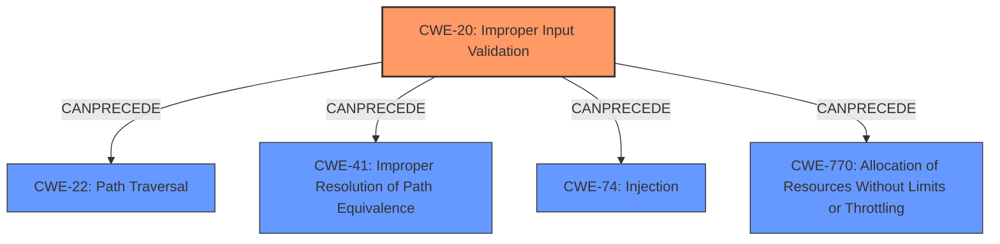

# Raw Analyzer Response for CVE-2021-39740

# Summary
| CWE ID | CWE Name | Confidence | CWE Abstraction Level | CWE Vulnerability Mapping Label | CWE-Vulnerability Mapping Notes |
|---|---|---|---|---|---|
| CWE-20 [Improper Input Validation](https://cwe.mitre.org/data/definitions/20.html) | Improper Input Validation | 0.75 | Class | Primary | Discouraged |

## Evidence and Confidence

*   **Confidence Score:** 0.75
*   **Evidence Strength:** MEDIUM

## Relationship Analysis
The primary CWE identified is CWE-20 [Improper Input Validation](https://cwe.mitre.org/data/definitions/20.html), which is a Class-level CWE. It is a parent CWE for more specific input validation errors. The relationships show that CWE-20 [Improper Input Validation](https://cwe.mitre.org/data/definitions/20.html) can precede other vulnerabilities like CWE-22, CWE-41, CWE-74 and CWE-770.

## Vulnerability Chain
The vulnerability chain starts with **improper input validation** (CWE-20 [Improper Input Validation](https://cwe.mitre.org/data/definitions/20.html)) which leads to bypassing attachment restrictions and results in local information disclosure.

## Summary of Analysis
The initial analysis identified **improper input validation** as the root cause of the vulnerability. The vulnerability description clearly states "**improper input validation**" as the reason for bypassing attachment restrictions.

The provided evidence includes the key phrase "**improper input validation**" from the vulnerability description. The CVE Reference Links Content Summary does not provide any further technical details about the root cause, reinforcing the reliance on the initial vulnerability description.

CWE-20 [Improper Input Validation](https://cwe.mitre.org/data/definitions/20.html) is a Class-level CWE, and the mapping guidance discourages its use when more specific CWEs are available. However, without more information about the specific type of input that is not being properly validated, it's difficult to choose a more specific CWE. The retriever results list several potential candidates, such as CWE-1284 (Improper Validation of Specified Quantity in Input), but these are speculative without further detail.

Given the available information, CWE-20 [Improper Input Validation](https://cwe.mitre.org/data/definitions/20.html) is the most appropriate choice, despite its discouraged usage, because it directly reflects the stated root cause. The confidence score is 0.75, reflecting the uncertainty due to the lack of technical details.