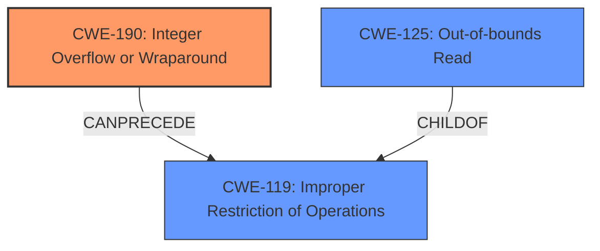

# Enhanced Analysis for CVE-2021-39762

# Summary
| CWE ID | CWE Name | Confidence | CWE Abstraction Level | CWE Vulnerability Mapping Label | CWE-Vulnerability Mapping Notes |
|---|---|---|---|---|---|
| CWE-190 | Integer Overflow or Wraparound | 1.0 | Base | Allowed | Primary CWE |
| CWE-125 | Out-of-bounds Read | 0.7 | Base | Allowed | Secondary Candidate |

## Evidence and Confidence

*   **Confidence Score:** 0.85
*   **Evidence Strength:** HIGH

## Relationship Analysis
The primary identified weakness is CWE-190 **Integer Overflow or Wraparound**, which is a base-level CWE. It can **CanPrecede** CWE-119 Improper Restriction of Operations within a Buffer. The secondary weakness, CWE-125 **Out-of-bounds Read** could be a consequence of the integer overflow and a ChildOf CWE-119. The retriever results and the vulnerability description key phrases support this relationship.



## Vulnerability Chain
The vulnerability chain starts with an **integer overflow** (CWE-190), potentially leading to an **out-of-bounds read** (CWE-125), resulting in remote information disclosure. The **integer overflow** causes the program to read data beyond the intended buffer boundaries.

## Summary of Analysis
The primary weakness is an **integer overflow** (CWE-190) that leads to an **out-of-bounds read** (CWE-125) and finally to information disclosure. The vulnerability description clearly states "there is a possible out of bounds read due to an **integer overflow**."

The retriever results also list CWE-190 as the top candidate. CWE-190's description matches the vulnerability: "The product performs a calculation that can produce an **integer overflow** or wraparound when the logic assumes that the resulting value will always be larger than the original value."

CWE-125 **Out-of-bounds Read** is a likely consequence, because the integer overflow could lead to an incorrect calculation of the buffer size or index, causing the program to read memory outside the allocated buffer.

The other CWEs considered were less relevant:
- CWE-191: Integer Underflow (Wrap or Wraparound): While related to integer issues, the description specifies an overflow, not an underflow.
- CWE-908: Use of Uninitialized Resource: Not directly related to the **integer overflow** described.
- CWE-704: Incorrect Type Conversion or Cast: Could be related, but the description focuses on the **integer overflow** as the root cause.
- CWE-862: Missing Authorization: Not applicable, as the issue is a calculation error, not an authorization problem.

The selected CWEs are at the optimal level of specificity, with CWE-190 representing the root cause and CWE-125 being a likely consequence of the **integer overflow**.


## CWE Relationship Analysis

Current CWEs represent these abstraction levels: .


### Vulnerability Chain Analysis

**Chain starting from CWE-190:**
- 190 (Integer Overflow or Wraparound) - ROOT


**Chain starting from CWE-862:**
- 862 (Missing Authorization) - ROOT


### CWE Relationship Diagram

```mermaid
graph TD
    classDef primary fill:#f96,stroke:#333,stroke-width:2px
    classDef secondary fill:#69f,stroke:#333
    classDef tertiary fill:#9e9,stroke:#333
```