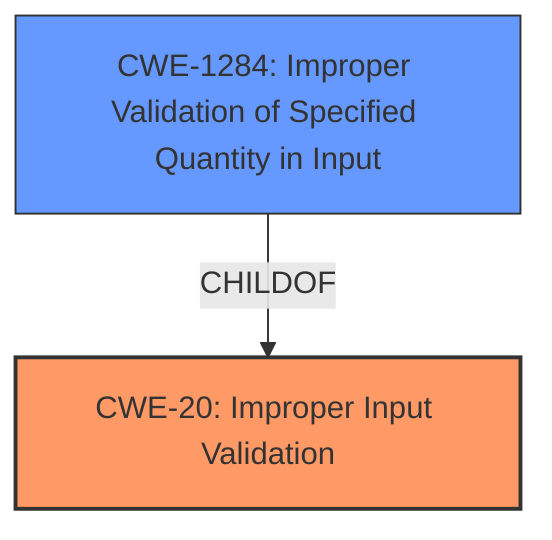

# Enhanced Analysis for CVE-2021-39764

# Summary
| CWE ID | CWE Name | Confidence | CWE Abstraction Level | CWE Vulnerability Mapping Label | CWE-Vulnerability Mapping Notes |
|---|---|---|---|---|---|
| CWE-20 ([CWE-20: Improper Input Validation](https://cwe.mitre.org/data/definitions/20.html)) | Improper Input Validation | 0.75 | Class | Primary | Discouraged |
| CWE-1284 ([CWE-1284: Improper Validation of Specified Quantity in Input](https://cwe.mitre.org/data/definitions/1284.html)) | Improper Validation of Specified Quantity in Input | 0.6 | Base | Secondary | Allowed |

## Evidence and Confidence

*   **Confidence Score:** 0.7
*   **Evidence Strength:** MEDIUM

## Relationship Analysis
The primary relationship that influenced the decision was the parent-child relationship between CWE-20 ([CWE-20: Improper Input Validation](https://cwe.mitre.org/data/definitions/20.html)) and CWE-1284 ([CWE-1284: Improper Validation of Specified Quantity in Input](https://cwe.mitre.org/data/definitions/1284.html)). CWE-1284 ([CWE-1284: Improper Validation of Specified Quantity in Input](https://cwe.mitre.org/data/definitions/1284.html)) is a child of CWE-20 ([CWE-20: Improper Input Validation](https://cwe.mitre.org/data/definitions/20.html)). While CWE-1284 ([CWE-1284: Improper Validation of Specified Quantity in Input](https://cwe.mitre.org/data/definitions/1284.html)) is more specific, the vulnerability description doesn't offer enough details to confirm it is quantity related, so I opted for CWE-20 ([CWE-20: Improper Input Validation](https://cwe.mitre.org/data/definitions/20.html)) as the primary.



## Vulnerability Chain
The vulnerability chain starts with the **improper input validation**, leading to an incorrect app name being displayed, and finally resulting in a local escalation of privilege via app spoofing.

## Summary of Analysis
The initial analysis focused on identifying the root cause of the vulnerability, which is stated as **improper input validation**. The retriever results also pointed to CWE-20 ([CWE-20: Improper Input Validation](https://cwe.mitre.org/data/definitions/20.html)) as a potential candidate.

The vulnerability description states, "In Settings, there is a possible way to display an incorrect app name due to **improper input validation**. This could lead to local escalation of privilege via app spoofing with no additional execution privileges needed." This statement provides direct evidence supporting the selection of CWE-20 ([CWE-20: Improper Input Validation](https://cwe.mitre.org/data/definitions/20.html)).

The relationship analysis considered more specific CWEs, particularly CWE-1284 ([CWE-1284: Improper Validation of Specified Quantity in Input](https://cwe.mitre.org/data/definitions/1284.html)), given that the app name could be considered a quantity or length of characters. However, without further details, CWE-20 ([CWE-20: Improper Input Validation](https://cwe.mitre.org/data/definitions/20.html)) remains the most appropriate primary classification.

CWE-20 ([CWE-20: Improper Input Validation](https://cwe.mitre.org/data/definitions/20.html)) is selected as the primary CWE because the vulnerability stems from the **improper validation** of input, which allows an attacker to display an incorrect app name, leading to privilege escalation. The weakness is at Class level of specificity as the nature of the input is not explicit.

Relevant CWE Information:

# Enhanced Context (25 CWEs)
The following CWEs were identified as potentially relevant to this vulnerability:

## CWE-1289: Improper Validation of Unsafe Equivalence in Input
**Abstraction Level**: Base
**Similarity Score**: 0.77

**Description**:
The product receives an input value that is used as a resource identifier or other type of reference, but it does not validate or incorrectly validates that the input is equivalent to a potentially-unsafe value.

**Mapping Guidance**:
- Usage: Allowed
- Rationale: This CWE entry is at the Base level of abstraction, which is a preferred level of abstraction for mapping to the root causes of vulnerabilities.

## CWE-1288: Improper Validation of Consistency within Input
**Abstraction Level**: Base
**Similarity Score**: 0.74

**Description**:
The product receives a complex input with multiple elements or fields that must be consistent with each other, but it does not validate or incorrectly validates that the input is actually consistent.

**Mapping Guidance**:
- Usage: Allowed
- Rationale: This CWE entry is at the Base level of abstraction, which is a preferred level of abstraction for mapping to the root causes of vulnerabilities.

## CWE-807: Reliance on Untrusted Inputs in a Security Decision
**Abstraction Level**: Base
**Similarity Score**: 0.74

**Description**:
The product uses a protection mechanism that relies on the existence or values of an input, but the input can be modified by an untrusted actor in a way that bypasses the protection mechanism.

**Mapping Guidance**:
- Usage: Allowed
- Rationale: This CWE entry is at the Base level of abstraction, which is a preferred level of abstraction for mapping to the root causes of vulnerabilities.

## CWE-451: User Interface (UI) Misrepresentation of Critical Information
**Abstraction Level**: Class
**Similarity Score**: 0.74

**Description**:
The user interface (UI) does not properly represent critical information to the user, allowing the information - or its source - to be obscured or spoofed. This is often a component in phishing attacks.

**Mapping Guidance**:
- Usage: Allowed-with-Review
- Rationale: This CWE entry is a Class and might have Base-level children that would be more appropriate

## CWE-404: Improper Resource Shutdown or Release
**Abstraction Level**: Class
**Similarity Score**: 0.73

**Description**:
The product does not release or incorrectly releases a resource before it is made available for re-use.

**Mapping Guidance**:
- Usage: Allowed-with-Review
- Rationale: This CWE entry is a Class and might have Base-level children that would be more appropriate

## CWE-184: Incomplete List of Disallowed Inputs
**Abstraction Level**: Base
**Similarity Score**: 0.73

**Description**:
The product implements a protection mechanism that relies on a list of inputs (or properties of inputs) that are not allowed by policy or otherwise require other action to neutralize before additional processing takes place, but the list is incomplete.

**Mapping Guidance**:
- Usage: Allowed
- Rationale: This CWE entry is at the Base level of abstraction, which is a preferred level of abstraction for mapping to the root causes of vulnerabilities.

## CWE-799: Improper Control of Interaction Frequency
**Abstraction Level**: Class
**Similarity Score**: 0.73

**Description**:
The product does not properly limit the number or frequency of interactions that it has with an actor, such as the number of incoming requests.

**Mapping Guidance**:
- Usage: Allowed-with-Review
- Rationale: This CWE entry is a Class and might have Base-level children that would be more appropriate

## CWE-754: Improper Check for Unusual or Exceptional Conditions
**Abstraction Level**: Class
**Similarity Score**: 0.73

**Description**:
The product does not check or incorrectly checks for unusual or exceptional conditions that are not expected to occur frequently during day to day operation of the product.

**Mapping Guidance**:
- Usage: Allowed-with-Review
- Rationale: This CWE entry is a Class and might have Base-level children that would be more appropriate

## CWE-667: Improper Locking
**Abstraction Level**: Class
**Similarity Score**: 0.73

**Description**:
The product does not properly acquire or release a lock on a resource, leading to unexpected resource state changes and behaviors.

**Mapping Guidance**:
- Usage: Allowed-with-Review
- Rationale: This CWE entry is a Class and might have Base-level children that would be more appropriate

## CWE-274: Improper Handling of Insufficient Privileges
**Abstraction Level**: Base
**Similarity Score**: 0.73

**Description**:


## CWE Relationship Analysis

Current CWEs represent these abstraction levels: .


### Vulnerability Chain Analysis

**Chain starting from CWE-184:**
- 184 (Incomplete List of Disallowed Inputs) - ROOT


**Chain starting from CWE-807:**
- 807 (Reliance on Untrusted Inputs in a Security Decision) - ROOT


### CWE Relationship Diagram

```mermaid
graph TD
    classDef primary fill:#f96,stroke:#333,stroke-width:2px
    classDef secondary fill:#69f,stroke:#333
    classDef tertiary fill:#9e9,stroke:#333
```