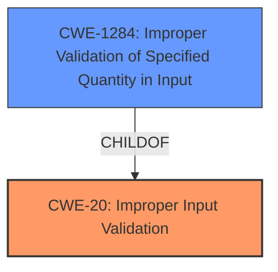

# Enhanced Analysis for CVE-2021-39771

# Summary
| CWE ID | CWE Name | Confidence | CWE Abstraction Level | CWE Vulnerability Mapping Label | CWE-Vulnerability Mapping Notes |
|---|---|---|---|---|---|
| CWE-20 | Improper Input Validation | 0.75 | Class | Primary | Discouraged |
| CWE-1284 | Improper Validation of Specified Quantity in Input | 0.6 | Base | Secondary | Allowed |

## Evidence and Confidence

*   **Confidence Score:** 0.7
*   **Evidence Strength:** MEDIUM

## Relationship Analysis
The primary CWE selected is CWE-20, which is a Class-level CWE. However, it's discouraged because it's often misused and lacks specificity. The secondary CWE, CWE-1284, is a Base-level CWE and a child of CWE-20, offering more specific details related to the **improper validation** of a specified quantity in the input.



## Vulnerability Chain
The chain of events begins with **improper input validation** (CWE-20), leading to a potential misrepresentation of the app adding a Wi-Fi network, and ultimately results in a local escalation of privilege.

## Summary of Analysis
Initially, CWE-20 (Improper Input Validation) seemed appropriate because the vulnerability description highlights "**improper input validation**". However, CWE-20 is a discouraged Class-level CWE due to its generality. The more specific CWE-1284 (Improper Validation of Specified Quantity in Input) provides a better fit because it addresses the **validation** of a specific aspect - a quantity - within the input. Though the exact quantity is unspecified, using CWE-1284 offers slightly improved specificity over the more general CWE-20.

The vulnerability description states that there is a "**improper input validation**". The "**Vulnerability Description Key Phrases**" section also highlights "**improper input validation**" as the root cause. The "CVE Reference Links Content Summary" indicates that the vulnerability leads to an "Elevation of Privilege (EoP)".

Relevant CWE Information:

# Enhanced Context (25 CWEs)

## CWE-191: Integer Underflow (Wrap or Wraparound)
**Abstraction Level**: Base
**Similarity Score**: 0.78
**Source**: dense

## CWE-1289: Improper Validation of Unsafe Equivalence in Input
**Abstraction Level**: Base
**Similarity Score**: 0.76
**Source**: dense

## CWE-754: Improper Check for Unusual or Exceptional Conditions
**Abstraction Level**: Class
**Similarity Score**: 0.75
**Source**: dense

## CWE-197: Numeric Truncation Error
**Abstraction Level**: Base
**Similarity Score**: 0.75
**Source**: dense

## CWE-681: Incorrect Conversion between Numeric Types
**Abstraction Level**: Base
**Similarity Score**: 0.75
**Source**: dense

## CWE-667: Improper Locking
**Abstraction Level**: Class
**Similarity Score**: 0.75
**Source**: dense

## CWE-131: Incorrect Calculation of Buffer Size
**Abstraction Level**: Base
**Similarity Score**: 0.74
**Source**: dense

## CWE-703: Improper Check or Handling of Exceptional Conditions
**Abstraction Level**: Pillar
**Similarity Score**: 0.74
**Source**: dense

## CWE-404: Improper Resource Shutdown or Release
**Abstraction Level**: Class
**Similarity Score**: 0.74
**Source**: dense

## CWE-807: Reliance on Untrusted Inputs in a Security Decision
**Abstraction Level**: Base
**Similarity Score**: 0.74
**Source**: dense

## CWE-1284: Improper Validation of Specified Quantity in Input
**Abstraction Level**: Base
**Similarity Score**: 5974.23
**Source**: sparse

**Description**:
The product receives input that is expected to specify a quantity (such as size or length), but it does not validate or incorrectly validates that the quantity has the required properties.

**Mapping Guidance**:
- Usage: Allowed
- Rationale: This CWE entry is at the Base level of abstraction, which is a preferred level of abstraction for mapping to the root causes of vulnerabilities.

## CWE-22: Improper Limitation of a Pathname to a Restricted Directory ('Path Traversal')
**Abstraction Level**: Base
**Similarity Score**: 5813.04
**Source**: sparse

## CWE-190: Integer Overflow or Wraparound
**Abstraction Level**: Base
**Similarity Score**: 5804.42
**Source**: sparse

## CWE-125: Out-of-bounds Read
**Abstraction Level**: Base
**Similarity Score**: 5739.55
**Source**: sparse

## CWE-367: Time-of-check Time-of-use (TOCTOU) Race Condition
**Abstraction Level**: Base
**Similarity Score**: 5715.39
**Source**: sparse

## CWE-41: Improper Resolution of Path Equivalence
**Abstraction Level**: base
**Similarity Score**: 5.03
**Source**: graph

## CWE-73: External Control of File Name or Path
**Abstraction Level**: base
**Similarity Score**: 4.33
**Source**: graph

## CWE-22: Improper Limitation of a Pathname to a Restricted Directory ('Path Traversal')
**Abstraction Level**: base
**Similarity Score**: 4.33
**Source**: graph

## CWE-59: Improper Link Resolution Before File Access ('Link Following')
**Abstraction Level**: base
**Similarity Score**: 4.33
**Source**: graph

## CWE-190: Integer Overflow or Wraparound
**Abstraction Level**: base
**Similarity Score**: 4.33
**Source**: graph

## CWE-434: Unrestricted Upload of File with Dangerous Type
**Abstraction Level**: base
**Similarity Score**: 4.33
**Source**: graph

## CWE-770: Allocation of Resources Without Limits or Throttling
**Abstraction Level**: base
**Similarity Score**: 4.33
**Source**: graph

## CWE-1284: Improper Validation of Specified Quantity in Input
**Abstraction Level**: base
**Similarity Score**: 4.33
**Source**: graph

## CWE-789: Memory Allocation with Excessive Size Value
**Abstraction Level**: variant
**Similarity Score**: 3.88
**Source**: graph

## CWE-128: Wrap-around Error
**Abstraction Level**: base
**Similarity Score**: 3.57
**Source**: graph

The "Retriever Results" section also indicates CWE-20 as a candidate, but also provides several other potential matches. The final decision favored CWE-1284 to provide more specificity given the available information.

Given that the "improper input validation" is the root cause, and leads to misrepresentation of which app wants to add a wifi network.
*   CWE-862 (Missing Authorization): This CWE was considered because the vulnerability leads to local escalation of privilege, suggesting an authorization issue. However, the root cause is more directly related to input validation than a missing authorization check.
*   CWE-1021 (Improper Restriction of Rendered UI Layers or Frames): This CWE is related to clickjacking and UI redress attacks, which don't align with the vulnerability description.
*   CWE-514 (Covert Channel): This CWE is not relevant to the vulnerability description.
*   CWE-667 (Improper Locking): This CWE is not relevant to the vulnerability description.
*   CWE-925 (Improper Verification of Intent by Broadcast Receiver): This CWE is specific to Android applications using Broadcast Receivers, and while the description mentions Android settings, it doesn't specify that the vulnerability involves a Broadcast Receiver.
*   CWE-73 (External Control of File Name or Path): This CWE is not relevant to the vulnerability description.
*   CWE-908 (Use of Uninitialized Resource): This CWE is not relevant to the vulnerability description.
*   CWE-191 (Integer Underflow (Wrap or Wraparound)): This CWE is not relevant to the vulnerability description.

Therefore, the primary CWE is CWE-20, with a secondary CWE of CWE-1284 to give more context.


## CWE Relationship Analysis

Current CWEs represent these abstraction levels: .


### Vulnerability Chain Analysis

**Chain starting from CWE-41:**
- 41 (Improper Resolution of Path Equivalence) - ROOT


**Chain starting from CWE-908:**
- 908 (Use of Uninitialized Resource) - ROOT


### CWE Relationship Diagram

```mermaid
graph TD
    classDef primary fill:#f96,stroke:#333,stroke-width:2px
    classDef secondary fill:#69f,stroke:#333
    classDef tertiary fill:#9e9,stroke:#333
```