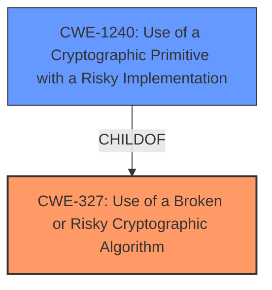

# Raw Analyzer Response for CVE-2021-3979

# Summary
| CWE ID | CWE Name | Confidence | CWE Abstraction Level | CWE Vulnerability Mapping Label | CWE-Vulnerability Mapping Notes |
|---|---|---|---|---|---|
| CWE-327 | Use of a Broken or Risky Cryptographic Algorithm | 0.9 | Class | Primary | Allowed-with-Review |
| CWE-1240 | Use of a Cryptographic Primitive with a Risky Implementation | 0.8 | Base | Secondary | Allowed |

## Evidence and Confidence

*   **Confidence Score:** 0.9
*   **Evidence Strength:** HIGH

## Relationship Analysis
The primary CWE is CWE-327, which represents a broad class of vulnerabilities related to the use of weak or broken cryptographic algorithms. The secondary CWE, CWE-1240, is a more specific base-level weakness that describes the use of risky implementations of cryptographic primitives. The relationship between these CWEs is that CWE-1240 is a ChildOf CWE-327, meaning it is a more specific type of the broader weakness. This hierarchical relationship influenced the decision to map both CWEs, with CWE-327 as the primary (more general) and CWE-1240 as a secondary (more specific) mapping.

## Vulnerability Chain
The vulnerability chain starts with the **key length flaw**, leading to the incorrect key size being used for encryption. This results in a weaker, non-random key, ultimately leading to a potential loss of confidentiality and integrity on encrypted disks.

Key Length Flaw -> Weaker Encryption Key (CWE-327/CWE-1240) -> Loss of Confidentiality and Integrity

## Summary of Analysis
The initial analysis focused on identifying the root cause of the vulnerability and its potential impact. The evidence clearly indicates that the **key length flaw** leads to the use of a weaker encryption key, which can be exploited by an attacker.

The selection of CWE-327 and CWE-1240 is based on the following evidence:

*   **Vulnerability Description Key Phrases:** "Key length flaw" indicates an issue with the encryption process, suggesting a problem with the cryptographic algorithm or its implementation.
*   **CVE Reference Links Content Summary:** The summary explicitly mentions that the `osd_dmcrypt_key_size` configuration option was not being correctly passed, resulting in a default, weaker key size being used. This aligns with the description of CWE-327 ("The product uses a broken or risky cryptographic algorithm or protocol.") and CWE-1240 ("To fulfill the need for a cryptographic primitive, the product implements a cryptographic algorithm using a non-standard, unproven, or disallowed/non-compliant cryptographic implementation.").

The graph relationships influenced the final selection by highlighting the hierarchical connection between CWE-327 and CWE-1240. While CWE-327 is more general, CWE-1240 provides a more specific description of the vulnerability.

The selected CWEs are at the optimal level of specificity because they accurately represent the weakness without being overly specific. While other CWEs were considered (e.g., CWE-321 Use of Hard-coded Cryptographic Key, CWE-1391 Use of Weak Credentials), they did not fully capture the essence of the vulnerability, which is related to the incorrect handling of the key length in the encryption process.

Relevant CWE Information:

# Enhanced Context (25 CWEs)

## CWE-1240: Use of a Cryptographic Primitive with a Risky Implementation
**Abstraction Level**: Base
**Similarity Score**: 0.79
**Source**: dense

**Description**:
To fulfill the need for a cryptographic primitive, the product implements a cryptographic algorithm using a non-standard, unproven, or disallowed/non-compliant cryptographic implementation.

**Mapping Guidance**:
- Usage: Allowed
- Rationale: This CWE entry is at the Base level of abstraction, which is a preferred level of abstraction for mapping to the root causes of vulnerabilities.

## CWE-1391: Use of Weak Credentials
**Abstraction Level**: Class
**Similarity Score**: 0.76
**Source**: dense

**Description**:
The product uses weak credentials (such as a default key or hard-coded password) that can be calculated, derived, reused, or guessed by an attacker.

**Mapping Guidance**:
- Usage: Allowed-with-Review
- Rationale: This CWE entry is a Class and might have Base-level children that would be more appropriate

## CWE-1204: Generation of Weak Initialization Vector (IV)
**Abstraction Level**: Base
**Similarity Score**: 0.75
**Source**: dense

**Description**:
The product uses a cryptographic primitive that uses an Initialization Vector (IV), but the product does not generate IVs that are sufficiently unpredictable or unique according to the expected cryptographic requirements for that primitive.

**Mapping Guidance**:
- Usage: Allowed
- Rationale: This CWE entry is at the Base level of abstraction, which is a preferred level of abstraction for mapping to the root causes of vulnerabilities.

## CWE-330: Use of Insufficiently Random Values
**Abstraction Level**: Class
**Similarity Score**: 0.75
**Source**: dense

**Description**:
The product uses insufficiently random numbers or values in a security context that depends on unpredictable numbers.

**Mapping Guidance**:
- Usage: Discouraged
- Rationale: This CWE entry is a level-1 Class (i.e., a child of a Pillar). It might have lower-level children that would be more appropriate

## CWE-328: Use of Weak Hash
**Abstraction Level**: Base
**Similarity Score**: 0.74
**Source**: dense

**Description**:
The product uses an algorithm that produces a digest (output value) that does not meet security expectations for a hash function that allows an adversary to reasonably determine the original input (preimage attack), find another input that can produce the same hash (2nd preimage attack), or find multiple inputs that evaluate to the same hash (birthday attack).

**Mapping Guidance**:
- Usage: Allowed
- Rationale: This CWE entry is at the Base level of abstraction, which is a preferred level of abstraction for mapping to the root causes of vulnerabilities.

## CWE-325: Missing Cryptographic Step
**Abstraction Level**: Base
**Similarity Score**: 0.74
**Source**: dense

**Description**:
The product does not implement a required step in a cryptographic algorithm, resulting in weaker encryption than advertised by the algorithm.

**Mapping Guidance**:
- Usage: Allowed
- Rationale: This CWE entry is at the Base level of abstraction, which is a preferred level of abstraction for mapping to the root causes of vulnerabilities.

## CWE-331: Insufficient Entropy
**Abstraction Level**: Base
**Similarity Score**: 0.74
**Source**: dense

**Description**:
The product uses an algorithm or scheme that produces insufficient entropy, leaving patterns or clusters of values that are more likely to occur than others.

**Mapping Guidance**:
- Usage: Allowed
- Rationale: This CWE entry is at the Base level of abstraction, which is a preferred level of abstraction for mapping to the root causes of vulnerabilities.

## CWE-345: Insufficient Verification of Data Authenticity
**Abstraction Level**: Class
**Similarity Score**: 0.74
**Source**: dense

**Description**:
The product does not sufficiently verify the origin or authenticity of data, in a way that causes it to accept invalid data.

**Mapping Guidance**:
- Usage: Discouraged
- Rationale: This CWE entry is a level-1 Class (i.e., a child of a Pillar). It might have lower-level children that would be more appropriate

## CWE-321: Use of Hard-coded Cryptographic Key
**Abstraction Level**: Variant
**Similarity Score**: 0.73
**Source**: dense

**Description**:
The use of a hard-coded cryptographic key significantly increases the possibility that encrypted data may be recovered.

**Mapping Guidance**:
- Usage: Allowed
- Rationale: This CWE entry is at the Variant level of abstraction, which is a preferred level of abstraction for mapping to the root causes of vulnerabilities.

## CWE-1289: Improper Validation of Unsafe Equivalence in Input
**Abstraction Level**: Base
**Similarity Score**: 0.73
**Source**: dense

**Description**:
The product receives an input value that is used as a resource identifier or other type of reference, but it does not validate or incorrectly validates that the input is equivalent to a potentially-unsafe value.

**Mapping Guidance**:
- Usage: Allowed
- Rationale: This CWE entry is at the Base level of abstraction, which is a preferred level of abstraction for mapping to the root causes of vulnerabilities.

## CWE-1240: Use of a Cryptographic Primitive with a Risky Implementation