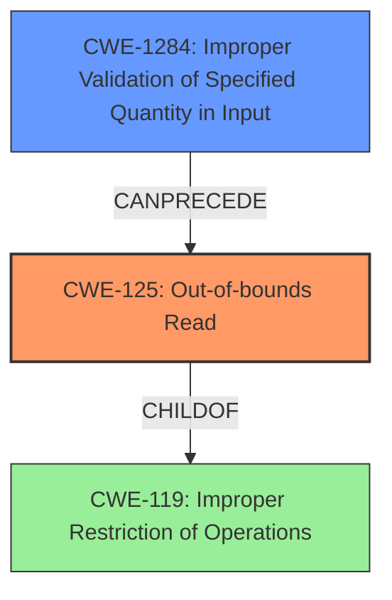

# Analysis Report for CVE-2021-39805

# Vulnerability Analysis Report: CVE-2021-39805

## Description


## Analysis (with Relationship Data)

# Summary
| CWE ID  | CWE Name                                                                                                   | Confidence | CWE Abstraction Level | CWE Vulnerability Mapping Label | CWE-Vulnerability Mapping Notes |
| :-------- | :--------------------------------------------------------------------------------------------------------- | :---------- | :---------------------- | :------------------------------ | :------------------------------ |
| CWE-125   | Out-of-bounds Read                                                                                           | 1          | Base                    | Primary CWE                     | Allowed                        |
| CWE-1284  | Improper Validation of Specified Quantity in Input                                                         | 0.7         | Base                    | Secondary CWE                   | Allowed                        |

## Evidence and Confidence

*   **Confidence Score:** 0.85
*   **Evidence Strength:** HIGH

## Relationship Analysis
The primary CWE identified is CWE-125 (Out-of-bounds Read), which is a base-level CWE. It is related to CWE-119 (Improper Restriction of Operations within the Bounds of a Memory Buffer). CWE-1284 (Improper Validation of Specified Quantity in Input) is considered as a secondary CWE because the **missing bounds check** is a form of improper validation. CWE-1284 can precede CWE-789 (Allocation of Resources Without Limits or Throttling).



## Vulnerability Chain
The vulnerability chain starts with **missing bounds check** (CWE-1284), which leads to an **out-of-bounds read** (CWE-125), eventually resulting in remote information disclosure.

## Summary of Analysis
The initial analysis identified CWE-125 (Out-of-bounds Read) as the primary weakness based on the vulnerability description and CVE reference links content summary. The description clearly states an "**out of bounds read** due to a **missing bounds check**." The CVE reference links content summary confirms the "Out-of-bounds read vulnerability" and "Information disclosure."

CWE-125 is a base-level CWE, which is the preferred level of abstraction. The retriever results also list CWE-125 as a candidate.

CWE-1284 (Improper Validation of Specified Quantity in Input) was considered because the **missing bounds check** is a failure to validate the size or length of the input, which could have prevented the out-of-bounds read.

Other CWEs were considered but ultimately not selected:

*   CWE-191 (Integer Underflow) and CWE-190 (Integer Overflow) were not chosen because the root cause isn't specifically related to integer handling but rather a general **missing bounds check**.
*   CWE-862 (Missing Authorization) is not applicable as the vulnerability is not related to authorization.
*   CWE-476 (NULL Pointer Dereference) is not applicable because the description does not mention null pointers.
*   CWE-20 (Improper Input Validation) is a class-level CWE and too generic. The vulnerability is more specifically related to a **missing bounds check**, making CWE-1284 a more appropriate secondary mapping.

The selection of CWE-125 and CWE-1284 are based on the explicit evidence in the vulnerability description and the retriever results. The relationships between the CWEs helped refine the understanding of the vulnerability chain, leading to a more accurate classification. The chosen CWEs are at the optimal level of specificity, providing a clear and concise representation of the vulnerability.


## CWE Relationship Analysis

Current CWEs represent these abstraction levels: .


### Vulnerability Chain Analysis

**Chain starting from CWE-190:**
- 190 (Integer Overflow or Wraparound) - ROOT


**Chain starting from CWE-862:**
- 862 (Missing Authorization) - ROOT


### CWE Relationship Diagram

```mermaid
graph TD
    classDef primary fill:#f96,stroke:#333,stroke-width:2px
    classDef secondary fill:#69f,stroke:#333
    classDef tertiary fill:#9e9,stroke:#333
```


*Report generated on 2025-03-31 06:43:52*
