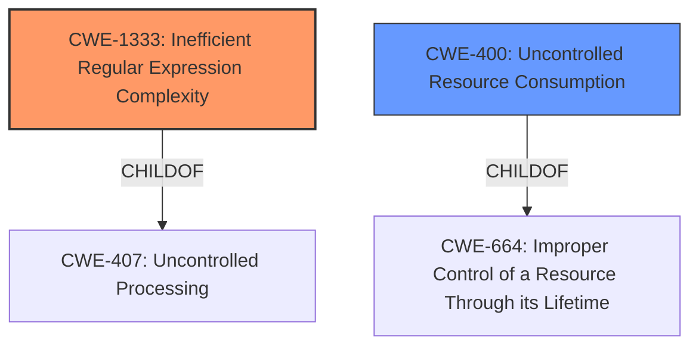

# Raw Analyzer Response for CVE-2021-39940

# Summary
| CWE ID    | CWE Name                                         | Confidence | CWE Abstraction Level | CWE Vulnerability Mapping Label | CWE-Vulnerability Mapping Notes |
| :-------- | :----------------------------------------------- | :--------- | :-------------------- | :------------------------------ | :------------------------------ |
| CWE-1333  | Inefficient Regular Expression Complexity        | 1          | Base                  | Primary CWE                     | Allowed                       |
| CWE-400 | Uncontrolled Resource Consumption | 0.6          | Class                  | Secondary CWE                    | Discouraged                     |

## Evidence and Confidence

*   **Confidence Score:** 0.9
*   **Evidence Strength:** HIGH

## Relationship Analysis
The primary relationship influencing the CWE selection is that CWE-1333 (Base) is a child of CWE-407 (Class), while CWE-400 is a child of CWE-664. This suggests that CWE-1333 provides a more specific characterization of the vulnerability than CWE-400, focusing on the inefficient regular expression as the root cause, whereas CWE-400 describes the general consequence of resource consumption.

## Vulnerability Chain
The vulnerability chain starts with the **inefficient regular expression** (CWE-1333) used in the GitLab Maven Package registry. A specifically crafted string triggers **catastrophic backtracking**, leading to excessive CPU consumption and ultimately causing a **denial of service** (CWE-400).

## Summary of Analysis
The initial assessment strongly points to CWE-1333 as the primary weakness. The vulnerability description explicitly mentions a regular expression denial of service due to a specifically crafted string. The CVE Reference Links Content Summary further confirms that the Maven package version validation uses a regular expression that is vulnerable to catastrophic backtracking, leading to CPU exhaustion.

The retriever results also list CWE-1333 as the top candidate. While CWE-400 (Uncontrolled Resource Consumption) is also listed, it is a more general class of weakness, whereas CWE-1333 specifically addresses the root cause related to the inefficient regular expression.

The evidence provided supports the selection of CWE-1333 as the primary CWE because the **ROOT CAUSE** of the vulnerability is the inefficient regular expression complexity. The **VULNERABILITY** occurs when a specially crafted string causes catastrophic backtracking, which consumes excessive CPU cycles, leading to a denial of service. This aligns perfectly with the description of CWE-1333.
The usage is **ALLOWED** for CWE-1333 since it is at the Base level of abstraction.
CWE-400 is a secondary candidate because the **IMPACT** of the vulnerability is a denial of service due to uncontrolled resource consumption. The usage is **DISCOURAGED** for CWE-400 because it is a Class and a more specific CWE is available.

I considered CWE-863 (Incorrect Authorization), CWE-285 (Improper Authorization), CWE-116 (Improper Encoding or Escaping of Output), CWE-1286 (Improper Validation of Syntactic Correctness of Input), CWE-117 (Improper Output Neutralization for Logs), CWE-267 (Privilege Defined With Unsafe Actions), CWE-639 (Authorization Bypass Through User-Controlled Key), CWE-1390 (Weak Authentication), but these did not directly align with the root cause of the vulnerability, which is related to the inefficient regular expression complexity.

# Relevant CWE Information:

# Enhanced Context (25 CWEs)
The following CWEs were identified as potentially relevant to this vulnerability:

## CWE-1289: Improper Validation of Unsafe Equivalence in Input
**Abstraction Level**: Base
**Similarity Score**: 0.76
**Source**: dense

**Description**:
The product receives an input value that is used as a resource identifier or other type of reference, but it does not validate or incorrectly validates that the input is equivalent to a potentially-unsafe value.

**Mapping Guidance**:
- Usage: Allowed
- Rationale: This CWE entry is at the Base level of abstraction, which is a preferred level of abstraction for mapping to the root causes of vulnerabilities.

## CWE-639: Authorization Bypass Through User-Controlled Key
**Abstraction Level**: Base
**Similarity Score**: 0.76
**Source**: dense

**Description**:
The system's authorization functionality does not prevent one user from gaining access to another user's data or record by modifying the key value identifying the data.

**Mapping Guidance**:
- Usage: Allowed
- Rationale: This CWE entry is at the Base level of abstraction, which is a preferred level of abstraction for mapping to the root causes of vulnerabilities.

## CWE-807: Reliance on Untrusted Inputs in a Security Decision
**Abstraction Level**: Base
**Similarity Score**: 0.75
**Source**: dense

**Description**:
The product uses a protection mechanism that relies on the existence or values of an input, but the input can be modified by an untrusted actor in a way that bypasses the protection mechanism.

**Mapping Guidance**:
- Usage: Allowed
- Rationale: This CWE entry is at the Base level of abstraction, which is a preferred level of abstraction for mapping to the root causes of vulnerabilities.

## CWE-1390: Weak Authentication
**Abstraction Level**: Class
**Similarity Score**: 0.75
**Source**: dense

**Description**:
The product uses an authentication mechanism to restrict access to specific users or identities, but the mechanism does not sufficiently prove that the claimed identity is correct.

**Mapping Guidance**:
- Usage: Allowed-with-Review
- Rationale: This CWE entry is a Class and might have Base-level children that would be more appropriate

## CWE-303: Incorrect Implementation of Authentication Algorithm
**Abstraction Level**: Base
**Similarity Score**: 0.75
**Source**: dense

**Description**:
The requirements for the product dictate the use of an established authentication algorithm, but the implementation of the algorithm is incorrect.

**Mapping Guidance**:
- Usage: Allowed
- Rationale: This CWE entry is at the Base level of abstraction, which is a preferred level of abstraction for mapping to the root causes of vulnerabilities.

## CWE-307: Improper Restriction of Excessive Authentication Attempts
**Abstraction Level**: Base
**Similarity Score**: 0.74
**Source**: dense

**Description**:
The product does not implement sufficient measures to prevent multiple failed authentication attempts within a short time frame.

**Mapping Guidance**:
- Usage: Allowed
- Rationale: This CWE entry is at the Base level of abstraction, which is a preferred level of abstraction for mapping to the root causes of vulnerabilities.

## CWE-472: External Control of Assumed-Immutable Web Parameter
**Abstraction Level**: Base
**Similarity Score**: 0.74
**Source**: dense

**Description**:
The web application does not sufficiently verify inputs that are assumed to be immutable but are actually externally controllable, such as hidden form fields.

**Mapping Guidance**:
- Usage: Allowed
- Rationale: This CWE entry is at the Base level of abstraction, which is a preferred level of abstraction for mapping to the root causes of vulnerabilities.

## CWE-274: Improper Handling of Insufficient Privileges
**Abstraction Level**: Base
**Similarity Score**: 0.74
**Source**: dense

**Description**:
The product does not handle or incorrectly handles when it has insufficient privileges to perform an operation, leading to resultant weaknesses.

**Mapping Guidance**:
- Usage: Discouraged
- Rationale: This CWE entry could be deprecated in a future version of CWE.

## CWE-653: Improper Isolation or Compartmentalization
**Abstraction Level**: Class
**Similarity Score**: 0.74
**Source**: dense

**Description**:
The product does not properly compartmentalize or isolate functionality, processes, or resources that require different privilege levels, rights, or permissions.

**Mapping Guidance**:
- Usage: Allowed
- Rationale: This CWE entry is at the Base level of abstraction, which is a preferred level of abstraction for mapping to the root causes of vulnerabilities.

## CWE-183: Permissive List of Allowed Inputs
**Abstraction Level**: Base
**Similarity Score**: 0.74
**Source**: dense

**Description**:
The product implements a protection mechanism that relies on a list of inputs (or properties of inputs) that are explicitly allowed by policy because the inputs are assumed to be safe, but the list is too permissive - that is, it allows an input that