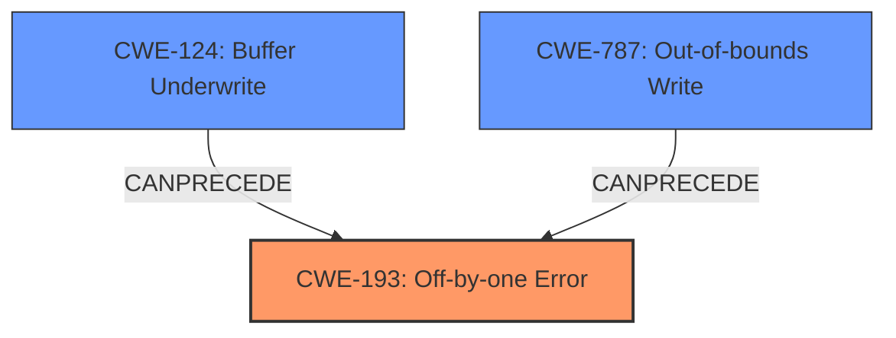

# Analysis Report for CVE-2021-3999

# Vulnerability Analysis Report: CVE-2021-3999

## Description


## Analysis (with Relationship Data)

# Summary
| CWE ID | CWE Name | Confidence | CWE Abstraction Level | CWE Vulnerability Mapping Label | CWE-Vulnerability Mapping Notes |
|---|---|---|---|---|---|
| CWE-193 | Off-by-one Error | 0.9 | Base | Allowed | Primary CWE |
| CWE-124 | Buffer Underwrite ('Buffer Underflow') | 0.7 | Base | Allowed | Secondary Candidate |
| CWE-787 | Out-of-bounds Write | 0.7 | Base | Allowed | Secondary Candidate |

## Evidence and Confidence

*   **Confidence Score:** 0.8
*   **Evidence Strength:** HIGH

## Relationship Analysis
The primary CWE is CWE-193, which describes the **off-by-one error**.
CWE-193 can lead to buffer overflows or underflows, represented by CWE-787 (Out-of-bounds Write) and CWE-124 (Buffer Underwrite), respectively. The relationships are:
  - CWE-193 is the root cause (**off-by-one error**).
  - CWE-124 and CWE-787 are potential consequences (buffer underflow and overflow).



## Vulnerability Chain
The vulnerability chain starts with the **off-by-one error** (CWE-193) in `getcwd()`, which leads to a buffer overflow or underflow (CWE-787 or CWE-124), and finally results in memory corruption. The attacker can control the input buffer and size, escalating privileges.

## Summary of Analysis
The initial assessment focuses on the provided evidence, primarily the vulnerability description and the CVE reference summary. The description explicitly mentions an "**off-by-one buffer overflow and underflow**" in the `getcwd()` function of glibc. The CVE reference summary confirms this, stating the root cause as "The `getcwd` function in glibc has a flaw where a buffer of size 1 can lead to an off-by-one buffer overflow and underflow due to incorrect size checks and logic in the generic implementation."

Based on this evidence, the primary CWE is CWE-193 (Off-by-one Error). This is the most specific weakness directly identified in the description. The buffer overflow and underflow are consequences of this error.

CWE-787 (Out-of-bounds Write) and CWE-124 (Buffer Underwrite) are secondary candidates, representing the potential outcomes of the **off-by-one error**. The vulnerability can result in memory corruption, potentially leading to arbitrary code execution and privilege escalation.

The selected CWEs are at the optimal level of specificity. CWE-193 is a Base level CWE, and CWE-787 and CWE-124 are also Base level CWEs, providing a detailed representation of the weakness and its potential consequences.

# Relevant CWE Information:

## CWE-124: Buffer Underwrite ('Buffer Underflow')
**Abstraction Level**: Base
**Similarity Score**: 0.78
**Source**: dense

**Description**:
The product writes to a buffer using an index or pointer that references a memory location prior to the beginning of the buffer.

**Mapping Guidance**:
- Usage: Allowed
- Rationale: This CWE entry is at the Base level of abstraction, which is a preferred level of abstraction for mapping to the root causes of vulnerabilities.

## CWE-193: Off-by-one Error
**Abstraction Level**: Base
**Similarity Score**: 0.73
**Source**: dense

**Description**:
A product calculates or uses an incorrect maximum or minimum value that is 1 more, or 1 less, than the correct value.

**Mapping Guidance**:
- Usage: Allowed
- Rationale: This CWE entry is at the Base level of abstraction, which is a preferred level of abstraction for mapping to the root causes of vulnerabilities.

## CWE-787: Out-of-bounds Write
**Abstraction Level**: base
**Similarity Score**: 4.33
**Source**: graph

**Description**:
CWE-787: Out-of-bounds Write

**Mapping Guidance**:
- Usage: Allowed
- Rationale: This CWE entry is at the Base level of abstraction, which is a preferred level of abstraction for mapping to the root causes of vulnerabilities.

### CWE Considerations:
- **CWE-119: Improper Restriction of Operations within the Bounds of a Memory Buffer:** This is a Class-level CWE, and therefore too high-level. The vulnerability description provides enough detail to identify more specific CWEs.
- **CWE-190: Integer Overflow or Wraparound and CWE-191: Integer Underflow (Wrap or Wraparound):** While integer issues can be related to buffer overflows, the description specifically points to an off-by-one error, making CWE-193 a better fit.
- **CWE-120: Buffer Copy without Checking Size of Input ('Classic Buffer Overflow'):** This CWE is relevant to buffer overflows, but the root cause is an **off-by-one error** rather than a missing size check.


## CWE Relationship Analysis

Current CWEs represent these abstraction levels: .


### Vulnerability Chain Analysis

**Chain starting from CWE-190:**
- 190 (Integer Overflow or Wraparound) - ROOT


**Chain starting from CWE-124:**
- 124 (Buffer Underwrite ('Buffer Underflow')) - ROOT


### CWE Relationship Diagram

```mermaid
graph TD
    classDef primary fill:#f96,stroke:#333,stroke-width:2px
    classDef secondary fill:#69f,stroke:#333
    classDef tertiary fill:#9e9,stroke:#333
```


*Report generated on 2025-03-30 12:43:42*
