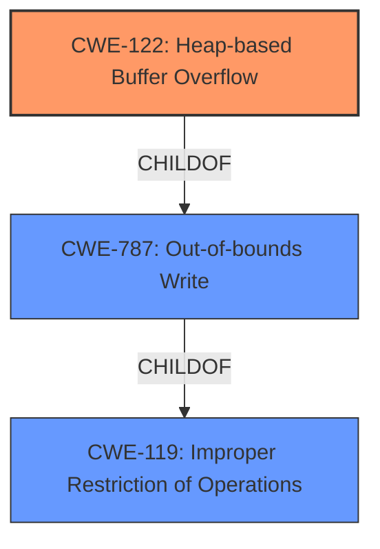

# Raw Analyzer Response for CVE-2021-39996

# Summary
| CWE ID | CWE Name | Confidence | CWE Abstraction Level | CWE Vulnerability Mapping Label | CWE-Vulnerability Mapping Notes |
|---|---|---|---|---|---|
| CWE-122 | Heap-based Buffer Overflow | 1.0 | Variant | Allowed | Primary CWE |
| CWE-119 | Improper Restriction of Operations within the Bounds of a Memory Buffer | 0.7 | Class | Discouraged | Secondary Candidate |

## Evidence and Confidence

*   **Confidence Score:** 0.9
*   **Evidence Strength:** HIGH

## Relationship Analysis
The primary relationship that influenced the decision was the ChildOf relationship between CWE-122 (Heap-based Buffer Overflow) and CWE-787 (Out-of-bounds Write). CWE-122 is a variant of CWE-787 which describes the specific location of the overflow on the heap. CWE-119 (Improper Restriction of Operations within the Bounds of a Memory Buffer) is a parent Class of both of these CWEs, representing a more general case of memory safety issues. While CWE-119 is listed as a top candidate by the retriever, it is discouraged because more specific CWEs are available.

## Vulnerability Chain
The vulnerability chain is straightforward: a **heap-based buffer overflow** leads to memory overflow.
  - **Root Cause:** Heap-based Buffer Overflow (CWE-122)
  - **Impact:** Memory Overflow

## Summary of Analysis
The initial assessment identified CWE-122 (Heap-based Buffer Overflow) as the primary candidate due to the explicit mention of "**Heap-based buffer overflow**" in both the vulnerability description and the CVE reference links content summary. The supporting evidence is strong, leading to high confidence.

The retriever results also suggested CWE-119 (Improper Restriction of Operations within the Bounds of a Memory Buffer) and CWE-190 (Integer Overflow or Wraparound). However, CWE-119 is a more general class of weakness, and the description clearly points to a heap-based buffer overflow. CWE-190 is not relevant because there is no mention of integer overflow in the vulnerability description.

The final selection of CWE-122 is at the optimal level of specificity because it accurately describes the **heap-based buffer overflow** vulnerability.

Relevant CWE Information:

# Enhanced Context (25 CWEs)

## CWE-191: Integer Underflow (Wrap or Wraparound)
**Abstraction Level**: Base
**Similarity Score**: 0.79
**Source**: dense

## CWE-805: Buffer Access with Incorrect Length Value
**Abstraction Level**: Base
**Similarity Score**: 0.79
**Source**: dense

## CWE-131: Incorrect Calculation of Buffer Size
**Abstraction Level**: Base
**Similarity Score**: 0.78
**Source**: dense

## CWE-681: Incorrect Conversion between Numeric Types
**Abstraction Level**: Base
**Similarity Score**: 0.77
**Source**: dense

## CWE-126: Buffer Over-read
**Abstraction Level**: Variant
**Similarity Score**: 0.77
**Source**: dense

## CWE-124: Buffer Underwrite ('Buffer Underflow')
**Abstraction Level**: Base
**Similarity Score**: 0.76
**Source**: dense

## CWE-197: Numeric Truncation Error
**Abstraction Level**: Base
**Similarity Score**: 0.76
**Source**: dense

## CWE-190: Integer Overflow or Wraparound
**Abstraction Level**: Base
**Similarity Score**: 0.76
**Source**: dense

## CWE-680: Integer Overflow to Buffer Overflow
**Abstraction Level**: Compound
**Similarity Score**: 0.76
**Source**: dense

## CWE-125: Out-of-bounds Read
**Abstraction Level**: Base
**Similarity Score**: 0.76
**Source**: dense

## CWE-190: Integer Overflow or Wraparound
**Abstraction Level**: Base
**Similarity Score**: 6286.11
**Source**: sparse

## CWE-125: Out-of-bounds Read
**Abstraction Level**: Base
**Similarity Score**: 5871.86
**Source**: sparse

## CWE-681: Incorrect Conversion between Numeric Types
**Abstraction Level**: Base
**Similarity Score**: 5785.12
**Source**: sparse

## CWE-193: Off-by-one Error
**Abstraction Level**: Base
**Similarity Score**: 5768.96
**Source**: sparse

## CWE-197: Numeric Truncation Error
**Abstraction Level**: Base
**Similarity Score**: 5688.08
**Source**: sparse

## CWE-128: Wrap-around Error
**Abstraction Level**: base
**Similarity Score**: 5.03
**Source**: graph

## CWE-170: Improper Null Termination
**Abstraction Level**: base
**Similarity Score**: 5.03
**Source**: graph

## CWE-195: Signed to Unsigned Conversion Error
**Abstraction Level**: variant
**Similarity Score**: 4.53
**Source**: graph

## CWE-1284: Improper Validation of Specified Quantity in Input
**Abstraction Level**: base
**Similarity Score**: 4.33
**Source**: graph

## CWE-617: Reachable Assertion
**Abstraction Level**: base
**Similarity Score**: 4.33
**Source**: graph

## CWE-123: Write-what-where Condition
**Abstraction Level**: base
**Similarity Score**: 3.89
**Source**: graph

## CWE-463: Deletion of Data Structure Sentinel
**Abstraction Level**: base
**Similarity Score**: 3.64
**Source**: graph

## CWE-1339: Insufficient Precision or Accuracy of a Real Number
**Abstraction Level**: base
**Similarity Score**: 3.57
**Source**: graph

## CWE-120: Buffer Copy without Checking Size of Input ('Classic Buffer Overflow')
**Abstraction Level**: base
**Similarity Score**: 3.36
**Source**: graph

## CWE-190: Integer Overflow or Wraparound
**Abstraction Level**: Base
**Similarity Score**: 3.32
**Source**: graph

**CWE-122: Heap-based Buffer Overflow**

*   **Explanation:** The vulnerability is explicitly described as a **Heap-based buffer overflow**, indicating that the overflow occurs in the heap memory region. This directly aligns with the definition of CWE-122.
*   **Security Implications:** A heap-based buffer overflow can allow an attacker to overwrite critical program data or execute arbitrary code, potentially leading to complete system compromise.
*   **Relationship:** CWE-122 is a variant of CWE-787 (Out-of-bounds Write), specifying the location (heap) where the out-of-bounds write occurs.
*   **Primary/Secondary:** This is the primary weakness.
*   **Mapping Guidance:** The usage for CWE-122 is ALLOWED, and it is at the Variant level of abstraction, which is preferred.

**CWE-119: Improper Restriction of Operations within the Bounds of a Memory Buffer**

*   **Explanation:** While the vulnerability involves writing outside the bounds of a buffer, CWE-119 is a more general case. Because "heap-based buffer overflow" is specified, CWE-122 is a better fit.
*   **Security Implications:** N/A
*   **Relationship:** CWE-119 is a parent Class of CWE-122 (Heap-based Buffer Overflow).
*   **Primary/Secondary:** This is a secondary candidate.
*   **Mapping Guidance:** The usage for CWE-119 is DISCOURAGED because more specific CWEs are available.

**CWEs Considered but Not Used:**

*   CWE-190 (Integer Overflow or Wraparound), CWE-131 (Incorrect Calculation of Buffer Size), CWE-193 (Off-by-one Error), CWE-126 (Buffer Over-read), CWE-125 (Out-of-bounds Read), CWE-681 (Incorrect Conversion between Numeric Types), CWE-128 (Wrap-around Error), CWE-1284 (Improper Validation of Specified Quantity in Input): These CWEs were considered but not selected because the vulnerability description specifically indicates a **heap-based buffer overflow**, and there is no mention or