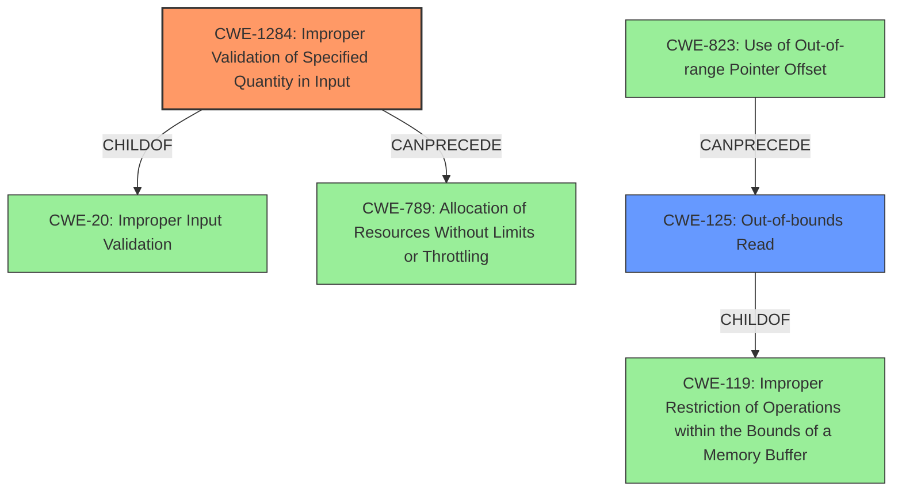

# Analysis Report for CVE-2021-39997

# Vulnerability Analysis Report: CVE-2021-39997

## Description


## Analysis (with Relationship Data)

# Summary
| CWE ID | CWE Name | Confidence | CWE Abstraction Level | CWE Vulnerability Mapping Label | CWE-Vulnerability Mapping Notes |
|---|---|---|---|---|---|
| CWE-1284 | Improper Validation of Specified Quantity in Input | 0.9 | Base | Allowed | Primary CWE. The audio assembly does not properly validate input parameters, which are a specified quantity. |
| CWE-125 | Out-of-bounds Read | 0.7 | Base | Allowed | Secondary CWE. Exploitation of the **unstrict input parameter verification** leads to out-of-bounds access. |

## Evidence and Confidence

*   **Confidence Score:** 0.8
*   **Evidence Strength:** HIGH

## Relationship Analysis
The primary weakness, CWE-1284 (Improper Validation of Specified Quantity in Input), is a child of CWE-20 (Improper Input Validation). The secondary weakness, CWE-125 (Out-of-bounds Read), is a child of CWE-119 (Improper Restriction of Operations within the Bounds of a Memory Buffer). CWE-1284 can precede CWE-789 (Allocation of Resources Without Limits or Throttling). CWE-823 can precede CWE-125. The abstraction levels are appropriate, with both CWE-1284 and CWE-125 being base level CWEs.



## Vulnerability Chain
The vulnerability chain starts with **unstrict input parameter verification** (CWE-1284), which leads to out-of-bounds access (CWE-125).

## Summary of Analysis
The initial assessment identified that the root cause is **unstrict input parameter verification** and the impact is out-of-bounds access.

The **Vulnerability Description Key Phrases** highlights:
- **rootcause:** **unstrict input parameter verification**
- **impact:** out-of-bounds access

The **CVE Reference Links Content Summary** confirms this assessment:
```
{
  "vulnerability_details": {
    "root_cause": "Unstrict input parameter verification in the audio assembly.",
    "weaknesses": [
      "Improper input validation",
      "Out-of-bounds access"
    ],
    "impact": "Successful exploitation of this vulnerability may cause out-of-bounds access.",
     "attack_vectors": [
        "Input manipulation through audio assembly"
      ],
    "required_capabilities": "An attacker would need to be able to provide manipulated audio data to the vulnerable audio assembly component."
  }
}
```

Based on the retriever results, CWE-125, CWE-119, CWE-131, CWE-20, and CWE-233 were considered.

*   CWE-125 (Out-of-bounds Read) is a strong candidate since the impact is out-of-bounds access.
*   CWE-119 (Improper Restriction of Operations within the Bounds of a Memory Buffer) is too general.
*   CWE-131 (Incorrect Calculation of Buffer Size) is not directly supported by the description.
*   CWE-20 (Improper Input Validation) is too general; CWE-1284 is a more specific child.
*   CWE-233 (Improper Handling of Parameters) is related to parameters, but the problem isn't with missing or undefined parameters, but with their validation.

CWE-1284 (Improper Validation of Specified Quantity in Input) is the most appropriate primary CWE because the **root cause** is **unstrict input parameter verification**. Input parameters are quantities. The description of CWE-1284 matches the **root cause** description. CWE-125 is a secondary CWE since the impact is out-of-bounds access due to the missing validation.


## CWE Relationship Analysis

Current CWEs represent these abstraction levels: .


### Vulnerability Chain Analysis

**Chain starting from CWE-131:**
- 131 (Incorrect Calculation of Buffer Size) - ROOT


**Chain starting from CWE-823:**
- 823 (Use of Out-of-range Pointer Offset) - ROOT


### CWE Relationship Diagram

```mermaid
graph TD
    classDef primary fill:#f96,stroke:#333,stroke-width:2px
    classDef secondary fill:#69f,stroke:#333
    classDef tertiary fill:#9e9,stroke:#333
```


*Report generated on 2025-03-31 02:14:23*
