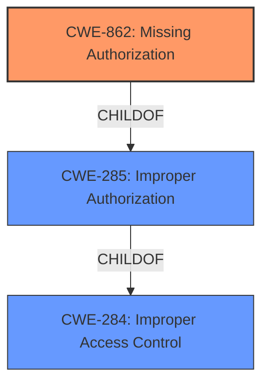

# Analysis for CVE-2021-40005

# Summary

| CWE ID | CWE Name | Confidence | CWE Abstraction Level | CWE Vulnerability Mapping Label | CWE-Vulnerability Mapping Notes |
|---|---|---|---|---|---|
| CWE-862 | Missing Authorization | 0.8 | Base | Primary | Allowed |
| CWE-285 | Improper Authorization | 0.6 | Class | Secondary | Discouraged |
| CWE-284 | Improper Access Control | 0.5 | Pillar | Secondary | Discouraged |

## Evidence and Confidence

*   **Confidence Score:** 0.8
*   **Evidence Strength:** MEDIUM

## Relationship Analysis
The primary CWE selected is CWE-862, which is a more specific child of CWE-285 (Improper Authorization), which itself is a child of CWE-284 (Improper Access Control). The relationship analysis helped refine the selection from the high-level CWE-284 to the more specific base-level CWE-862.

## Vulnerability Chain
The vulnerability chain begins with the **vulnerability in data access control**, which leads to a lack of proper authorization, ultimately affecting data confidentiality.
  - Root Cause: **Vulnerability in data access control**
  - Weakness: Missing Authorization (CWE-862)
  - Impact: Data confidentiality affected

## Summary of Analysis
The initial analysis identified a "**vulnerability in data access control**" that may affect data confidentiality. This description is broad, but the phrase points toward issues with authorization.

The Retriever Results suggested CWE-285 (Improper Authorization) and CWE-284 (Improper Access Control) as potential matches. However, the mapping guidance for both CWEs discourages their use because they are high-level. The guidance recommends considering their children.

Given the limited information, I am selecting CWE-862 (Missing Authorization) as the primary CWE because it is a more specific child of CWE-285 and CWE-284. The vulnerability description indicates that the data access control is flawed, suggesting that authorization checks may be missing entirely.

The evidence supporting this decision comes directly from the "**vulnerability in data access control**" phrase in the Vulnerability Description Key Phrases section.

The confidence level is 0.8 because the description is somewhat vague. A more detailed description would allow for a more precise mapping.

Relevant CWE Information:

# Enhanced Context (25 CWEs)

## CWE-798: Use of Hard-coded Credentials
**Abstraction Level**: Base
**Similarity Score**: 0.79
**Source**: dense

**Description**:
The product contains hard-coded credentials, such as a password or cryptographic key.

**Mapping Guidance**:
- Usage: Allowed
- Rationale: This CWE entry is at the Base level of abstraction, which is a preferred level of abstraction for mapping to the root causes of vulnerabilities.

*   **Why it was not selected**: While hardcoded credentials could be a contributing factor to a data access control vulnerability, the provided description does not explicitly mention credentials. Therefore, this CWE is not appropriate.

## CWE-807: Reliance on Untrusted Inputs in a Security Decision
**Abstraction Level**: Base
**Similarity Score**: 0.79
**Source**: dense

**Description**:
The product uses a protection mechanism that relies on the existence or values of an input, but the input can be modified by an untrusted actor in a way that bypasses the protection mechanism.

**Mapping Guidance**:
- Usage: Allowed
- Rationale: This CWE entry is at the Base level of abstraction, which is a preferred level of abstraction for mapping to the root causes of vulnerabilities.

*   **Why it was not selected**: The description does not specify that untrusted inputs are used in security decisions, so this CWE is not appropriate.

## CWE-1220: Insufficient Granularity of Access Control
**Abstraction Level**: Base
**Similarity Score**: 0.78
**Source**: dense

**Description**:
The product implements access controls via a policy or other feature with the intention to disable or restrict accesses (reads and/or writes) to assets in a system from untrusted agents. However, implemented access controls lack required granularity, which renders the control policy too broad because it allows accesses from unauthorized agents to the security-sensitive assets.

**Mapping Guidance**:
- Usage: Allowed
- Rationale: This CWE entry is at the Base level of abstraction, which is a preferred level of abstraction for mapping to the root causes of vulnerabilities.

*   **Why it was not selected**: The description does not specify that there is insufficient granularity in the access control, so this CWE is not appropriate.

## CWE-274: Improper Handling of Insufficient Privileges
**Abstraction Level**: Base
**Similarity Score**: 0.78
**Source**: dense

**Description**:
The product does not handle or incorrectly handles when it has insufficient privileges to perform an operation, leading to resultant weaknesses.

**Mapping Guidance**:
- Usage: Discouraged
- Rationale: This CWE entry could be deprecated in a future version of CWE.

*   **Why it was not selected**: The description does not focus on insufficient privileges, so this CWE is not appropriate.

## CWE-280: Improper Handling of Insufficient Permissions or Privileges
**Abstraction Level**: Base
**Similarity Score**: 0.78
**Source**: dense

**Description**:
The product does not handle or incorrectly handles when it has insufficient privileges to access resources or functionality as specified by their permissions. This may cause it to follow unexpected code paths that may leave the product in an invalid state.

**Mapping Guidance**:
- Usage: Allowed
- Rationale: This CWE entry is at the Base level of abstraction, which is a preferred level of abstraction for mapping to the root causes of vulnerabilities.

*   **Why it was not selected**: The description does not focus on insufficient permissions or privileges, so this CWE is not appropriate.

## CWE-1391: Use of Weak Credentials
**Abstraction Level**: Class
**Similarity Score**: 0.77
**Source**: dense

**Description**:
The product uses weak credentials (such as a default key or hard-coded password) that can be calculated, derived, reused, or guessed by an attacker.

**Mapping Guidance**:
- Usage: Allowed-with-Review
- Rationale: This CWE entry is a Class and might have Base-level children that would be more appropriate

*   **Why it was not selected**: While weak credentials could be a contributing factor to a data access control vulnerability, the provided description does not explicitly mention credentials. Therefore, this CWE is not appropriate.

## CWE-653: Improper Isolation or Compartmentalization
**Abstraction Level**: Class
**Similarity Score**: 0.77
**Source**: dense

**Description**:
The product does not properly compartmentalize or isolate functionality, processes, or resources that require different privilege levels, rights, or permissions.

**Mapping Guidance**:
- Usage: Allowed
- Rationale: This CWE entry is at the Base level of abstraction, which is a preferred level of abstraction for mapping to the root causes of vulnerabilities.

*   **Why it was not selected**: The description does not specify that there is improper isolation or compartmentalization, so this CWE is not appropriate.

## CWE-303: Incorrect Implementation of Authentication Algorithm
**Abstraction Level**: Base
**Similarity Score**: 0.77
**Source**: dense

**Description**:
The requirements for the product dictate the use of an established authentication algorithm, but the implementation of the algorithm is incorrect.

**Mapping Guidance**:
- Usage: Allowed
- Rationale: This CWE entry is at the Base level of abstraction, which is a preferred level of abstraction for mapping to the root causes of vulnerabilities.

*   **Why it was not selected**: The description does not specify that there is an incorrect implementation of an authentication algorithm, so this CWE is not appropriate.

## CWE-657: Violation of Secure Design Principles
**Abstraction Level**: Class
**Similarity Score**: 0.77
**Source**: dense

**Description**:
The product violates well-established principles for secure design.

**Mapping Guidance**:
- Usage: Discouraged
- Rationale: This CWE entry is a level-1 Class (i.e., a child of a Pillar). It might have lower-level children that would be more appropriate

*   **Why it was not selected**: This is a very broad CWE, and the information provided is not sufficient to determine if it applies.

## CWE-668: Exposure of Resource to Wrong Sphere
**Abstraction Level**: Class
**Similarity Score**: 0.76
**Source**: dense

**Description**: