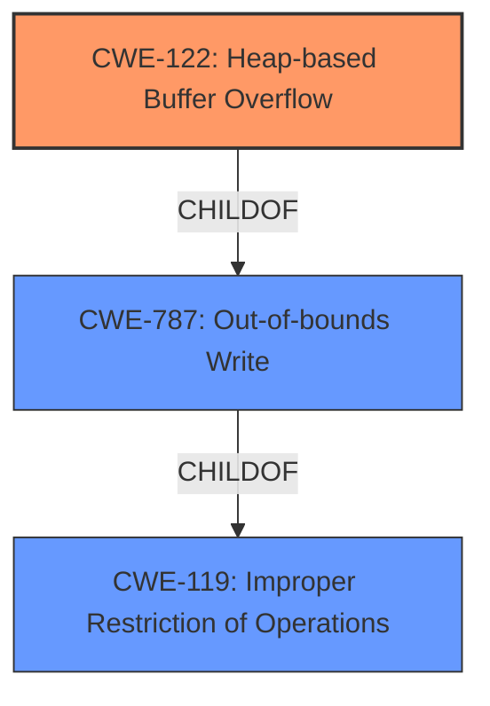

# Enhanced Analysis for CVE-2021-40058

# Summary
| CWE ID    | CWE Name                                                         | Confidence | CWE Abstraction Level | CWE Vulnerability Mapping Label | CWE-Vulnerability Mapping Notes |
| --------- | ---------------------------------------------------------------- | ---------- | --------------------- | ------------------------------- | ------------------------------- |
| CWE-122   | Heap-based Buffer Overflow                                       | 0.9        | Variant               | Allowed                         | Primary CWE                     |
| CWE-787   | Out-of-bounds Write                                               | 0.7        | Base                  | Allowed                         | Secondary Candidate             |
| CWE-119   | Improper Restriction of Operations within the Bounds of a Memory Buffer | 0.6        | Class                   | Discouraged                   | Secondary Candidate             |

## Evidence and Confidence

*   **Confidence Score:** 0.9
*   **Evidence Strength:** HIGH

## Relationship Analysis
The primary relationship that influenced the selection was the ChildOf relationship between CWE-122 (Heap-based Buffer Overflow) and CWE-787 (Out-of-bounds Write). CWE-122 is a more specific variant of CWE-787, indicating the location of the buffer overflow. CWE-119 (Improper Restriction of Operations within the Bounds of a Memory Buffer) is a parent Class of both CWE-122 and CWE-787, representing a broader category of memory safety issues. The abstraction levels guided the selection of CWE-122 as the most specific and relevant CWE, with CWE-787 and CWE-119 considered as broader, less specific alternatives.



## Vulnerability Chain
The vulnerability chain starts with a **heap-based buffer overflow** due to **incorrect handling of buffer sizes** within the video framework. This leads to an out-of-bounds write, which corrupts memory and ultimately affects the availability of the system, potentially causing a denial-of-service condition.

## Summary of Analysis
The initial analysis focused on the **heap-based buffer overflow** description in the vulnerability report. The key phrases "heap-based buffer overflow" strongly suggest CWE-122. The CVE Reference Links Content Summary confirms the presence of a **heap-based buffer overflow** due to **incorrect handling of buffer sizes** within the video framework, leading to potential memory corruption and denial of service.

The retriever results also point to CWE-119, CWE-190, CWE-122, CWE-131 and CWE-125 as potential candidates, but upon review of their descriptions, CWE-122 appears to be the most accurate.

CWE-122 is chosen as the primary CWE because the description explicitly mentions a "heap-based buffer overflow." This aligns perfectly with the CWE's definition: "A heap overflow condition is a buffer overflow, where the buffer that can be overwritten is allocated in the heap portion of memory."

CWE-787 (Out-of-bounds Write) is considered as a secondary CWE because heap-based buffer overflows inherently involve writing data beyond the intended boundaries of a buffer.

CWE-119 is considered but ultimately deemed too general. While it encompasses buffer overflows, it does not provide the specificity of CWE-122 in terms of the memory allocation location (heap).

The final decision is based on the explicit mention of "heap-based buffer overflow" in the vulnerability description and the accurate representation of this weakness by CWE-122. The chosen CWEs are at the optimal level of specificity, with CWE-122 providing the most accurate and detailed classification of the vulnerability.
The evidence for this is "Root cause of vulnerability: **Heap-based buffer overflow** in the video framework."

Relevant CWE Information:
# Enhanced Context (25 CWEs)
The following CWEs were identified as potentially relevant to this vulnerability:

## CWE-805: Buffer Access with Incorrect Length Value
**Abstraction Level**: Base
**Similarity Score**: 0.79
**Source**: dense

**Description**:
The product uses a sequential operation to read or write a buffer, but it uses an incorrect length value that causes it to access memory that is outside of the bounds of the buffer.

**Mapping Guidance**:
- Usage: Allowed
- Rationale: This CWE entry is at the Base level of abstraction, which is a preferred level of abstraction for mapping to the root causes of vulnerabilities.

## CWE-131: Incorrect Calculation of Buffer Size
**Abstraction Level**: Base
**Similarity Score**: 0.78
**Source**: dense

**Description**:
The product does not correctly calculate the size to be used when allocating a buffer, which could lead to a buffer overflow.

**Mapping Guidance**:
- Usage: Allowed
- Rationale: This CWE entry is at the Base level of abstraction, which is a preferred level of abstraction for mapping to the root causes of vulnerabilities.

## CWE-191: Integer Underflow (Wrap or Wraparound)
**Abstraction Level**: Base
**Similarity Score**: 0.78
**Source**: dense

**Description**:
The product subtracts one value from another, such that the result is less than the minimum allowable integer value, which produces a value that is not equal to the correct result.

**Mapping Guidance**:
- Usage: Allowed
- Rationale: This CWE entry is at the Base level of abstraction, which is a preferred level of abstraction for mapping to the root causes of vulnerabilities.

## CWE-124: Buffer Underwrite ('Buffer Underflow')
**Abstraction Level**: Base
**Similarity Score**: 0.78
**Source**: dense

**Description**:
The product writes to a buffer using an index or pointer that references a memory location prior to the beginning of the buffer.

**Mapping Guidance**:
- Usage: Allowed
- Rationale: This CWE entry is at the Base level of abstraction, which is a preferred level of abstraction for mapping to the root causes of vulnerabilities.

## CWE-126: Buffer Over-read
**Abstraction Level**: Variant
**Similarity Score**: 0.77
**Source**: dense

**Description**:
The product reads from a buffer using buffer access mechanisms such as indexes or pointers that reference memory locations after the targeted buffer.

**Mapping Guidance**:
- Usage: Allowed
- Rationale: This CWE entry is at the Variant level of abstraction, which is a preferred level of abstraction for mapping to the root causes of vulnerabilities.

## CWE-127: Buffer Under-read
**Abstraction Level**: Variant
**Similarity Score**: 0.76
**Source**: dense

**Description**:
The product reads from a buffer using buffer access mechanisms such as indexes or pointers that reference memory locations prior to the targeted buffer.

**Mapping Guidance**:
- Usage: Allowed
- Rationale: This CWE entry is at the Variant level of abstraction, which is a preferred level of abstraction for mapping to the root causes of vulnerabilities.

## CWE-193: Off-by-one Error
**Abstraction Level**: Base
**Similarity Score**: 0.76
**Source**: dense

**Description**:
A product calculates or uses an incorrect maximum or minimum value that is 1 more, or 1 less, than the correct value.

**Mapping Guidance**:
- Usage: Allowed
- Rationale: This CWE entry is at the Base level of abstraction, which is a preferred level of abstraction for mapping to the root causes of vulnerabilities.

## CWE-680: Integer Overflow to Buffer Overflow
**Abstraction Level**: Compound
**Similarity Score**: 0.76
**Source**: dense

**Description**:
The product performs a calculation to determine how much memory to allocate, but an integer overflow can occur that causes less memory to be allocated than expected, leading to a buffer overflow.

**Mapping Guidance**:
- Usage: Discouraged
- Rationale: This CWE entry is a named chain, which combines multiple weaknesses.

## CWE-125: Out-of-bounds Read
**Abstraction Level**: Base
**Similarity Score**: 0.76
**Source**: dense

**Description**:
The product reads data past the end, or before the beginning, of the intended buffer.

**Mapping Guidance**:
- Usage: Allowed
- Rationale: This CWE entry is at the Base level of abstraction, which is a preferred level of abstraction for mapping to the root causes of vulnerabilities.

## CWE-197: Numeric Truncation Error
**Abstraction Level**: Base
**Similarity Score**: 0.75
**Source**: dense

**Description**:
Truncation errors occur when a primitive is cast to a primitive of a smaller size and data is lost in the conversion.

**Mapping Guidance**:
- Usage: Allowed
- Rationale: This CWE entry is at the Base level


## CWE Relationship Analysis

Current CWEs represent these abstraction levels: .


### Vulnerability Chain Analysis

**Chain starting from CWE-190:**
- 190 (Integer Overflow or Wraparound) - ROOT


**Chain starting from CWE-131:**
- 131 (Incorrect Calculation of Buffer Size) - ROOT


### CWE Relationship Diagram

```mermaid
graph TD
    classDef primary fill:#f96,stroke:#333,stroke-width:2px
    classDef secondary fill:#69f,stroke:#333
    classDef tertiary fill:#9e9,stroke:#333
```