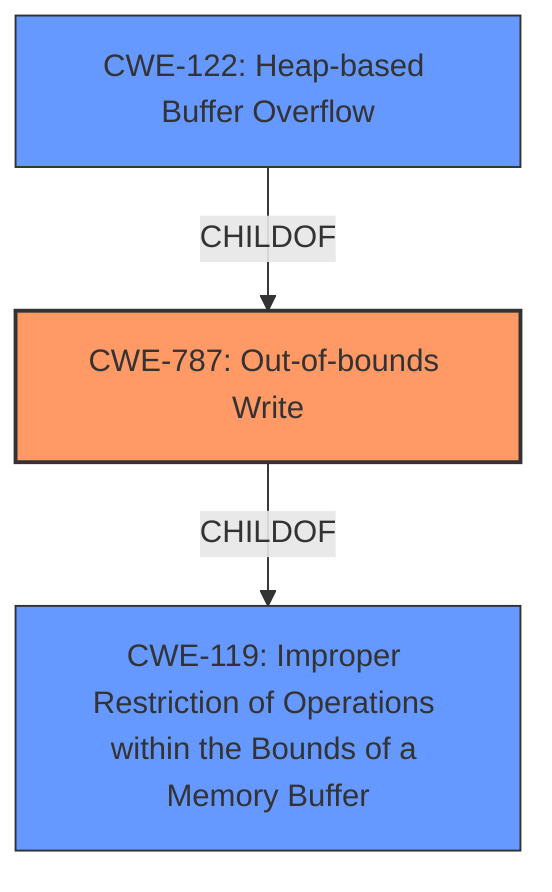

# Analysis Report for CVE-2021-40060

# Vulnerability Analysis Report: CVE-2021-40060

## Description


## Analysis (with Relationship Data)

# Summary
| CWE ID | CWE Name | Confidence | CWE Abstraction Level | CWE Vulnerability Mapping Label | CWE-Vulnerability Mapping Notes |
|---|---|---|---|---|---|
| CWE-787 | Out-of-bounds Write | 1.0 | Base | Primary | Allowed |
| CWE-122 | Heap-based Buffer Overflow | 0.7 | Variant | Secondary | Allowed |
| CWE-119 | Improper Restriction of Operations within the Bounds of a Memory Buffer | 0.5 | Class | Secondary | Discouraged |

## Evidence and Confidence

*   **Confidence Score:** 0.8
*   **Evidence Strength:** HIGH

## Relationship Analysis
The primary CWE is CWE-787, which represents the **out-of-bounds write**. CWE-122, a **heap-based buffer overflow**, is a variant of CWE-787, further specifying the location of the overflow. CWE-119 is a more general class that encompasses various memory boundary errors, including out-of-bounds reads and writes. The relationship is hierarchical: CWE-787 is a specific type of CWE-119, and CWE-122 is a specific type of CWE-787, indicating the memory allocation type. The abstraction levels influenced the decision to select the most specific CWE-787 as primary.



## Vulnerability Chain
The vulnerability chain involves a **heap-based buffer overflow** (root cause) leading to a potential impact on availability.

## Summary of Analysis
The initial assessment identified a **heap-based buffer overflow** vulnerability in the video framework, potentially affecting availability. The primary CWE match suggested was CWE-NVD-noinfo, which is not specific enough. The top CWEs included CWE-787 and CWE-20, suggesting further investigation. The retriever results also highlighted CWE-119, CWE-190, and CWE-122.

Based on the evidence, CWE-787 (Out-of-bounds Write) is the most appropriate primary CWE. The vulnerability description explicitly mentions "heap-based buffer overflow," indicating a write operation (**heap-based buffer overflow**) outside the intended buffer boundaries. This aligns perfectly with the definition of CWE-787.

CWE-122 (Heap-based Buffer Overflow) is a valid secondary consideration as it specifies the location of the buffer overflow (heap).

CWE-119 (Improper Restriction of Operations within the Bounds of a Memory Buffer) is a more general category and, while applicable, is less specific than CWE-787 and thus less ideal as the primary mapping.

The selection is based on the provided evidence: "There is a **heap-based buffer overflow** vulnerability in the video framework." This directly supports CWE-787 as the most specific and accurate representation of the vulnerability.

The selected CWEs are at the optimal level of specificity, with CWE-787 representing the root cause and CWE-122 providing additional context about the memory allocation.

Relevant CWE Information:

# Enhanced Context (25 CWEs)

## CWE-805: Buffer Access with Incorrect Length Value
**Abstraction Level**: Base
**Similarity Score**: 0.79
**Source**: dense

**Description**:
The product uses a sequential operation to read or write a buffer, but it uses an incorrect length value that causes it to access memory that is outside of the bounds of the buffer.

**Mapping Guidance**:
- Usage: Allowed
- Rationale: This CWE entry is at the Base level of abstraction, which is a preferred level of abstraction for mapping to the root causes of vulnerabilities.

*Not selected:* This CWE focuses on incorrect length values, which are not explicitly mentioned in the description.

## CWE-131: Incorrect Calculation of Buffer Size
**Abstraction Level**: Base
**Similarity Score**: 0.78
**Source**: dense

**Description**:
The product does not correctly calculate the size to be used when allocating a buffer, which could lead to a buffer overflow.

**Mapping Guidance**:
- Usage: Allowed
- Rationale: This CWE entry is at the Base level of abstraction, which is a preferred level of abstraction for mapping to the root causes of vulnerabilities.

*Not selected:* This CWE focuses on size calculation, which is not explicitly mentioned in the description.

## CWE-191: Integer Underflow (Wrap or Wraparound)
**Abstraction Level**: Base
**Similarity Score**: 0.78
**Source**: dense

**Description**:
The product subtracts one value from another, such that the result is less than the minimum allowable integer value, which produces a value that is not equal to the correct result.

**Mapping Guidance**:
- Usage: Allowed
- Rationale: This CWE entry is at the Base level of abstraction, which is a preferred level of abstraction for mapping to the root causes of vulnerabilities.

*Not selected:* This CWE focuses on integer underflow, which is not explicitly mentioned in the description.

## CWE-124: Buffer Underwrite ('Buffer Underflow')
**Abstraction Level**: Base
**Similarity Score**: 0.78
**Source**: dense

**Description**:
The product writes to a buffer using an index or pointer that references a memory location prior to the beginning of the buffer.

**Mapping Guidance**:
- Usage: Allowed
- Rationale: This CWE entry is at the Base level of abstraction, which is a preferred level of abstraction for mapping to the root causes of vulnerabilities.

*Not selected:* This CWE is about buffer underwrite, while the vulnerability is a buffer overflow.

## CWE-126: Buffer Over-read
**Abstraction Level**: Variant
**Similarity Score**: 0.77
**Source**: dense

**Description**:
The product reads from a buffer using buffer access mechanisms such as indexes or pointers that reference memory locations after the targeted buffer.

**Mapping Guidance**:
- Usage: Allowed
- Rationale: This CWE entry is at the Variant level of abstraction, which is a preferred level of abstraction for mapping to the root causes of vulnerabilities.

*Not selected:* This CWE is about buffer over-read, while the vulnerability is a buffer overflow.

## CWE-127: Buffer Under-read
**Abstraction Level**: Variant
**Similarity Score**: 0.76
**Source**: dense

**Description**:
The product reads from a buffer using buffer access mechanisms such as indexes or pointers that reference memory locations prior to the targeted buffer.

**Mapping Guidance**:
- Usage: Allowed
- Rationale: This CWE entry is at the Variant level of abstraction, which is a preferred level of abstraction for mapping to the root causes of vulnerabilities.

*Not selected:* This CWE is about buffer under-read, while the vulnerability is a buffer overflow.

## CWE-193: Off-by-one Error
**Abstraction Level**: Base
**Similarity Score**: 0.76
**Source**: dense

**Description**:
A product calculates or uses an incorrect maximum or minimum value that is 1 more, or 1 less, than the correct value.

**Mapping Guidance**:
- Usage: Allowed
- Rationale: This CWE entry is at the Base level of abstraction, which is a preferred level of abstraction for mapping to the root causes of vulnerabilities.

*Not selected:* This CWE focuses on off-by-one errors, which are not explicitly mentioned in the description.

## CWE-680: Integer Overflow to Buffer Overflow
**Abstraction Level**: Compound
**Similarity Score**: 0.76
**Source**: dense

**Description**:
The product performs a calculation to determine how much memory to allocate, but an integer overflow can occur that causes less memory to be allocated than expected, leading to a buffer overflow.

**Mapping Guidance**:
- Usage: Discouraged
- Rationale: This CWE entry is a named chain, which combines multiple weaknesses.

*Not selected:* While an integer overflow could potentially lead to a buffer overflow, it is not explicitly mentioned in the description. The description focuses solely on the buffer overflow itself.

## CWE-125: Out-of-bounds Read
**Abstraction Level**: Base
**Similarity Score**: 0.76
**Source**: dense

**Description**:
The product reads data past the end, or before the beginning, of the intended buffer.

**Mapping Guidance**:
- Usage: Allowed
- Rationale: This CWE entry is at the Base level of abstraction, which is a preferred level of abstraction for mapping to the root causes of vulnerabilities.

*Not selected:* This CWE is about out-of-bounds read, while the vulnerability is a buffer overflow (write


## CWE Relationship Analysis

Current CWEs represent these abstraction levels: .


### Vulnerability Chain Analysis

**Chain starting from CWE-190:**
- 190 (Integer Overflow or Wraparound) - ROOT


**Chain starting from CWE-131:**
- 131 (Incorrect Calculation of Buffer Size) - ROOT


### CWE Relationship Diagram

```mermaid
graph TD
    classDef primary fill:#f96,stroke:#333,stroke-width:2px
    classDef secondary fill:#69f,stroke:#333
    classDef tertiary fill:#9e9,stroke:#333
```


*Report generated on 2025-03-30 13:52:17*
