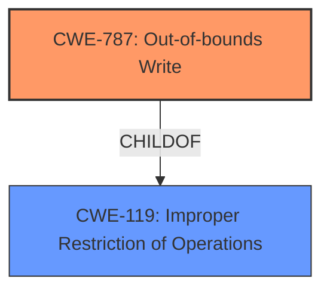

# Analysis for CVE-2021-40161

# Summary
| CWE ID    | CWE Name                        | Confidence | CWE Abstraction Level | CWE Vulnerability Mapping Label | CWE-Vulnerability Mapping Notes |
| --------- | ------------------------------- | ---------- | --------------------- | ------------------------------- | ------------------------------- |
| CWE-787   | Out-of-bounds Write             | 0.9        | Base                  | Allowed                        | Primary CWE                     |

## Evidence and Confidence

*   **Confidence Score:** 0.9
*   **Evidence Strength:** HIGH

## Relationship Analysis
The primary relationship that impacted my decision was the parent-child relationship between CWE-787 **CWE-787: Out-of-bounds Write** and CWE-119 **CWE-119: Improper Restriction of Operations**. CWE-787 is a base CWE, which is more specific than CWE-119. The retriever results did suggest other CWEs like CWE-122 **CWE-122: Heap-based Buffer Overflow**, CWE-843 **CWE-843: Access of Resource Using Incompatible Type ('Type Confusion')**, and CWE-190 **CWE-190: Integer Overflow or Wraparound**, but these did not have the same specific applicability as CWE-787.

## Vulnerability Chain
The vulnerability chain starts with the processing of a maliciously crafted DLL file by PDFTron, leading to **Memory Corruption** due to an out-of-bounds write, ultimately resulting in code execution.

## Summary of Analysis
The analysis is primarily based on the provided evidence, which explicitly states a "**Memory Corruption**" vulnerability that leads to code execution through maliciously crafted DLL files. The "CVE Reference Links Content Summary" reinforces this by detailing the **root cause** as a memory corruption vulnerability exploitable via maliciously crafted DLL files, leading to arbitrary code execution.

The retriever results highlight CWE-787 **CWE-787: Out-of-bounds Write** as the top candidate, with a score of 1.000. The description of CWE-787 directly matches the "**Memory Corruption**" aspect of the vulnerability, where data is written past the end or before the beginning of the intended buffer. The "Alternative Terms" section of CWE-787 even mentions that "**Memory Corruption**" is often used to describe the consequences of such writes.

The selection of CWE-787 is further justified by its "Mapping Guidance," which designates it as "Allowed" and notes that it's at the Base level of abstraction, which is preferred. The evidence strongly supports that the **root cause** is an out-of-bounds write, making CWE-787 the most specific and accurate classification.

Other CWEs were considered but deemed less suitable:

*   CWE-122 **CWE-122: Heap-based Buffer Overflow**: While buffer overflows can cause memory corruption, the description doesn't specifically indicate a heap-based overflow, making CWE-787 a more general and fitting classification.
*   CWE-843 **CWE-843: Access of Resource Using Incompatible Type ('Type Confusion')**: This involves accessing a resource with an incompatible type, which is not explicitly mentioned in the description.
*   CWE-190 **CWE-190: Integer Overflow or Wraparound**: This relates to integer overflows, which are not evident in the vulnerability description.

The choice of CWE-787 is at the optimal level of specificity because it accurately captures the **root cause** of the **Memory Corruption** vulnerability, as evidenced by the provided vulnerability description and supporting information.