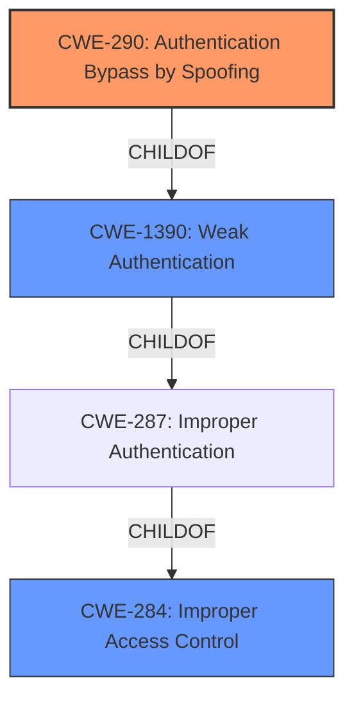

# Analysis Report for CVE-2021-40288

# Vulnerability Analysis Report: CVE-2021-40288

## Description


## Analysis (with Relationship Data)

# Summary
| CWE ID  | CWE Name                                            | Confidence | CWE Abstraction Level | CWE Vulnerability Mapping Label | CWE-Vulnerability Mapping Notes |
| :-------- | :-------------------------------------------------- | :--------- | :-------------------- | :------------------------------ | :------------------------------ |
| CWE-290 | Authentication Bypass by Spoofing | 0.85       | Base                  | Allowed                       | Primary CWE                     |
| CWE-284   | Improper Access Control                             | 0.65       | Pillar                  | Discouraged                   | Secondary Candidate             |
| CWE-1390  | Weak Authentication                               | 0.60       | Class                   | Allowed-with-Review           | Secondary Candidate             |

## Evidence and Confidence

*   **Confidence Score:** 0.80
*   **Evidence Strength:** MEDIUM

## Relationship Analysis
The primary relationship that influenced the decision was the child-of relationship between CWE-290 and CWE-1390, and the child-of relationship between CWE-1390 and CWE-287. CWE-290 is the most specific base-level CWE, while CWE-284 represents a higher-level, more general access control issue. CWE-1390 is a class-level CWE that represents weak authentication.



## Vulnerability Chain
The vulnerability chain starts with the **improper access control**, allowing an unauthenticated attacker to send spoofed authentication frames, leading to a denial of service.

## Summary of Analysis
The initial assessment, based on the provided evidence, points towards a weakness related to authentication and access control in the WPA2 and WPA3-SAE authentication methods. The vulnerability description clearly states that a remote unauthenticated attacker can disconnect a connected wireless client by sending spoofed authentication frames. This indicates a flaw in how the system authenticates or authorizes wireless clients.

The key phrase "rootcause: **improper access control**" directly supports the selection of CWE-290, "Authentication Bypass by Spoofing". The description of CWE-290 matches the vulnerability: "This attack-focused weakness is caused by incorrectly implemented authentication schemes that are subject to spoofing attacks." The attacker is spoofing authentication frames to cause a denial of service, which aligns perfectly with CWE-290.

CWE-284, "Improper Access Control," was considered, but it is a high-level Pillar CWE and is generally discouraged for direct mapping. While the root cause is related to access control, CWE-290 provides a more specific and accurate representation of the vulnerability.

CWE-1390, "Weak Authentication," was also considered. The description indicates that the authentication mechanism does not sufficiently prove that the claimed identity is correct. While this could be a contributing factor, the direct attack vector involves spoofing, making CWE-290 a more precise fit.

Therefore, the final decision is to assign CWE-290 as the primary CWE, representing the **authentication bypass by spoofing**. This is based on the evidence of the vulnerability description and the supporting definitions from the CWE specifications. The selection of CWE-290 is at the optimal level of specificity because it precisely describes the root cause and attack vector.


## CWE Relationship Analysis

Current CWEs represent these abstraction levels: .


### Vulnerability Chain Analysis

**Chain starting from CWE-1390:**
- 1390 (Weak Authentication) - ROOT


**Chain starting from CWE-290:**
- 290 (Authentication Bypass by Spoofing) - ROOT


### CWE Relationship Diagram

```mermaid
graph TD
    classDef primary fill:#f96,stroke:#333,stroke-width:2px
    classDef secondary fill:#69f,stroke:#333
    classDef tertiary fill:#9e9,stroke:#333
```


*Report generated on 2025-03-31 01:33:46*
