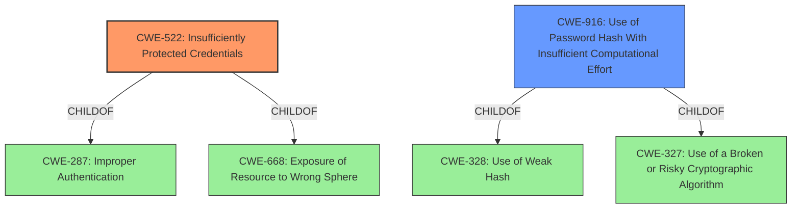

# Analysis for CVE-2021-40360

# Summary
| CWE ID | CWE Name | Confidence | CWE Abstraction Level | CWE Vulnerability Mapping Label | CWE-Vulnerability Mapping Notes |
|---|---|---|---|---|---|
| CWE-522 | Insufficiently Protected Credentials | 0.9 | Class | Allowed-with-Review | Primary CWE |
| CWE-916 | Use of Password Hash With Insufficient Computational Effort | 0.7 | Base | Allowed | Secondary CWE |

## Evidence and Confidence

*   **Confidence Score:** 0.8
*   **Evidence Strength:** HIGH

## Relationship Analysis
The primary CWE selected is CWE-522, which is a Class-level CWE. It has a ChildOf relationship to CWE-287 (Improper Authentication) and CWE-668 (Exposure of Resource to Wrong Sphere), indicating it's a specific type of authentication or information exposure issue. CWE-916 is a Base-level CWE and a child of CWE-328 (Use of Weak Hash) and CWE-327 (Use of a Broken or Risky Cryptographic Algorithm). The hierarchical relationship guided the selection, favoring CWE-522 as the broader, more encompassing issue, with CWE-916 representing a specific contributing factor.

## Vulnerability Chain
The vulnerability chain starts with the **exposure of the password hash** through a public API. This leads to **insufficient protection of credentials** (CWE-522). The **weakness** is that an attacker can then **brute force the password hash**. The impact is that the attacker can **login to the server**.

## Summary of Analysis
The analysis identified CWE-522 (Insufficiently Protected Credentials) as the primary weakness because the vulnerability allows an authenticated attacker to obtain the password hash of a local user account via a public API. This directly relates to the insecure handling of credentials. The evidence supporting this includes the "Vulnerability Description Key Phrases" which highlight the **rootcause** as "**public API to get password hash**" and the **weakness** as "**brute force the password hash**." Also the "CVE Reference Links Content Summary" states the "**Root cause of vulnerability:** The password hash of a local user account on the remote server can be accessed via a public API" and "**Weaknesses/vulnerabilities present:** Exposure of sensitive information (password hash) via a public API."

CWE-916 (Use of Password Hash With Insufficient Computational Effort) is included as a secondary weakness, as the ability to brute-force the password hash suggests that the hashing algorithm used might not be sufficiently strong, making it easier for attackers to crack the passwords.

The selection of CWE-522 is at the Class level, which is appropriate as it encapsulates the general issue of insufficiently protected credentials. While more specific Base or Variant CWEs could exist, the available information does not provide enough detail to pinpoint the exact mechanism of credential exposure. CWE-916 is at the Base level, providing a more specific view on the hashing algorithm itself.

CWE-799 (Improper Control of Interaction Frequency) was considered but not selected. Although the **weakness** includes **brute force the password hash**, the root cause is the exposure of the password hash. CWE-799 is more relevant when the vulnerability involves the frequency of interactions, such as an authentication routine that doesn't limit the number of password guesses. In this case, the primary issue is the accessibility of the password hash, not the rate at which it can be brute-forced.