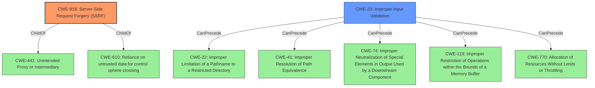

# Raw Analyzer Response for CVE-2021-40438

# Summary
| CWE ID | CWE Name | Confidence | CWE Abstraction Level | CWE Vulnerability Mapping Label | CWE-Vulnerability Mapping Notes |
|---|---|---|---|---|---|
| CWE-918 | Server-Side Request Forgery (SSRF) | 0.9 | Base | Primary | Allowed |
| CWE-20 | Improper Input Validation | 0.6 | Class | Secondary | Discouraged |

## Evidence and Confidence

*   **Confidence Score:** 0.75
*   **Evidence Strength:** HIGH

## Relationship Analysis
The primary CWE is CWE-918, a Base level weakness that describes Server-Side Request Forgery (SSRF). The secondary CWE is CWE-20, a Class level weakness that describes Improper Input Validation. CWE-918 is child of CWE-441 (Unintended Proxy or Intermediary) and CWE-610 (Reliance on untrusted data for control sphere crossing). CWE-20 can precede CWE-22 (Improper Limitation of a Pathname to a Restricted Directory ('Path Traversal')), CWE-41 (Improper Resolution of Path Equivalence), CWE-74 (Improper Neutralization of Special Elements in Output Used by a Downstream Component ('Injection')), CWE-119 (Improper Restriction of Operations within the Bounds of a Memory Buffer), and CWE-770 (Allocation of Resources Without Limits or Throttling).

## Vulnerability Chain
The vulnerability chain starts with **improper input sanitization** (CWE-20), which leads to the ability to forward requests to an attacker-chosen origin server (CWE-918). The chain highlights how failure to properly validate input can enable server-side request forgery.

## Summary of Analysis
My analysis identified CWE-918 as the primary weakness due to the **Server-Side Request Forgery** (SSRF) vulnerability in the `mod_proxy` module of the Apache HTTP Server. The vulnerability arises from **insufficient input validation** (CWE-20), allowing attackers to redirect requests to arbitrary servers. This assessment is based on the following evidence:

- **Vulnerability Description Key Phrases:** "rootcause: **improper input sanitization**," "impact: forward request to attacker-chosen origin server,"
- **CVE Reference Links Content Summary:** "The vulnerability is a Server-Side Request Forgery (SSRF) issue in the `mod_proxy` module of the Apache HTTP Server...The core vulnerability lies in the `mod_proxy` module not properly sanitizing or validating the target server specified in the crafted URI path."

The retriever results also listed CWE-918 as the top match. The relationship graph shows that **improper input validation** (CWE-20) can lead to various other vulnerabilities.

While CWE-20 is a relevant contributing factor, it is a broad class, and CWE-918 directly addresses the resulting SSRF vulnerability. Therefore, CWE-918 is the most specific and appropriate classification.

Relevant CWE Information:

# Enhanced Context (25 CWEs)
The following CWEs were identified as potentially relevant to this vulnerability:

## CWE-918: Server-Side Request Forgery (SSRF)
**CWE-918** (Server-Side Request Forgery (SSRF)) is the primary CWE because the vulnerability allows a crafted request URI path to cause `mod_proxy` to forward the request to an origin server chosen by the remote user. This matches the CWE-918 description: "The web server receives a URL or similar request from an upstream component and retrieves the contents of this URL, but it does not sufficiently ensure that the request is being sent to the expected destination." This can lead to information disclosure or other attacks, as the server makes requests to unintended locations. The Mapping Guidance allows the use of CWE-918.

## CWE-20: Improper Input Validation
**CWE-20** (Improper Input Validation) is a secondary CWE. The vulnerability stems from **improper input sanitization**, as indicated in the key phrases. The "CVE Reference Links Content Summary" states that the `mod_proxy` module is "not properly sanitizing or validating the target server specified in the crafted URI path." While CWE-20 is relevant, it is a broad Class-level CWE. The Mapping Guidance discourages its use when lower-level CWEs are available, and CWE-918 provides a more specific description of the resulting vulnerability.