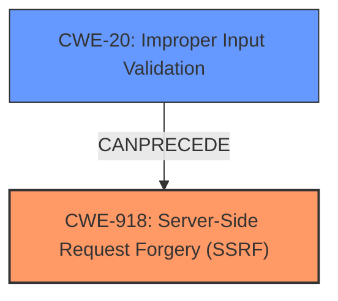

# Analysis Report for CVE-2021-40438

# Vulnerability Analysis Report: CVE-2021-40438

## Description


## Analysis (with Relationship Data)

# Summary
| CWE ID | CWE Name | Confidence | CWE Abstraction Level | CWE Vulnerability Mapping Label | CWE-Vulnerability Mapping Notes |
|---|---|---|---|---|---|
| CWE-918 | Server-Side Request Forgery (SSRF) | 1.0 | Base | Allowed | Primary CWE |
| CWE-20 | Improper Input Validation | 0.7 | Class | Discouraged | Secondary Candidate |

## Evidence and Confidence

*   **Confidence Score:** 0.9
*   **Evidence Strength:** HIGH

## Relationship Analysis
The primary relationship that influenced the CWE selection was the direct match of the vulnerability description to CWE-918 (Server-Side Request Forgery (SSRF)), which is a Base level CWE. While CWE-20 (Improper Input Validation) is a plausible contributing factor, it is a Class level CWE and less specific. CWE-918 is appropriate because the **improper input sanitization** leads directly to the server forwarding requests to an attacker-chosen origin, fitting the SSRF description precisely.



## Vulnerability Chain
The vulnerability chain starts with **improper input sanitization** which is a type of Improper Input Validation (CWE-20). This then leads to the core issue, which is the ability to cause mod_proxy to forward requests to an attacker-controlled server, resulting in Server-Side Request Forgery (CWE-918).
  - **Root Cause:** Improper Input Validation (CWE-20)
  - **Weakness:** Server-Side Request Forgery (CWE-918)
  - **Impact:** Forward request to attacker-chosen origin server.

## Summary of Analysis
The initial analysis identified CWE-918 as the primary weakness due to the direct correlation with the SSRF vulnerability described. The vulnerability description highlights that a crafted request URI-path allows mod_proxy to forward requests to an origin server chosen by the remote user. This directly aligns with the definition of CWE-918: "The web server receives a URL or similar request from an upstream component and retrieves the contents of this URL, but it does not sufficiently ensure that the request is being sent to the expected destination."

The **Vulnerability Description Key Phrases** section also mentions "**improper input sanitization**" as the root cause. The CVE reference links confirm that the `mod_proxy` module **does not properly sanitize or validate** the target server specified in the crafted URI path. This points to a lack of input validation, which could be represented by CWE-20.

While CWE-20 (Improper Input Validation) can be seen as a contributing factor, it is a more general weakness. CWE-918 more precisely describes the resulting vulnerability, making it the most appropriate primary CWE. The decision to include CWE-20 as a secondary weakness reflects its role as a prerequisite condition that enables the SSRF.

I am basing my assessment on the provided evidence, specifically:
- "A crafted request uri-path can cause mod_proxy to forward the request to an origin server choosen by the remote user."
- "**rootcause:** **improper input sanitization**"
- "The vulnerability is a Server-Side Request Forgery (SSRF) issue in the `mod_proxy` module of the Apache HTTP Server. A crafted request URI path allows an attacker to control the destination server where the request is forwarded via `mod_proxy`."

The selected CWEs are at the optimal level of specificity. CWE-918 is a Base level CWE, directly representing the SSRF vulnerability. CWE-20 is a Class level CWE, representing a high level weakness of improper validation.

Relevant CWE Information:

# Enhanced Context (25 CWEs)

## CWE-1289: Improper Validation of Unsafe Equivalence in Input
**Abstraction Level**: Base
**Similarity Score**: 0.75
**Source**: dense

**Description**:
The product receives an input value that is used as a resource identifier or other type of reference, but it does not validate or incorrectly validates that the input is equivalent to a potentially-unsafe value.

**Mapping Guidance**:
- Usage: Allowed
- Rationale: This CWE entry is at the Base level of abstraction, which is a preferred level of abstraction for mapping to the root causes of vulnerabilities.

## CWE-1288: Improper Validation of Consistency within Input
**Abstraction Level**: Base
**Similarity Score**: 0.72
**Source**: dense

**Description**:
The product receives a complex input with multiple elements or fields that must be consistent with each other, but it does not validate or incorrectly validates that the input is actually consistent.

**Mapping Guidance**:
- Usage: Allowed
- Rationale: This CWE entry is at the Base level of abstraction, which is a preferred level of abstraction for mapping to the root causes of vulnerabilities.

## CWE-807: Reliance on Untrusted Inputs in a Security Decision
**Abstraction Level**: Base
**Similarity Score**: 0.72
**Source**: dense

**Description**:
The product uses a protection mechanism that relies on the existence or values of an input, but the input can be modified by an untrusted actor in a way that bypasses the protection mechanism.

**Mapping Guidance**:
- Usage: Allowed
- Rationale: This CWE entry is at the Base level of abstraction, which is a preferred level of abstraction for mapping to the root causes of vulnerabilities.

## CWE-179: Incorrect Behavior Order: Early Validation
**Abstraction Level**: Base
**Similarity Score**: 0.71
**Source**: dense

**Description**:
The product validates input before applying protection mechanisms that modify the input, which could allow an attacker to bypass the validation via dangerous inputs that only arise after the modification.

**Mapping Guidance**:
- Usage: Allowed
- Rationale: This CWE entry is at the Base level of abstraction, which is a preferred level of abstraction for mapping to the root causes of vulnerabilities.

## CWE-184: Incomplete List of Disallowed Inputs
**Abstraction Level**: Base
**Similarity Score**: 0.70
**Source**: dense

**Description**:
The product implements a protection mechanism that relies on a list of inputs (or properties of inputs) that are not allowed by policy or otherwise require other action to neutralize before additional processing takes place, but the list is incomplete.

**Mapping Guidance**:
- Usage: Allowed
- Rationale: This CWE entry is at the Base level of abstraction, which is a preferred level of abstraction for mapping to the root causes of vulnerabilities.

## CWE-183: Permissive List of Allowed Inputs
**Abstraction Level**: Base
**Similarity Score**: 0.70
**Source**: dense

**Description**:
The product implements a protection mechanism that relies on a list of inputs (or properties of inputs) that are explicitly allowed by policy because the inputs are assumed to be safe, but the list is too permissive - that is, it allows an input that is unsafe, leading to resultant weaknesses.

**Mapping Guidance**:
- Usage: Allowed
- Rationale: This CWE entry is at the Base level of abstraction, which is a preferred level of abstraction for mapping to the root causes of vulnerabilities.

## CWE-115: Misinterpretation of Input
**Abstraction Level**: Base
**Similarity Score**: 0.70
**Source**: dense

**Description**:
The product misinterprets an input, whether from an attacker or another product, in a security-relevant fashion.

**Mapping Guidance**:
- Usage: Allowed
- Rationale: This CWE entry is at the Base level of abstraction, which is a preferred level of abstraction for mapping to the root causes of vulnerabilities.

## CWE-74: Improper Neutralization of Special Elements in Output Used by a Downstream Component ('Injection')
**Abstraction Level**: Class
**Similarity Score**: 0.70
**Source**: dense

**Description**:
The product constructs all or part of a command, data structure, or record using externally-influenced input from an upstream component, but it does not neutralize or incorrectly neutralizes special elements that could modify how it is parsed or interpreted when it is sent to a downstream component.

**Mapping Guidance**:
- Usage: Discouraged
- Rationale: CWE-74 is high-level and often misused when lower-level weaknesses are more appropriate.

## CWE-838: Inappropriate Encoding for Output Context
**Abstraction Level**: Base
**Similarity Score**: 0.70
**Source**: dense

**Description**:
The product uses or specifies an encoding when generating output to a downstream component, but the specified encoding is not the same as the encoding that is expected by the downstream component.

**Mapping Guidance**:
- Usage: Allowed
- Rationale: This CWE entry is at the Base level of abstraction, which is a preferred level of abstraction for mapping to the root causes of vulnerabilities.

## CWE-1173: Improper Use of Validation Framework
**Abstraction Level**: Base
**Similarity Score**:


## CWE Relationship Analysis

Current CWEs represent these abstraction levels: .


### Vulnerability Chain Analysis

**Chain starting from CWE-918:**
- 918 (Server-Side Request Forgery (SSRF)) - ROOT


**Chain starting from CWE-179:**
- 179 (Incorrect Behavior Order: Early Validation) - ROOT


### CWE Relationship Diagram

```mermaid
graph TD
    classDef primary fill:#f96,stroke:#333,stroke-width:2px
    classDef secondary fill:#69f,stroke:#333
    classDef tertiary fill:#9e9,stroke:#333
```


*Report generated on 2025-03-30 21:18:00*
