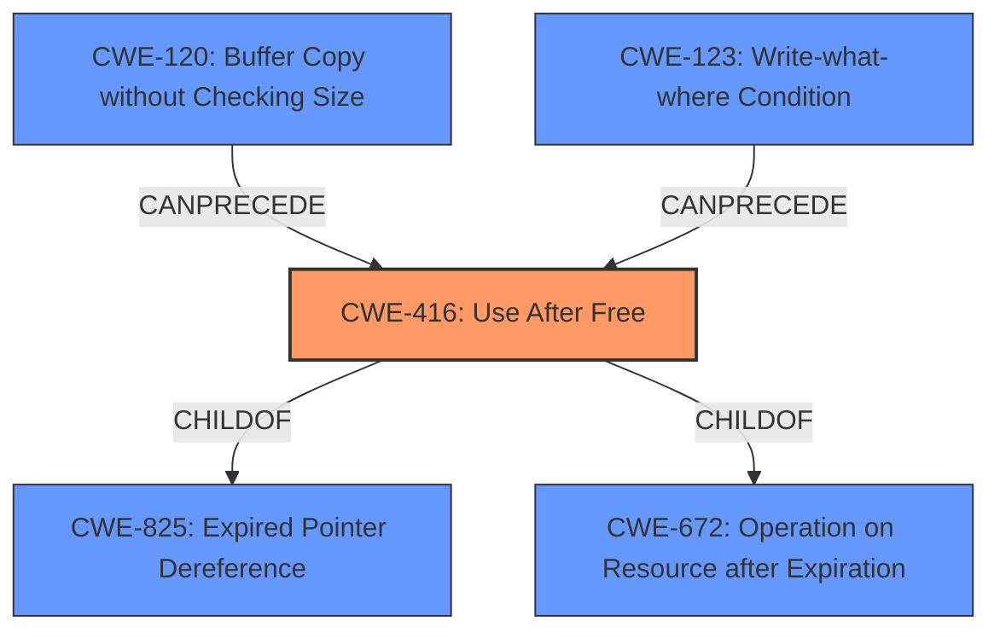

# Analysis for CVE-2021-4053

# Summary
| CWE ID | CWE Name | Confidence | CWE Abstraction Level | CWE Vulnerability Mapping Label | CWE-Vulnerability Mapping Notes |
|---|---|---|---|---|---|
| CWE-416 | Use After Free | 1.0 | Variant | Allowed | Primary CWE |

## Evidence and Confidence

*   **Confidence Score:** 1.0
*   **Evidence Strength:** HIGH

## Relationship Analysis
The primary relationship is the ChildOf relationship, where CWE-416 (Use After Free) is a child of CWE-825 (Expired Pointer Dereference) and CWE-672 (Operation on Resource after Expiration). This indicates that CWE-416 is a specific type of expired pointer dereference and operation on a resource after expiration, which aligns with the vulnerability description. There are also chain relationships, indicating that CWE-416 can be preceded by CWE-120 (Buffer Copy without Checking Size of Input) or CWE-123 (Write-what-where Condition). The Variant abstraction level of CWE-416 makes it a precise match for the vulnerability.

## Vulnerability Chain
The vulnerability chain starts with a **use after free** condition, leading to **heap corruption**. The attacker exploits this through a crafted HTML page.

## Summary of Analysis
The analysis is based on the provided evidence, which strongly supports the selection of CWE-416. The "Vulnerability Description Key Phrases" section clearly identifies "**rootcause:** **use after free**" and "**weakness:** **heap corruption**". The "CVE Reference Links Content Summary" confirms that the **root cause of the vulnerability** is a **use-after-free (UAF) error**. This direct evidence makes CWE-416 the most appropriate choice.

The retriever results also listed CWE-416 as the top candidate, reinforcing the initial assessment.

The chain relationships (CanPrecede) of CWE-416 suggest potential causes of the UAF condition (like CWE-120 or CWE-123), but those are not directly indicated in the evidence. Therefore, focusing on the direct cause, CWE-416, is the most accurate mapping.

The variant level of CWE-416 provides sufficient specificity for this vulnerability, making it the optimal choice.