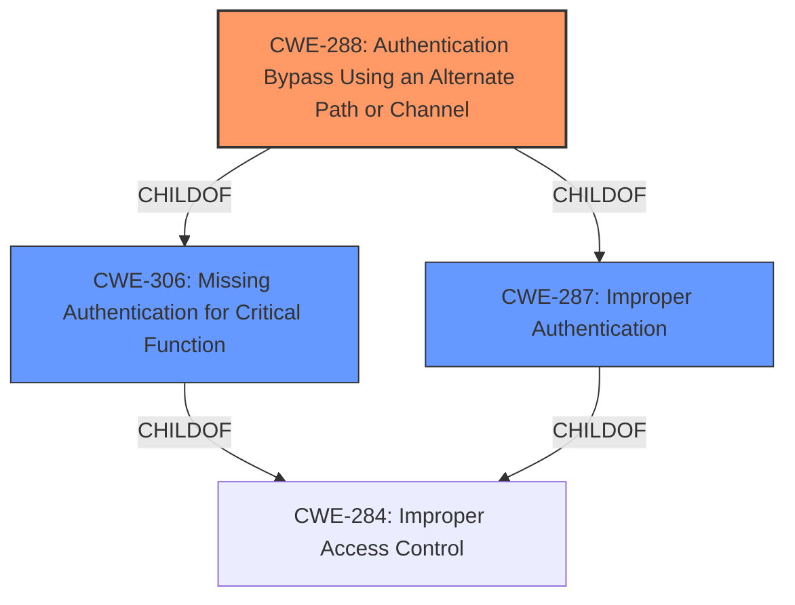

# Raw Analyzer Response for CVE-2021-40539

# Summary

| CWE ID | CWE Name | Confidence | CWE Abstraction Level | CWE Vulnerability Mapping Label | CWE-Vulnerability Mapping Notes |
|---|---|---|---|---|---|
| CWE-288 | Authentication Bypass Using an Alternate Path or Channel | 0.9 | Base | Allowed | Primary CWE |
| CWE-306 | Missing Authentication for Critical Function | 0.7 | Base | Allowed | Secondary Candidate |
| CWE-287 | Improper Authentication | 0.6 | Class | Discouraged | Secondary Candidate |

## Evidence and Confidence

*   **Confidence Score:** 0.9
*   **Evidence Strength:** HIGH

## Relationship Analysis
The primary CWE, CWE-288 Authentication Bypass Using an Alternate Path or Channel, is a child of CWE-306 Missing Authentication for Critical Function and CWE-287 Improper Authentication. This indicates a hierarchical relationship where CWE-288 is a more specific case of the more general authentication issues described by CWE-306 and CWE-287. The vulnerability description points to a specific alternate path being exploited to bypass authentication, making CWE-288 the most accurate selection.

## Vulnerability Chain
The vulnerability chain starts with the **improper URL normalization** leading to **authentication bypass**, which results in **remote code execution**.

## Summary of Analysis
The initial analysis focused on the **authentication bypass** vulnerability in Zoho ManageEngine ADSelfService Plus. The vulnerability description and CVE details clearly indicate that the system **fails to properly normalize URLs before validation, allowing specially crafted URLs to bypass the authentication filter.**

The primary CWE selected is CWE-288 Authentication Bypass Using an Alternate Path or Channel. This CWE accurately captures the vulnerability where an alternate path is used to bypass authentication. The CVE reference states, "The vulnerability lies in how ADSelfService Plus handles REST API URLs...the security filter responsible for authenticating REST API requests fails to properly normalize URLs before validation. This allows specially crafted URLs to bypass the authentication filter."

CWE-306 Missing Authentication for Critical Function was considered but not selected as the primary CWE because the system does have authentication in place, but it is being bypassed due to the URL normalization issue. CWE-288 is more specific in this case.

CWE-287 Improper Authentication was also considered, but it is a more general class of weakness. CWE-288 is a more specific instance of improper authentication, making it the better choice. The MITRE mapping guidance discourages the use of CWE-287 when lower-level CWEs are applicable.

The selection of CWE-288 is at the optimal level of specificity because it directly reflects the root cause of the vulnerability: the existence of an alternate path that bypasses the intended authentication mechanism.

Relevant CWE Information:

# Enhanced Context (25 CWEs)

## CWE-204: Observable Response Discrepancy
**Abstraction Level**: Base
**Similarity Score**: 0.80
**Source**: dense

**Description**:
The product provides different responses to incoming requests in a way that reveals internal state information to an unauthorized actor outside of the intended control sphere.
**Why it was not selected**: The primary issue is not about observable response discrepancy, but about bypassing authentication using an alternate path.

## CWE-41: Improper Resolution of Path Equivalence
**Abstraction Level**: Base
**Similarity Score**: 0.79
**Source**: dense

**Description**:
The product is vulnerable to file system contents disclosure through path equivalence. Path equivalence involves the use of special characters in file and directory names. The associated manipulations are intended to generate multiple names for the same object.
**Why it was not selected**: While path equivalence is mentioned in the CVE details, the core issue is not directly related to file system disclosure, but rather bypassing authentication using manipulated URLs.

## CWE-668: Exposure of Resource to Wrong Sphere
**Abstraction Level**: Class
**Similarity Score**: 0.78
**Source**: dense

**Description**:
The product exposes a resource to the wrong control sphere, providing unintended actors with inappropriate access to the resource.
**Why it was not selected**: Too general. The vulnerability is more specifically related to authentication bypass.

## CWE-807: Reliance on Untrusted Inputs in a Security Decision
**Abstraction Level**: Base
**Similarity Score**: 0.78
**Source**: dense

**Description**:
The product uses a protection mechanism that relies on the existence or values of an input, but the input can be modified by an untrusted actor in a way that bypasses the protection mechanism.
**Why it was not selected**: This is relevant, but CWE-288 is a more direct and specific description of the vulnerability.

## CWE-74: Improper Neutralization of Special Elements in Output Used by a Downstream Component ('Injection')
**Abstraction Level**: Class
**Similarity Score**: 0.77
**Source**: dense

**Description**:
The product constructs all or part of a command, data structure, or record using externally-influenced input from an upstream component, but it does not neutralize or incorrectly neutralizes special elements that could modify how it is parsed or interpreted when it is sent to a downstream component.
**Why it was not selected**: The vulnerability is not related to injection.

## CWE-23: Relative Path Traversal
**Abstraction Level**: Base
**Similarity Score**: 0.77
**Source**: dense

**Description**:
The product uses external input to construct a pathname that should be within a restricted directory, but it does not properly neutralize sequences such as ".." that can resolve to a location that is outside of that directory.
**Why it was not selected**: The vulnerability is not directly related to path traversal.

## CWE-1390: Weak Authentication
**Abstraction Level**: Class
**Similarity Score**: 0.77
**Source**: dense

**Description**:
The product uses an authentication mechanism to restrict access to specific users or identities, but the mechanism does not sufficiently prove that the claimed identity is correct.
**Why it was not selected**: While this could be a high-level description, CWE-288 is a more specific and accurate fit.

## CWE-303: Incorrect Implementation of Authentication Algorithm
**Abstraction Level**: Base
**Similarity Score**: 0.77
**Source**: dense

**Description**:
The requirements for the product dictate the use of an established authentication algorithm, but the implementation of the algorithm is incorrect.
**Why it was not selected**: There is no evidence that the authentication algorithm itself is implemented incorrectly.

## CWE-345: Insufficient Verification of Data Authenticity
**Abstraction Level**: Class
**Similarity Score**: 0.77
**Source**: dense

**Description**:
The product does not sufficiently verify the origin or authenticity of data, in a way that causes it to accept invalid data.
**Why it was not selected**: The primary issue is not data authenticity verification.

## CWE-203: Observable Discrepancy
**Abstraction Level**: Base
**Similarity Score**: 0.76
**Source**: dense

**Description**:
The product behaves differently or sends different responses under different circumstances in a way that is observable to an unauthorized actor, which exposes security-relevant information about the state of the product, such as whether a particular operation was successful or not.
**Why it was not selected**: The vulnerability is not related to observable discrepancies.

## CWE-918: Server-Side Request Forgery (SSRF)
**Abstraction Level**: Base
**Similarity Score**: 4535.70
**Source**: sparse

**Description**:
The web server receives a URL or similar request from an upstream component and retrieves the contents of this URL, but it does not sufficiently ensure that the request is being sent to the expected destination.
**Why it was not selected**: Not related to SSRF

## CWE-425: Direct Request ('Forced Browsing')
**Abstraction Level**: Base
**Similarity Score**: 4487.71
**Source**: sparse

**Description**:
The web application does not adequately enforce appropriate authorization on all restricted URLs, scripts, or files.
**Why it was not selected**: Very similar to CWE-288, but CWE-288 focuses on the authentication bypass, which is the core of this vulnerability.

## CWE-1390: Weak Authentication
**Abstraction Level**: Class
**Similarity Score**: 4