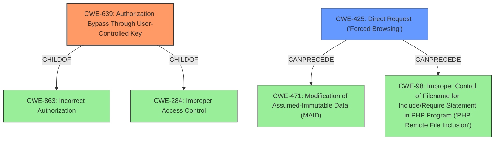

# Analysis Report for CVE-2021-40579

# Vulnerability Analysis Report: CVE-2021-40579

## Description


## Analysis (with Relationship Data)

# Summary
| CWE ID | CWE Name | Confidence | CWE Abstraction Level | CWE Vulnerability Mapping Label | CWE-Vulnerability Mapping Notes |
|---|---|---|---|---|---|
| CWE-639 | Authorization Bypass Through User-Controlled Key | 0.9 | Base | Allowed | Primary CWE |
| CWE-425 | Direct Request ('Forced Browsing') | 0.7 | Base | Allowed | Secondary Candidate |
| CWE-306 | Missing Authentication for Critical Function | 0.6 | Base | Allowed | Secondary Candidate |

## Evidence and Confidence

*   **Confidence Score:** 0.8
*   **Evidence Strength:** HIGH

## Relationship Analysis
The primary CWE, CWE-639, is a child of CWE-863 (Incorrect Authorization) and CWE-284 (Improper Access Control), reflecting a hierarchical relationship where CWE-639 is a more specific instance of a general authorization issue. CWE-425 (Direct Request) can precede CWE-471 (Modification of Assumed-Immutable Data) and CWE-98 (Improper Control of Filename for Include/Require Statement in PHP Program ('PHP Remote File Inclusion')), suggesting a possible chain of vulnerabilities where direct requests lead to further exploitation. The abstraction levels influenced the selection by favoring the more specific base-level CWEs over higher-level class or pillar CWEs when the evidence supported it.



## Vulnerability Chain
The vulnerability chain starts with **incorrect access control**, specifically an Insecure Direct Object Reference (IDOR).
  - The application **fails to properly authorize** access to resources based on a user-controlled key (`id` parameter).
  - This leads to unauthorized access to PII, manipulation of user data, and the ability to download receipts without authentication.

## Summary of Analysis
The primary assessment is based on the provided evidence, particularly the "CVE Reference Links Content Summary," which states: "The vulnerability is an Insecure Direct Object Reference (IDOR) due to the application using predictable IDs to access user resources. Specifically, the `id` parameter in the URL is directly used to fetch user data and admission details without proper authorization checks." This directly supports the selection of CWE-639 (Authorization Bypass Through User-Controlled Key).

The relationship analysis, especially the hierarchical structure, confirms that CWE-639 is the most specific and appropriate choice, being a base-level CWE that accurately represents the **root cause** of the vulnerability.

CWE-639 is chosen because the application's authorization **fails to prevent** one user from accessing another user's data by modifying the `id` parameter.

CWE-425 (Direct Request) is considered as a secondary CWE because the vulnerability involves direct manipulation of the URL to access resources. The application **does not adequately enforce authorization** on all restricted URLs, allowing an attacker to access resources directly by changing the `id` parameter.

CWE-306 (Missing Authentication for Critical Function) is considered as a secondary CWE because the attacker can download receipts without logging in. The application **does not perform any authentication** for the critical function of downloading receipts, allowing unauthorized access.

CWE-863 (Incorrect Authorization) was considered but not selected as the primary CWE because while the application performs an authorization check, it **does not correctly perform the check**, which is better described by CWE-639 and CWE-425.

CWE-284 (Improper Access Control) was considered but not selected as it is a high-level pillar CWE, and more specific base-level CWEs are available.

CWE-732 (Incorrect Permission Assignment for Critical Resource) was considered but not selected. The vulnerability is not about assigning wrong permissions, but about **failing to check** access based on a user-controlled key, making CWE-639 more appropriate.

CWE-472 (External Control of Assumed-Immutable Web Parameter) was considered because the `id` parameter could be seen as an assumed-immutable parameter. However, the core issue is the **lack of authorization** based on this parameter, not the modification of the parameter itself.

CWE-471 (Modification of Assumed-Immutable Data (MAID)) was considered but not selected as the core issue is the **lack of authorization**, not the modification of data.


## CWE Relationship Analysis

Current CWEs represent these abstraction levels: .


### Vulnerability Chain Analysis

**Chain starting from CWE-425:**
- 425 (Direct Request ('Forced Browsing')) - ROOT


**Chain starting from CWE-472:**
- 472 (External Control of Assumed-Immutable Web Parameter) - ROOT


### CWE Relationship Diagram

```mermaid
graph TD
    classDef primary fill:#f96,stroke:#333,stroke-width:2px
    classDef secondary fill:#69f,stroke:#333
    classDef tertiary fill:#9e9,stroke:#333
```


*Report generated on 2025-03-31 05:17:26*
