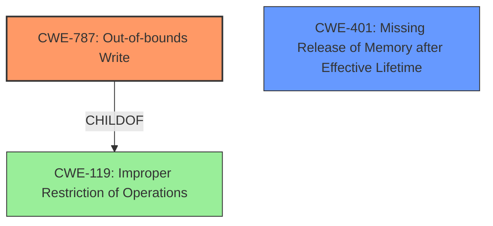

# Analysis Report for CVE-2021-40606

# Vulnerability Analysis Report: CVE-2021-40606

## Description


## Analysis (with Relationship Data)

# Summary
| CWE ID  | CWE Name                                                    | Confidence | CWE Abstraction Level | CWE Vulnerability Mapping Label | CWE-Vulnerability Mapping Notes |
| :-------- | :---------------------------------------------------------- | :--------- | :-------------------- | :------------------------------ | :------------------------------ |
| CWE-787 | Out-of-bounds Write                                         | 0.9        | Base                  | Primary                         | Allowed                       |
| CWE-401 | Missing Release of Memory after Effective Lifetime         | 0.6        | Variant               | Secondary                       | Allowed                       |

## Evidence and Confidence

*   **Confidence Score:** 0.8
*   **Evidence Strength:** MEDIUM

## Relationship Analysis
The primary weakness is CWE-787, which is a base-level CWE and a child of CWE-119. The secondary weakness is CWE-401, which indicates a memory leak scenario that can be a consequence of using uninitialized data. The tool classified several buffer over-read and integer overflow issues with reasonable retriever scores. However, the provided vulnerability details specifically mention an uninitialized data source being used in a `memcpy` operation leading to memory corruption. This directly relates to writing out of bounds. Therefore, selecting the base CWE-787 is the right level of abstraction.



## Vulnerability Chain
The vulnerability chain starts with the use of **uninitialized data** as a source in a `memcpy` operation. This leads to reading from an unknown memory address, resulting in memory corruption and an out-of-bounds write (CWE-787). The impact is a crash due to accessing invalid memory, leading to a denial of service. There's also a potential memory leak (CWE-401) if the uninitialized data includes pointers to allocated memory, which is never released because the program crashes before the memory can be freed.

## Summary of Analysis
The initial analysis focused on identifying the root cause of the vulnerability based on the provided description and CVE reference. The key phrase indicating the root cause is the "memcpy operation in `gf_bs_write_data` function in `src/utils/bitstream.c` where the source `data` is not initialized. This results in copying from an unknown memory address." This directly points to the use of uninitialized data in a memory operation, leading to memory corruption.

The evidence from the CVE Reference Links Content Summary is:
```
"root_cause": "The vulnerability is due to a memcpy operation in `gf_bs_write_data` function in `src/utils/bitstream.c` where the source `data` is not initialized. This results in copying from an unknown memory address.",
"weaknesses": [
  "Use of uninitialized data as a source for memcpy",
  "Memory corruption due to read of uninitialized memory"
],
```

The retriever results suggested CWE-401 (Missing Release of Memory after Effective Lifetime), CWE-125 (Out-of-bounds Read), and CWE-787 (Out-of-bounds Write). While the denial-of-service impact could suggest a memory leak (CWE-401), the primary issue is the memory corruption caused by the uninitialized data and the resulting out-of-bounds write (CWE-787). I am adding the memory leak as a secondary concern.

CWE-787 is the optimal level of specificity because it directly describes the memory corruption resulting from the uninitialized data being copied.
CWE-119 is too general and not specific enough to describe the **out-of-bounds write**.

Relevant CWE Information:

# Enhanced Context (25 CWEs)

## CWE-787: Out-of-bounds Write
**Abstraction**: base
**Similarity Score**: 3.89
**Source**: graph

**Description**:
CWE-787: Out-of-bounds Write

**Mapping Guidance**:
- Usage: Allowed
- Rationale: This CWE entry is at the Base level of abstraction, which is a preferred level of abstraction for mapping to the root causes of vulnerabilities.

**Relationships**:
- CANFOLLOW -> CWE-825
- CANFOLLOW -> CWE-824
- CANFOLLOW -> CWE-823
- CANFOLLOW -> CWE-822
- PARENTOF -> CWE-124

### Technical Explanation for CWE-787:
The vulnerability's details match CWE-787 because the **memcpy** operation with **uninitialized source data** leads to writing data outside the intended buffer's boundaries. This can overwrite critical program data, leading to unpredictable behavior or a crash. The security implication is memory corruption, potentially leading to a denial of service. CWE-787 is a child of CWE-119 (Improper Restriction of Operations within the Bounds of a Memory Buffer), but CWE-787 is more specific and accurately describes the vulnerability. The official MITRE mapping guidance allows the use of CWE-787.

### Technical Explanation for CWE-401:
The vulnerability's details suggest a potential memory leak (CWE-401) if the uninitialized data includes pointers to allocated memory, which is never released because the program crashes before the memory can be freed.

### Explanation of CWEs Considered But Not Used:
- **CWE-119 (Improper Restriction of Operations within the Bounds of a Memory Buffer):** While related, CWE-119 is a more general class. CWE-787 is a more specific base CWE that directly describes the out-of-bounds write.
- **CWE-125 (Out-of-bounds Read):** While reading uninitialized memory is part of the process, the core issue is writing that uninitialized data to an unintended location, making CWE-787 more relevant.
- **CWE-190 (Integer Overflow or Wraparound), CWE-197 (Numeric Truncation Error):** These CWEs are related to numeric errors and are not directly relevant to the core issue of using uninitialized data in a `memcpy` operation.
- **CWE-120 (Buffer Copy without Checking Size of Input ('Classic Buffer Overflow'))**: While a buffer overflow can occur, the root cause is not a missing size check, but copying uninitialized memory into a buffer.


## CWE Relationship Analysis

Current CWEs represent these abstraction levels: .


### Vulnerability Chain Analysis

**Chain starting from CWE-190:**
- 190 (Integer Overflow or Wraparound) - ROOT


**Chain starting from CWE-825:**
- 825 (Expired Pointer Dereference) - ROOT


### CWE Relationship Diagram

```mermaid
graph TD
    classDef primary fill:#f96,stroke:#333,stroke-width:2px
    classDef secondary fill:#69f,stroke:#333
    classDef tertiary fill:#9e9,stroke:#333
```


*Report generated on 2025-03-31 06:43:02*
