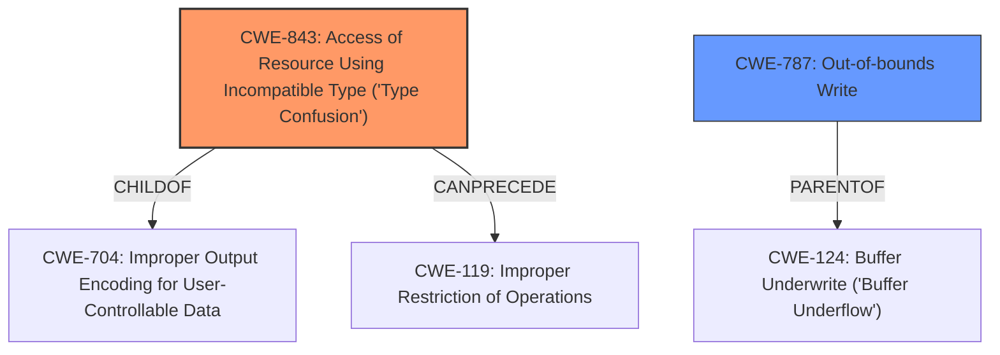

# Analysis Report for CVE-2021-4061

# Vulnerability Analysis Report: CVE-2021-4061

## Description


## Analysis (with Relationship Data)

# Summary
| CWE ID  | CWE Name                                                                  | Confidence | CWE Abstraction Level | CWE Vulnerability Mapping Label | CWE-Vulnerability Mapping Notes |
| :-------- | :------------------------------------------------------------------------ | :--------- | :---------------------- | :------------------------------ | :-------------------------------- |
| CWE-843   | Access of Resource Using Incompatible Type ('Type Confusion')              | 1          | Base                    | Primary                         | Allowed                           |
| CWE-787   | Out-of-bounds Write                                                       | 0.7        | Base                    | Secondary                       | Allowed                           |

## Evidence and Confidence

*   **Confidence Score:** 0.85
*   **Evidence Strength:** HIGH

## Relationship Analysis

The primary CWE, CWE-843 [CWE-843: Access of Resource Using Incompatible Type ('Type Confusion')], is a base-level CWE, which is the preferred level of abstraction. It is related to CWE-704 [CWE-704: Improper Output Encoding for User-Controllable Data] as a child. CWE-843 [CWE-843: Access of Resource Using Incompatible Type ('Type Confusion')] can precede CWE-119 [CWE-119: Improper Restriction of Operations within the Bounds of a Memory Buffer].

CWE-787 [CWE-787: Out-of-bounds Write] is a base-level CWE and a common consequence of type confusion, particularly in memory-unsafe languages. It is a parent of CWE-124 [CWE-124: Buffer Underwrite ('Buffer Underflow')] and has multiple CANFOLLOW relationships with other CWEs relating to memory corruption and information exposure.



## Vulnerability Chain

The vulnerability chain starts with a **type confusion** in the V8 engine (CWE-843 [CWE-843: Access of Resource Using Incompatible Type ('Type Confusion')]), which can lead to heap corruption. This heap corruption can manifest as an out-of-bounds write (CWE-787 [CWE-787: Out-of-bounds Write]), allowing a remote attacker to potentially execute arbitrary code.

## Summary of Analysis

The initial assessment identified the **type confusion** as the root cause, which aligns with the description of CWE-843 [CWE-843: Access of Resource Using Incompatible Type ('Type Confusion')]. The vulnerability description specifically mentions "**confusion in V8**" and "**heap corruption**," supported by the CVE reference summary which mentions "**Type confusion**" as a weakness. The primary CWE match in "**CWE for similar CVE Descriptions**" is also CWE-843 [CWE-843: Access of Resource Using Incompatible Type ('Type Confusion')], which is strong evidence.

The Retriever Results also ranked CWE-843 [CWE-843: Access of Resource Using Incompatible Type ('Type Confusion')] as the top combined result with a score of 0.394.

CWE-787 [CWE-787: Out-of-bounds Write] was considered as a secondary CWE because heap corruption often involves out-of-bounds writes. While the description doesn't explicitly state an out-of-bounds write, the impact of heap corruption makes it a likely consequence.

The selected CWEs are at the optimal level of specificity, as they directly address the root cause (**type confusion**) and a likely consequence (**out-of-bounds write**) of the vulnerability.

Relevant CWE Information:

# Enhanced Context (25 CWEs)

## CWE-415: Double Free
**Abstraction Level**: Variant
**Similarity Score**: 0.79
**Source**: dense

**Description**:
The product calls free() twice on the same memory address, potentially leading to modification of unexpected memory locations.

**Mapping Guidance**:
- Usage: Allowed
- Rationale: This CWE entry is at the Variant level of abstraction, which is a preferred level of abstraction for mapping to the root causes of vulnerabilities.

*Rationale for not selecting*: While double free can lead to memory corruption, the vulnerability description focuses on type confusion as the root cause, making CWE-415 less relevant.

## CWE-226: Sensitive Information in Resource Not Removed Before Reuse
**Abstraction Level**: Base
**Similarity Score**: 0.77
**Source**: dense

**Description**:
The product releases a resource such as memory or a file so that it can be made available for reuse, but it does not clear or "zeroize" the information contained in the resource before the product performs a critical state transition or makes the resource available for reuse by other entities.

**Mapping Guidance**:
- Usage: Allowed
- Rationale: This CWE entry is at the Base level of abstraction, which is a preferred level of abstraction for mapping to the root causes of vulnerabilities.

*Rationale for not selecting*: This CWE is not relevant as the description does not indicate any issue with sensitive information.

## CWE-404: Improper Resource Shutdown or Release
**Abstraction Level**: Class
**Similarity Score**: 0.77
**Source**: dense

**Description**:
The product does not release or incorrectly releases a resource before it is made available for re-use.

**Mapping Guidance**:
- Usage: Allowed-with-Review
- Rationale: This CWE entry is a Class and might have Base-level children that would be more appropriate

*Rationale for not selecting*: This CWE is too general, and there is no indication that a resource is not being released.

## CWE-366: Race Condition within a Thread
**Abstraction Level**: Base
**Similarity Score**: 0.77
**Source**: dense

**Description**:
If two threads of execution use a resource simultaneously, there exists the possibility that resources may be used while invalid, in turn making the state of execution undefined.

**Mapping Guidance**:
- Usage: Allowed
- Rationale: This CWE entry is at the Base level of abstraction, which is a preferred level of abstraction for mapping to the root causes of vulnerabilities.

*Rationale for not selecting*: While race conditions can contribute to vulnerabilities, there is no evidence to suggest that a race condition is involved in this type confusion vulnerability.

## CWE-191: Integer Underflow (Wrap or Wraparound)
**Abstraction Level**: Base
**Similarity Score**: 0.76
**Source**: dense

**Description**:
The product subtracts one value from another, such that the result is less than the minimum allowable integer value, which produces a value that is not equal to the correct result.

**Mapping Guidance**:
- Usage: Allowed
- Rationale: This CWE entry is at the Base level of abstraction, which is a preferred level of abstraction for mapping to the root causes of vulnerabilities.

*Rationale for not selecting*: There's no indication of integer underflow.

## CWE-131: Incorrect Calculation of Buffer Size
**Abstraction Level**: Base
**Similarity Score**: 0.76
**Source**: dense

**Description**:
The product does not correctly calculate the size to be used when allocating a buffer, which could lead to a buffer overflow.

**Mapping Guidance**:
- Usage: Allowed
- Rationale: This CWE entry is at the Base level of abstraction, which is a preferred level of abstraction for mapping to the root causes of vulnerabilities.

*Rationale for not selecting*: There's no evidence of incorrect buffer size calculation.

## CWE-667: Improper Locking
**Abstraction Level**: Class
**Similarity Score**: 0.76
**Source**: dense

**Description**:
The product does not properly acquire or release a lock on a resource, leading to unexpected resource state changes and behaviors.

**Mapping Guidance**:
- Usage: Allowed-with-Review
- Rationale: This CWE entry is a Class and might have Base-level children that would be more appropriate

*Rationale for not selecting*: There's no evidence of locking issues.

## CWE-843: Access of Resource Using Incompatible Type ('Type Confusion')
**Abstraction Level**: Base
**Similarity Score**: 0.76
**Source**: dense

**Description**:
The product allocates or initializes a resource such as a pointer, object, or variable using one type, but it later accesses that resource using a type that is incompatible with the


## CWE Relationship Analysis

Current CWEs represent these abstraction levels: .


### Vulnerability Chain Analysis

**Chain starting from CWE-131:**
- 131 (Incorrect Calculation of Buffer Size) - ROOT


**Chain starting from CWE-226:**
- 226 (Sensitive Information in Resource Not Removed Before Reuse) - ROOT


### CWE Relationship Diagram

```mermaid
graph TD
    classDef primary fill:#f96,stroke:#333,stroke-width:2px
    classDef secondary fill:#69f,stroke:#333
    classDef tertiary fill:#9e9,stroke:#333
```


*Report generated on 2025-03-30 23:18:29*
