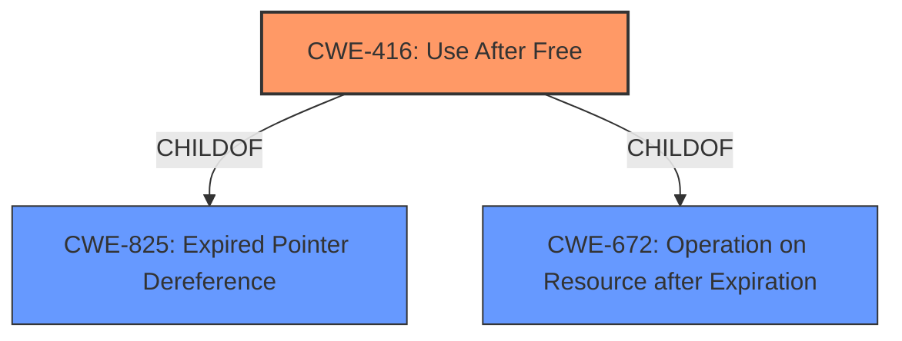

# Analysis Report for CVE-2021-4063

# Vulnerability Analysis Report: CVE-2021-4063

## Description


## Analysis (with Relationship Data)

# Summary
| CWE ID | CWE Name | Confidence | CWE Abstraction Level | CWE Vulnerability Mapping Label | CWE-Vulnerability Mapping Notes |
|---|---|---|---|---|---|
| CWE-416 | Use After Free | 1.0 | Variant | Allowed | Primary CWE |

## Evidence and Confidence

*   **Confidence Score:** 1.0
*   **Evidence Strength:** HIGH

## Relationship Analysis
The primary relationship considered was the ChildOf relationship, particularly how CWE-416 is a variant of CWE-825 (Expired Pointer Dereference), CWE-672 (Operation on Resource after Expiration). The description strongly points to a Use After Free condition, making CWE-416 the most appropriate variant. Other CWEs like CWE-123, CWE-415, and CWE-787 were considered but deemed less directly relevant.



## Vulnerability Chain
The vulnerability chain consists of the following sequence:
1.  **Root Cause:** **Use after free** (CWE-416) in developer tools.
2.  **Weakness:** **Heap corruption**.
3.  **Impact:** Potential to exploit **heap corruption**
4.  **Attack Vector:** Crafted HTML page.

## Summary of Analysis
The initial analysis strongly suggests CWE-416 as the primary CWE due to the explicit mention of "**use after free**" in the vulnerability description, key phrases, and CVE reference links content summary. The supporting evidence is strong, and the confidence is high.

The vulnerability description states: "Use after free in developer tools in Google Chrome prior to 96.0.4664.93 allowed a remote attacker to potentially exploit **heap corruption** via a crafted HTML page." The vulnerability description key phrases section contains a **rootcause** of "**use after free**" and a **weakness** of "**heap corruption**". The CVE Reference Links Content Summary confirms the "**Use after free**" root cause.

The graph relationships highlight that CWE-416 is a variant of more general weaknesses (CWE-825, CWE-672), but the specificity of "Use After Free" makes it the most appropriate choice.

CWE-416 is at the optimal level of specificity (Variant) and directly addresses the root cause identified in the vulnerability description.

Relevant CWE Information:

# Enhanced Context (25 CWEs)
The following CWEs were identified as potentially relevant to this vulnerability:

## CWE-191: Integer Underflow (Wrap or Wraparound)
**Abstraction Level**: Base
**Similarity Score**: 0.79

## CWE-366: Race Condition within a Thread
**Abstraction Level**: Base
**Similarity Score**: 0.77

## CWE-131: Incorrect Calculation of Buffer Size
**Abstraction Level**: Base
**Similarity Score**: 0.76

## CWE-667: Improper Locking
**Abstraction Level**: Class
**Similarity Score**: 0.76

## CWE-197: Numeric Truncation Error
**Abstraction Level**: Base
**Similarity Score**: 0.76

## CWE-404: Improper Resource Shutdown or Release
**Abstraction Level**: Class
**Similarity Score**: 0.76

## CWE-681: Incorrect Conversion between Numeric Types
**Abstraction Level**: Base
**Similarity Score**: 0.76

## CWE-362: Concurrent Execution using Shared Resource with Improper Synchronization ('Race Condition')
**Abstraction Level**: Class
**Similarity Score**: 0.76

## CWE-226: Sensitive Information in Resource Not Removed Before Reuse
**Abstraction Level**: Base
**Similarity Score**: 0.75

## CWE-754: Improper Check for Unusual or Exceptional Conditions
**Abstraction Level**: Class
**Similarity Score**: 0.75

## CWE-451: User Interface (UI) Misrepresentation of Critical Information
**Abstraction Level**: Class
**Similarity Score**: 5994.72

## CWE-362: Concurrent Execution using Shared Resource with Improper Synchronization ('Race Condition')
**Abstraction Level**: Class
**Similarity Score**: 5810.39

## CWE-415: Double Free
**Abstraction Level**: Variant
**Similarity Score**: 5771.55

## CWE-364: Signal Handler Race Condition
**Abstraction Level**: Base
**Similarity Score**: 5655.72

## CWE-190: Integer Overflow or Wraparound
**Abstraction Level**: Base
**Similarity Score**: 5653.54

## CWE-123: Write-what-where Condition
**Abstraction Level**: base
**Similarity Score**: 5.03

## CWE-120: Buffer Copy without Checking Size of Input ('Classic Buffer Overflow')
**Abstraction Level**: base
**Similarity Score**: 4.82

## CWE-416: Use After Free
**Abstraction Level**: variant
**Similarity Score**: 4.53

## CWE-415: Double Free
**Abstraction Level**: variant
**Similarity Score**: 4.53

## CWE-195: Signed to Unsigned Conversion Error
**Abstraction Level**: variant
**Similarity Score**: 4.53

## CWE-364: Signal Handler Race Condition
**Abstraction Level**: base
**Similarity Score**: 4.33

## CWE-825: Expired Pointer Dereference
**Abstraction Level**: base
**Similarity Score**: 4.33

## CWE-476: NULL Pointer Dereference
**Abstraction Level**: base
**Similarity Score**: 4.33

## CWE-787: Out-of-bounds Write
**Abstraction Level**: base
**Similarity Score**: 4.33

## CWE-170: Improper Null Termination
**Abstraction Level**: base
**Similarity Score**: 4.33

CWEs Considered but Not Used:

*   CWE-787 (Out-of-bounds Write): While **heap corruption** is mentioned, the root cause is the "**use after free**". **Heap corruption** is the result of the **use after free**, not the cause.
*   CWE-362 (Concurrent Execution using Shared Resource with Improper Synchronization ('Race Condition')): There's no mention or evidence of concurrency issues.
*   CWE-415 (Double Free): The vulnerability description clearly states "**use after free**", not a double free.
*   CWE-123 (Write-what-where Condition): While related to **heap corruption**, the primary cause is the **use after free**.
*   CWE-122 (Heap-based Buffer Overflow): Similar to CWE-123, the **heap corruption** is a consequence of the **use after free**, not the root cause itself.
*   CWE-843 (Access of Resource Using Incompatible Type ('Type Confusion')): There is no evidence to suggest this in the description.
*   CWE-366 (Race Condition within a Thread): There is no evidence to suggest this in the description.
*   CWE-451 (User Interface (UI) Misrepresentation of Critical Information): This is very unlikely given the description.
*   CWE-911 (Improper Update of Reference Count): This is very unlikely given the description.
*   CWE-191 (Integer Underflow (Wrap or Wraparound)): This is very unlikely given the description.


## CWE Relationship Analysis

Current CWEs represent these abstraction levels: .


### Vulnerability Chain Analysis

**Chain starting from CWE-366:**
- 366 (Race Condition within a Thread) - ROOT


**Chain starting from CWE-123:**
- 123 (Write-what-where Condition) - ROOT


### CWE Relationship Diagram

```mermaid
graph TD
    classDef primary fill:#f96,stroke:#333,stroke-width:2px
    classDef secondary fill:#69f,stroke:#333
    classDef tertiary fill:#9e9,stroke:#333
```


*Report generated on 2025-03-31 01:25:35*
