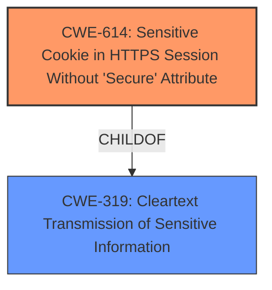

# Analysis for CVE-2021-40642

# Summary
| CWE ID | CWE Name | Confidence | CWE Abstraction Level | CWE Vulnerability Mapping Label | CWE-Vulnerability Mapping Notes |
|---|---|---|---|---|---|
| CWE-614 | Sensitive Cookie in HTTPS Session Without 'Secure' Attribute | 1.0 | Variant | Allowed | Primary CWE |
| CWE-319 | Cleartext Transmission of Sensitive Information | 0.7 | Base | Allowed | Secondary Candidate |

## Evidence and Confidence

*   **Confidence Score:** 0.9
*   **Evidence Strength:** HIGH

## Relationship Analysis
The primary relationship impacting the CWE selection is the ChildOf relationship between CWE-614 and CWE-319. CWE-614 is a variant of CWE-319 and deals specifically with the missing secure attribute for cookies in HTTPS sessions. This makes CWE-614 the more specific and appropriate choice. No relevant chain or peer relationships were found that influenced the decision. The abstraction level of Variant for CWE-614 and Base for CWE-319 helped select the most specific choice.

## Vulnerability Chain
The vulnerability chain begins with the **missing Secure Attribute in the HTTPS session**. This leads to the **transmission of the cookie in clear-text**, allowing an **attacker** to potentially intercept the cookie and hijack the user's session.

## Summary of Analysis
The initial assessment strongly points towards CWE-614, and the follow-up analysis confirms this. The vulnerability description explicitly states the **missing Secure Attribute in HTTPS Session** for the txp_login cookie. The "CVE Reference Links Content Summary" reinforces this by indicating the root cause is the incorrect default setting for the secure cookie attribute. This aligns perfectly with the description of CWE-614.

The evidence from the vulnerability description is clear: "The secure flag is not set for txp_login session cookie in the application." The "CVE Reference Links Content Summary" states: "The vulnerability lies in the way the `set_cookie` function within the `txplib_misc.php` file of the Textpattern CMS handles the `secure` attribute of cookies. The original code had `secure` set to `false` by default, which caused HTTP cookies to be sent over non-HTTPS connections as well."

The graph relationships confirm that CWE-614 is a more specific variant of CWE-319.

CWE-614 is chosen because it precisely addresses the vulnerability: a sensitive cookie in an HTTPS session lacks the 'Secure' attribute. This is at the optimal level of specificity (Variant).

Relevant CWE Information:

# Enhanced Context (25 CWEs)

## CWE-614: Sensitive Cookie in HTTPS Session Without 'Secure' Attribute
**Abstraction:** Variant
**Similarity Score**: 0.76, 7141.48, 0.924
**Description**:
The Secure attribute for sensitive cookies in HTTPS sessions is not set, which could cause the user agent to send those cookies in plaintext over an HTTP session.
**Mapping Guidance**:
- Usage: Allowed

## CWE-319: Cleartext Transmission of Sensitive Information
**Abstraction:** Base
**Similarity Score**: 0.77, 7221.94, 0.491
**Description**:
The product transmits sensitive or security-critical data in cleartext in a communication channel that can be sniffed by unauthorized actors.
**Mapping Guidance**:
- Usage: Allowed

## CWE-1004: Sensitive Cookie Without 'HttpOnly' Flag
**Abstraction:** Variant
**Similarity Score**: 0.620
**Description**:
The product uses a cookie to store sensitive information, but the cookie is not marked with the HttpOnly flag.

**Rationale for not selecting CWE-1004:**
The vulnerability specifically mentions the missing "Secure" attribute, not the "HttpOnly" flag. Therefore, CWE-1004 is not the correct choice.

## CWE-79: Improper Neutralization of Input During Web Page Generation ('Cross-site Scripting')
**Abstraction:** Base
**Similarity Score**: 7318.23, 5.03, 0.482
**Description**:
The product does not neutralize or incorrectly neutralizes user-controllable input before it is placed in output that is used as a web page that is served to other users.

**Rationale for not selecting CWE-79:**
This vulnerability is about the Secure attribute of a cookie, not about improper neutralization of input for web page generation.

## CWE-201: Insertion of Sensitive Information Into Sent Data
**Abstraction:** Base
**Similarity Score**: 3.64, 0.484
**Description**:
The code transmits data to another actor, but a portion of the data includes sensitive information that should not be accessible to that actor.

**Rationale for not selecting CWE-201:**
While the cookie does contain sensitive information, the primary issue is the lack of encryption during transmission due to the missing Secure attribute, making CWE-614 or CWE-319 more appropriate.

## Other Considered CWEs:

-   CWE-312: Cleartext Storage of Sensitive Information: This CWE was considered, but the vulnerability focuses on the transmission of the cookie, not its storage.
-   CWE-287: Improper Authentication: This is too high-level. The weakness is more specific than a general authentication problem.
-   CWE-472: External Control of Assumed-Immutable Web Parameter: This CWE is not relevant because the issue isn't about tampering with parameters.
-   CWE-494: Download of Code Without Integrity Check: Not relevant to the vulnerability.
-   CWE-784: Reliance on Cookies without Validation and Integrity Checking in a Security Decision: While related to cookies, it focuses on the lack of validation, not the missing secure attribute.