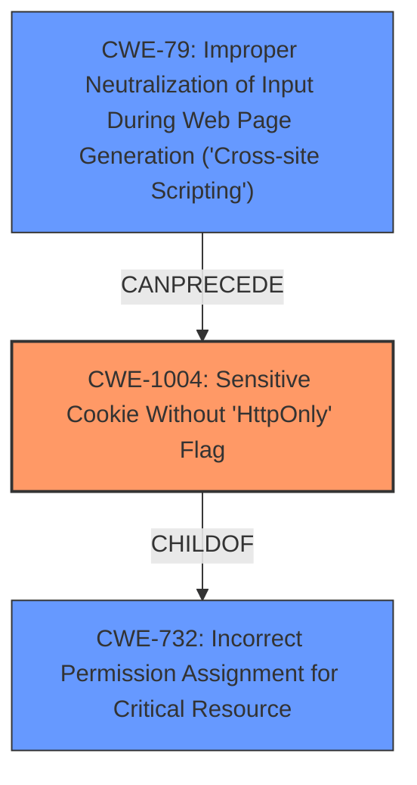

# Analysis Report for CVE-2021-40649

# Vulnerability Analysis Report: CVE-2021-40649

## Description


## Analysis (with Relationship Data)

# Summary
| CWE ID | CWE Name | Confidence | CWE Abstraction Level | CWE Vulnerability Mapping Label | CWE-Vulnerability Mapping Notes |
|---|---|---|---|---|---|
| CWE-1004 | Sensitive Cookie Without 'HttpOnly' Flag | 1.0 | Variant | Allowed | Primary CWE. Matches the vulnerability description perfectly.|
| CWE-79 | Improper Neutralization of Input During Web Page Generation ('Cross-site Scripting') | 0.7 | Base | Allowed | Secondary CWE. The CVE Reference Links Content Summary indicates that XSS is an attack vector. |

## Evidence and Confidence

*   **Confidence Score:** 0.9
*   **Evidence Strength:** HIGH

## Relationship Analysis
The primary relationship that influenced the decision was the parent-child relationship between CWE-732 (Incorrect Permission Assignment for Critical Resource) and CWE-1004 (Sensitive Cookie Without 'HttpOnly' Flag). CWE-1004 is a variant of CWE-732, making it more specific and appropriate for this vulnerability. The vulnerability is about a specific type of resource (cookie) and a specific permission (HttpOnly flag).



## Vulnerability Chain
The vulnerability chain starts with the **weakness** of a **cookie without the HttpOnly flag**. This allows for a Cross-Site Scripting (XSS) attack, where an attacker can inject malicious JavaScript into the user's browser session and access the cookie. The attacker can then impersonate the legitimate user and gain unauthorized access to resources.

## Summary of Analysis
The primary CWE is CWE-1004, which directly addresses the **weakness** described in the vulnerability. The vulnerability description clearly states that a cookie is issued without the HttpOnly flag set, and the CVE Reference Links Content Summary confirms this. "The vulnerability lies in the improper configuration of HTTP cookies in the CONNX software. Specifically, the `TSWAAuthClientSideCookie` is being set without the `HttpOnly` flag." This is a direct match for CWE-1004.

CWE-79 is included as a secondary CWE because the CVE Reference Links Content Summary indicates that XSS is a potential attack vector. "An attacker could potentially exploit this vulnerability through Cross-Site Scripting (XSS) attacks." While the primary issue is the missing HttpOnly flag, the potential for XSS exploitation adds another dimension to the vulnerability.

The selection of CWE-1004 is at the optimal level of specificity because it is a Variant-level CWE that directly addresses the specific **weakness** of a sensitive cookie without the HttpOnly flag. This is more specific than a more general CWE like CWE-732 (Incorrect Permission Assignment for Critical Resource).

Other CWEs Considered and Rejected:

*   CWE-614: Sensitive Cookie in HTTPS Session Without 'Secure' Attribute - This CWE addresses the absence of the Secure attribute for cookies in HTTPS sessions. While related to cookie security, it doesn't match the specific **weakness** of the missing HttpOnly flag.
*   CWE-312: Cleartext Storage of Sensitive Information - This CWE addresses the storage of sensitive information in cleartext. While cookies can store sensitive information, the vulnerability isn't about the storage of the information but the lack of the HttpOnly flag.
*   CWE-784: Reliance on Cookies without Validation and Integrity Checking in a Security Decision - This CWE addresses the reliance on cookies without proper validation. While relevant to cookie security, it's not the primary issue in this vulnerability, which is the lack of the HttpOnly flag.
*   CWE-79: Improper Neutralization of Input During Web Page Generation ('Cross-site Scripting') - Considered as the primary weakness because of the potential for XSS attacks. However, the root cause is the missing HttpOnly flag.
*   CWE-539: Use of Persistent Cookies Containing Sensitive Information - This CWE addresses the use of persistent cookies containing sensitive information. While cookies in this case may be persistent and sensitive, the core issue is still about the missing HttpOnly flag.
* CWE-212: Improper Removal of Sensitive Information Before Storage or Transfer, CWE-201: Insertion of Sensitive Information Into Sent Data, CWE-202: Exposure of Sensitive Information Through Data Queries, CWE-209: Generation of Error Message Containing Sensitive Information, CWE-311: Missing Encryption of Sensitive Data, CWE-319: Cleartext Transmission of Sensitive Information, CWE-538: Insertion of Sensitive Information into Externally-Accessible File or Directory, CWE-668: Exposure of Resource to Wrong Sphere. These are too general and don't fit the **weakness** of the vulnerability.


## CWE Relationship Analysis

Current CWEs represent these abstraction levels: .


### Vulnerability Chain Analysis

**Chain starting from CWE-201:**
- 201 (Insertion of Sensitive Information Into Sent Data) - ROOT


**Chain starting from CWE-202:**
- 202 (Exposure of Sensitive Information Through Data Queries) - ROOT


### CWE Relationship Diagram

```mermaid
graph TD
    classDef primary fill:#f96,stroke:#333,stroke-width:2px
    classDef secondary fill:#69f,stroke:#333
    classDef tertiary fill:#9e9,stroke:#333
```


*Report generated on 2025-03-31 08:32:20*
