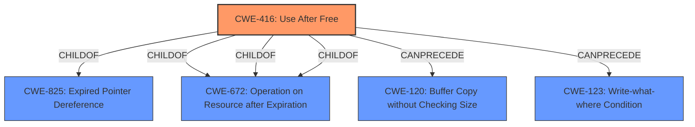

# Analysis Report for CVE-2021-4065

# Vulnerability Analysis Report: CVE-2021-4065

## Description


## Analysis (with Relationship Data)

# Summary
| CWE ID | CWE Name | Confidence | CWE Abstraction Level | CWE Vulnerability Mapping Label | CWE-Vulnerability Mapping Notes |
|---|---|---|---|---|---|
| CWE-416 | Use After Free | 1.0 | Variant | Allowed | Primary CWE |

## Evidence and Confidence

*   **Confidence Score:** 1.0
*   **Evidence Strength:** HIGH

## Relationship Analysis
The primary identified CWE is CWE-416 (Use After Free), which is a Variant level CWE. It is a child of CWE-825 (Expired Pointer Dereference) and CWE-672 (Operation on Resource after Expiration). The description of CWE-416 directly aligns with the vulnerability description.



## Vulnerability Chain
The vulnerability chain starts with a **use-after-free** condition (CWE-416), leading to potential heap corruption.

## Summary of Analysis
The analysis strongly supports CWE-416 (Use After Free) as the primary CWE for this vulnerability. The vulnerability description explicitly states "**use after free**" as the root cause, and the CVE reference links content summary also confirms this. The retriever results also list CWE-416 as the top match. The relationship analysis shows that CWE-416 is a variant of CWE-825 and CWE-672, which are more general classes of weaknesses related to expired pointers and operations on expired resources, respectively. Since the vulnerability description specifies "use after free", CWE-416 is the most specific and appropriate choice.

The evidence from the vulnerability description is: "**Use after free** in autofill in Google Chrome prior to 96.0.4664.93 allowed a remote attacker to potentially exploit heap corruption via a crafted HTML page."

CWE-843, CWE-366, CWE-122, CWE-415, CWE-113, CWE-123, CWE-362, CWE-911 and CWE-451 were considered but not selected. These CWEs are related to type confusion, race conditions, buffer overflows, double frees, HTTP request/response splitting, write-what-where conditions, improper synchronization, and UI misrepresentation. While these issues could potentially be related to memory corruption or other side effects of a use-after-free, they are not the primary cause of the vulnerability. The vulnerability description explicitly identifies a **use-after-free** condition.


## CWE Relationship Analysis

Current CWEs represent these abstraction levels: .


### Vulnerability Chain Analysis

**Chain starting from CWE-911:**
- 911 (Improper Update of Reference Count) - ROOT


**Chain starting from CWE-825:**
- 825 (Expired Pointer Dereference) - ROOT


### CWE Relationship Diagram

```mermaid
graph TD
    classDef primary fill:#f96,stroke:#333,stroke-width:2px
    classDef secondary fill:#69f,stroke:#333
    classDef tertiary fill:#9e9,stroke:#333
```


*Report generated on 2025-03-30 23:54:43*
