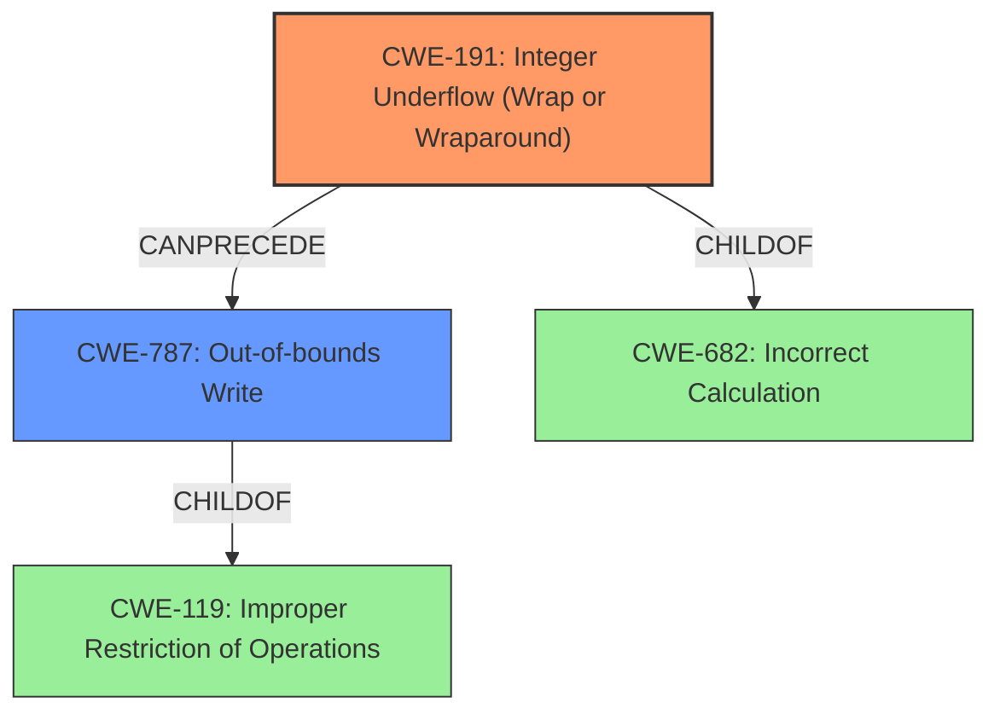

# Analysis Report for CVE-2021-4066

# Vulnerability Analysis Report: CVE-2021-4066

## Description


## Analysis (with Relationship Data)

# Summary
| CWE ID | CWE Name | Confidence | CWE Abstraction Level | CWE Vulnerability Mapping Label | CWE-Vulnerability Mapping Notes |
|---|---|---|---|---|---|
| CWE-191 | Integer Underflow (Wrap or Wraparound) | 1.0 | Base | Allowed | Primary CWE |
| CWE-787 | Out-of-bounds Write | 0.6 | Base | Allowed | Secondary Candidate |

## Evidence and Confidence

*   **Confidence Score:** 0.8
*   **Evidence Strength:** HIGH

## Relationship Analysis
The primary relationship that impacts the decision is the ChildOf relationship, where CWE-191 and CWE-787 are both children of higher-level classes related to numeric errors and improper restrictions. The integer underflow can lead to out-of-bounds write, creating a chain. The abstraction levels influenced the decision to choose the most specific Base CWE for the root cause and a potential consequence.



## Vulnerability Chain
The vulnerability chain starts with:
1.  **Root Cause:** **Integer underflow** (CWE-191) due to a calculation error in ANGLE.
2.  **Resulting Impact:** Heap corruption, potentially leading to arbitrary code execution (CWE-787).

## Summary of Analysis
The initial analysis pointed towards **CWE-191 (Integer Underflow)** as the primary weakness, based on the vulnerability description explicitly stating "**integer underflow** in ANGLE". The retriever results also strongly support this, with a high similarity score. Further supporting evidence is found in the "CVE Reference Links Content Summary" that includes the phrases "**root_cause**: Integer underflow in ANGLE" and "**weaknesses**: Integer underflow".

**CWE-787 (Out-of-bounds Write)** was considered as a secondary weakness, as the **integer underflow** could potentially lead to heap corruption by allowing writes outside the intended buffer boundaries. The vulnerability description mentions "heap corruption," which aligns with the impact of an out-of-bounds write. However, there is no direct evidence of an out-of-bounds write occurring.

The relationship analysis reinforces this, as **CWE-191** can precede **CWE-787** in a vulnerability chain.

The choice of **CWE-191** as the primary CWE is at the optimal level of specificity because it directly reflects the documented root cause. The evidence clearly points to an **integer underflow** as the initial flaw that triggers the vulnerability.

Relevant CWE Information:

# Enhanced Context (25 CWEs)
The following CWEs were identified as potentially relevant to this vulnerability:

## CWE-191: Integer Underflow (Wrap or Wraparound)
**Abstraction Level**: Base
**Similarity Score**: 0.80
**Source**: dense

**Description**:
The product subtracts one value from another, such that the result is less than the minimum allowable integer value, which produces a value that is not equal to the correct result.

**Mapping Guidance**:
- Usage: Allowed
- Rationale: This CWE entry is at the Base level of abstraction, which is a preferred level of abstraction for mapping to the root causes of vulnerabilities.

## CWE-787: Out-of-bounds Write
**Abstraction Level**: base
**Similarity Score**: 4.33
**Source**: graph

**Description**:
CWE-787: Out-of-bounds Write

**Mapping Guidance**:
- Usage: Allowed
- Rationale: This CWE entry is at the Base level of abstraction, which is a preferred level of abstraction for mapping to the root causes of vulnerabilities.

---

**CWE-191: Integer Underflow (Wrap or Wraparound)**

*   **Technical Explanation:** The vulnerability is caused by an **integer underflow**, meaning that a calculation results in a value smaller than the minimum representable value for the integer type. This can lead to unexpected behavior and potentially exploitable conditions.
*   **Security Implications:** An **integer underflow** can lead to incorrect memory allocation sizes, which can then lead to buffer overflows or other memory corruption issues. In this case, it leads to heap corruption.
*   **Relationship Analysis:** **CWE-191** is a base-level CWE, providing a specific description of the **integer underflow** condition.
*   **Mapping Guidance:** The mapping guidance allows for the use of this CWE, as it is a base-level weakness.
*   **Confidence:** 1.0

**CWE-787: Out-of-bounds Write**

*   **Technical Explanation:** The **integer underflow** could lead to writing data outside the intended buffer on the heap.
*   **Security Implications:** An out-of-bounds write can overwrite critical data structures on the heap, leading to arbitrary code execution.
*   **Relationship Analysis:** **CWE-787** is a base-level CWE.
*   **Mapping Guidance:** The mapping guidance allows for the use of this CWE, as it is a base-level weakness.
*   **Confidence:** 0.6

**CWEs Considered but Not Used:**

*   CWE-120: Buffer Copy without Checking Size of Input ('Classic Buffer Overflow'): This was not selected because there's no explicit mention of a buffer copy operation.
*   CWE-416: Use After Free: This was not selected because there is no mention of memory being freed and then reused.
*   CWE-843: Access of Resource Using Incompatible Type ('Type Confusion'): This was not selected because there's no mention of type confusion.
*   CWE-122: Heap-based Buffer Overflow: While heap corruption is mentioned, the root cause is the integer underflow, and there is no direct evidence that a heap overflow occurred.
*   CWE-366: Race Condition within a Thread: This was not selected as there is no mention of multiple threads.
*   CWE-124: Buffer Underwrite ('Buffer Underflow'): This was not selected because the description mentions the underflow but the root cause is related to the integer underflow.
*   CWE-123: Write-what-where Condition: Although heap corruption could lead to this, there is no direct evidence for that.
*   CWE-193: Off-by-one Error: There is no mention of an off-by-one error.
*   CWE-190: Integer Overflow or Wraparound: The description clearly states **integer underflow**.


## CWE Relationship Analysis

Current CWEs represent these abstraction levels: .


### Vulnerability Chain Analysis

**Chain starting from CWE-190:**
- 190 (Integer Overflow or Wraparound) - ROOT


**Chain starting from CWE-682:**
- 682 (Incorrect Calculation) - ROOT


### CWE Relationship Diagram

```mermaid
graph TD
    classDef primary fill:#f96,stroke:#333,stroke-width:2px
    classDef secondary fill:#69f,stroke:#333
    classDef tertiary fill:#9e9,stroke:#333
```


*Report generated on 2025-03-31 06:57:30*
