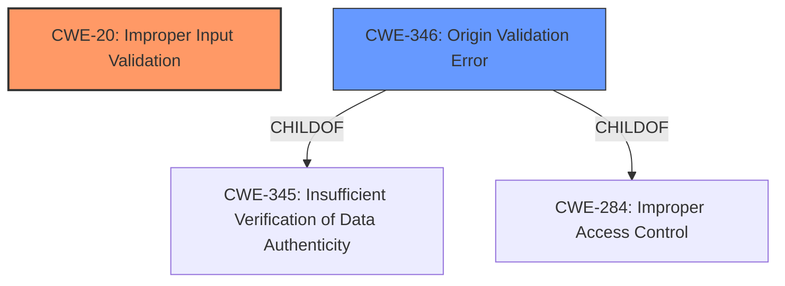

# Raw Analyzer Response for CVE-2021-4068

# Summary
| CWE ID | CWE Name | Confidence | CWE Abstraction Level | CWE Vulnerability Mapping Label | CWE-Vulnerability Mapping Notes |
|---|---|---|---|---|---|
| CWE-20 | Improper Input Validation | 1.0 | Class | Primary | Allowed |
| CWE-346 | Origin Validation Error | 0.6 | Class | Secondary | Allowed-with-Review |

## Evidence and Confidence

*   **Confidence Score:** 0.8
*   **Evidence Strength:** HIGH

## Relationship Analysis
The primary CWE, CWE-20 [Improper Input Validation], is a broad class. The retriever results suggested CWE-346 [Origin Validation Error], which is a child of CWE-345 [Insufficient Verification of Data Authenticity] and CWE-284 [Improper Access Control]. There is no evidence to select one of the children of CWE-346, so the class CWE-346 is selected.

## Vulnerability Chain
The vulnerability chain starts with **insufficient data validation** (CWE-20), which leads to a leak of cross-origin data. In the context of the new tab page in Google Chrome, this **insufficient validation** can be seen as an origin validation error (CWE-346) since the attacker crafts an HTML page to **leak cross-origin data**.

## Summary of Analysis
The vulnerability is due to **insufficient data validation** in the new tab page of Google Chrome, allowing a remote attacker to **leak cross-origin data** via a crafted HTML page.

The primary CWE is CWE-20 [Improper Input Validation]. The **Vulnerability Description Key Phrases** section indicates the **rootcause** as **insufficient data validation**. Additionally, the **CVE Reference Links Content Summary** mentions the **root cause** as **insufficient validation of untrusted input**. The **weakness** is the lack of proper input validation. The suggested primary CWE match in the **CWE for similar CVE Descriptions** section is CWE-20 [Improper Input Validation].

CWE-346 [Origin Validation Error] is considered as a secondary CWE because the attack involves a crafted HTML page that causes the browser to **leak cross-origin data**. This suggests that the origin of the data or communication is not properly verified. The **CVE Reference Links Content Summary** suggests the attack vector involves manipulating the data displayed on a new tab page, which aligns with the concept of origin validation.

The retriever results also suggested other CWEs like CWE-451 [User Interface (UI) Misrepresentation of Critical Information], CWE-843 [Access of Resource Using Incompatible Type ('Type Confusion')], and CWE-416 [Use After Free]. These were not selected because they don't directly address the **root cause** of **insufficient data validation**. UI misrepresentation is a potential impact, but not the primary weakness. Type confusion and use-after-free are memory corruption issues that are not directly indicated in the vulnerability description.

I have chosen the CWEs at the optimal level of specificity based on the available evidence. CWE-20 [Improper Input Validation] captures the broad **root cause**, while CWE-346 [Origin Validation Error] provides a more specific context related to the cross-origin data leakage.