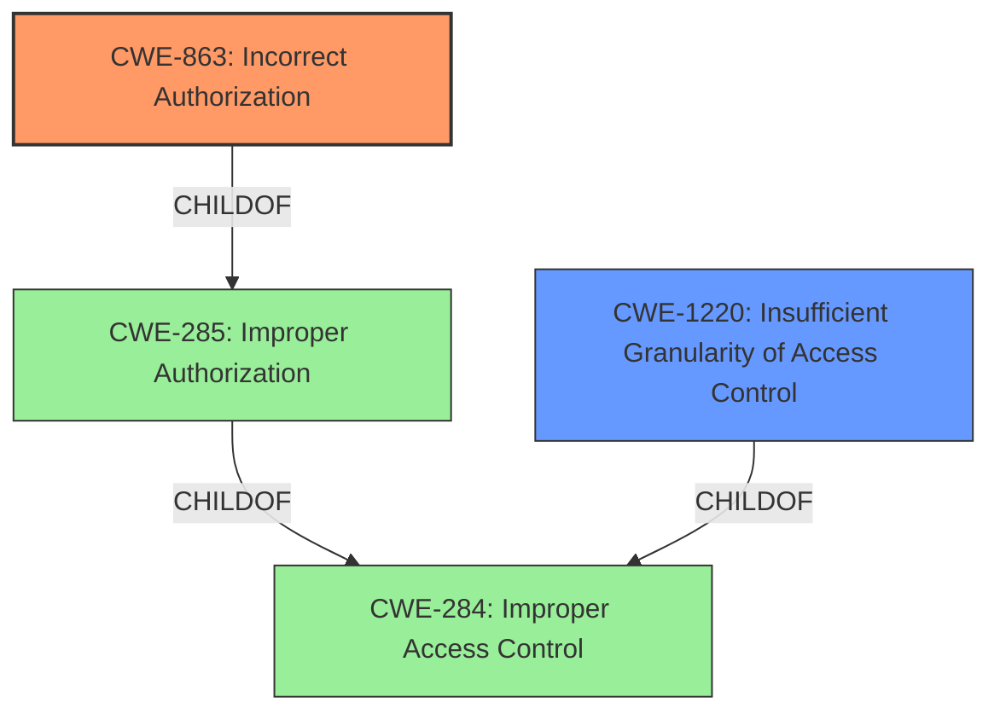

# Raw Analyzer Response for CVE-2021-40692

# Summary
| CWE ID | CWE Name | Confidence | CWE Abstraction Level | CWE Vulnerability Mapping Label | CWE-Vulnerability Mapping Notes |
|---|---|---|---|---|---|
| CWE-863 | Incorrect Authorization | 1.0 | Class | Primary | Allowed-with-Review |
| CWE-1220 | Insufficient Granularity of Access Control | 0.7 | Base | Secondary | Allowed |

## Evidence and Confidence

*   **Confidence Score:** 0.9
*   **Evidence Strength:** HIGH

## Relationship Analysis
The primary CWE is CWE-863, Incorrect Authorization, which is a Class-level CWE. The vulnerability description indicates that the authorization check was performed, but it was done incorrectly. CWE-863 is a child of CWE-285 Improper Authorization, and CWE-284 Improper Access Control. CWE-1220, Insufficient Granularity of Access Control, a Base-level CWE, is a more specific description of the authorization issue. It describes that the access controls lack the required granularity which results in unauthorized access.

## Vulnerability Chain
The vulnerability chain starts with **insufficient capability checks**, leading to teachers being able to download users outside of their courses. This is a direct result of **incorrect authorization**.

## Summary of Analysis
The initial assessment pointed to CWE-863, Incorrect Authorization, as the primary weakness, supported by the vulnerability description stating "**insufficient capability checks** made it possible for teachers to download users outside of their courses." The "CVE Reference Links Content Summary" also indicates "**root_cause**: Insufficient capability checks." and "**weaknesses**: Inadequate access control, Authorization bypass".

CWE-863 is a Class-level CWE, and the guidance suggests examining its children for a better fit. CWE-1220, Insufficient Granularity of Access Control, is a potential candidate since the access control policy might be too broad, allowing unauthorized access. However, the primary issue is that the authorization check was incorrectly performed, so CWE-863 remains the primary CWE. CWE-1220 is added as a secondary CWE to provide more context.

The final decision is based on the evidence that the authorization check was not correctly implemented (CWE-863), allowing the teachers to download user data from courses they were not authorized to access.
The CWEs selected are at the optimal level of specificity, with CWE-863 capturing the primary issue and CWE-1220 providing additional context.

Relevant CWE Information: