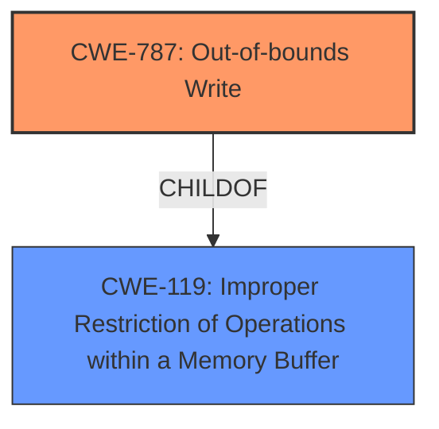

# Analysis for CVE-2021-40738

# Summary
| CWE ID | CWE Name | Confidence | CWE Abstraction Level | CWE Vulnerability Mapping Label | CWE-Vulnerability Mapping Notes |
|---|---|---|---|---|---|
| CWE-787 | Out-of-bounds Write | 0.9 | Base | Allowed | Primary CWE |
| CWE-119 | Improper Restriction of Operations within a Memory Buffer | 0.7 | Class | Allowed-with-Review | Secondary CWE |

## Evidence and Confidence

*   **Confidence Score:** 0.8
*   **Evidence Strength:** HIGH

## Relationship Analysis
The primary CWE is CWE-787 **Out-of-bounds Write**, which is a **Base** level CWE and a child of CWE-119 **Improper Restriction of Operations within a Memory Buffer**. CWE-119 is a broader class that encompasses various buffer-related weaknesses. The vulnerability description and CVE reference details indicate that the root cause involves writing data past the intended buffer, justifying the selection of the more specific CWE-787.

## Vulnerability Chain
The vulnerability chain starts with the parsing of a WAV file. Due to **memory corruption** caused by an **out-of-bounds write**, arbitrary code execution becomes possible.

## Summary of Analysis
The initial assessment, based on the vulnerability description and the retriever results, pointed towards CWE-787 **Out-of-bounds Write** and CWE-119 **Improper Restriction of Operations within a Memory Buffer**. The "CVE Reference Links Content Summary" section confirms an "out-of-bounds read/write due to improper buffer handling."

The choice of CWE-787 is further supported by the "Alternative Terms" listed for it: "Memory Corruption: Often used to describe the consequences of writing to memory outside the bounds of a buffer, or to memory that is otherwise invalid." The key phrase from the vulnerability description is "**memory corruption**," which directly aligns with this alternative term.

CWE-119 is a parent class of CWE-787, indicating a broader category of buffer-related issues. While CWE-119 could be considered, CWE-787 is a more specific and accurate representation of the **root cause** described in the vulnerability.

The analysis is strongly based on the provided evidence, especially the "Vulnerability Description Key Phrases" and "CVE Reference Links Content Summary." The relationship between CWE-787 and CWE-119, with CWE-787 being a child of CWE-119, helped refine the selection to the more specific CWE-787.

The selected CWEs are at the optimal level of specificity. CWE-787 accurately describes the **root cause**, while CWE-119 provides a broader context for the type of vulnerability.

Relevant CWE Information:

# Enhanced Context (25 CWEs)

## CWE-191: Integer Underflow (Wrap or Wraparound)
**Abstraction Level**: Base
**Similarity Score**: 0.76

**Description**:
The product subtracts one value from another, such that the result is less than the minimum allowable integer value, which produces a value that is not equal to the correct result.
*This was not selected because it is not related to this vulnerability which is a buffer overflow.*

## CWE-131: Incorrect Calculation of Buffer Size
**Abstraction Level**: Base
**Similarity Score**: 0.76

**Description**:
The product does not correctly calculate the size to be used when allocating a buffer, which could lead to a buffer overflow.
*This was not selected because the vulnerability description doesn't mention anything about incorrect calculation of buffer size*

## CWE-124: Buffer Underwrite ('Buffer Underflow')
**Abstraction Level**: Base
**Similarity Score**: 0.75

**Description**:
The product writes to a buffer using an index or pointer that references a memory location prior to the beginning of the buffer.
*This was not selected because the vulnerability description indicates the problem is an out-of-bounds write (overflow) not an underflow.*

## CWE-680: Integer Overflow to Buffer Overflow
**Abstraction Level**: Compound
**Similarity Score**: 0.75

**Description**:
The product performs a calculation to determine how much memory to allocate, but an integer overflow can occur that causes less memory to be allocated than expected, leading to a buffer overflow.
*This was not selected because the vulnerability description doesn't mention anything about an integer overflow.*

## CWE-197: Numeric Truncation Error
**Abstraction Level**: Base
**Similarity Score**: 0.74

**Description**:
Truncation errors occur when a primitive is cast to a primitive of a smaller size and data is lost in the conversion.
*This was not selected because the vulnerability description doesn't mention anything about numeric truncation.*

## CWE-681: Incorrect Conversion between Numeric Types
**Abstraction Level**: Base
**Similarity Score**: 0.74

**Description**:
When converting from one data type to another, such as long to integer, data can be omitted or translated in a way that produces unexpected values. If the resulting values are used in a sensitive context, then dangerous behaviors may occur.
*This was not selected because the vulnerability description doesn't mention anything about incorrect conversion between numeric types.*

## CWE-125: Out-of-bounds Read
**Abstraction Level**: Base
**Similarity Score**: 0.74

**Description**:
The product reads data past the end, or before the beginning, of the intended buffer.
*This was not selected because the vulnerability is due to an out-of-bounds write, not an out-of-bounds read.*

## CWE-1325: Improperly Controlled Sequential Memory Allocation
**Abstraction Level**: Base
**Similarity Score**: 0.74

**Description**:
The product manages a group of objects or resources and performs a separate memory allocation for each object, but it does not properly limit the total amount of memory that is consumed by all of the combined objects.
*This was not selected because it doesn't fit the vulnerability description.*

## CWE-805: Buffer Access with Incorrect Length Value
**Abstraction Level**: Base
**Similarity Score**: 0.74

**Description**:
The product uses a sequential operation to read or write a buffer, but it uses an incorrect length value that causes it to access memory that is outside of the bounds of the buffer.
*This was not selected because the vulnerability description does not state an incorrect length value was used.*

## CWE-129: Improper Validation of Array Index
**Abstraction Level**: Variant
**Similarity Score**: 0.73

**Description**:
The product uses untrusted input when calculating or using an array index, but the product does not validate or incorrectly validates the index to ensure the index references a valid position within the array.
*This was not selected because the vulnerability description does not state an improper array index was used.*

## CWE-190: Integer Overflow or Wraparound
**Abstraction Level**: Base
**Similarity Score**: 7098.55

**Description**:
The product performs a calculation that can
         produce an integer overflow or wraparound when the logic
         assumes that the resulting value will always be larger than
         the original value. This occurs when an integer value is
         incremented to a value that is too large to store in the
         associated representation. When this occurs, the value may
         become a very small or negative number.
*This was not selected because the vulnerability description doesn't mention anything about an integer overflow.*

## CWE-125: Out-of-bounds Read
**Abstraction Level**: Base
**Similarity Score**: 6643.77

**Description**:
The product reads data past the end, or before the beginning, of the intended buffer.
*This was not selected because the vulnerability is due to an out-of-bounds write, not an out-of-bounds read.*

## CWE-1284: Improper Validation of Specified Quantity in Input
**Abstraction Level**: Base
**Similarity Score**: 6546.99

**Description**:
The product receives input that is expected to specify a quantity (such as size or length), but it does not validate or incorrectly validates that the quantity has the required properties.
*This was not selected because the vulnerability description does not state a quantity was not validated.*

## CWE-839: Numeric Range Comparison Without Minimum Check
**Abstraction Level**: Base
**Similarity Score**: 6362.03

**Description**:
The product checks a value to ensure that it is less than or equal to a maximum, but it does not also verify that the value is greater than or equal to the minimum.
*This was not selected because the vulnerability description does not indicate that a range was not checked.*

## CWE-193: Off-by-one Error