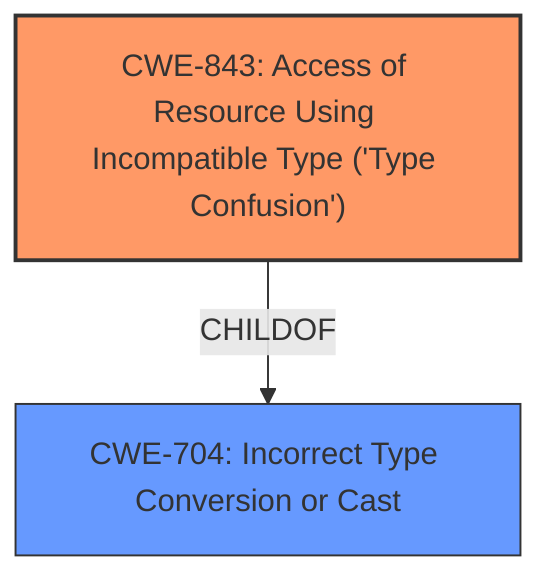

# Analysis Report for CVE-2021-4078

# Vulnerability Analysis Report: CVE-2021-4078

## Description


## Analysis (with Relationship Data)

# Summary
| CWE ID  | CWE Name                                                                 | Confidence | CWE Abstraction Level | CWE Vulnerability Mapping Label | CWE-Vulnerability Mapping Notes |
| :-------- | :----------------------------------------------------------------------- | :---------- | :-------------------- | :------------------------------ | :------------------------------ |
| CWE-843 | Access of Resource Using Incompatible Type ('**Type Confusion**') | 1          | Base                  | Primary CWE                     | Allowed                       |

## Evidence and Confidence

*   **Confidence Score:** 1
*   **Evidence Strength:** HIGH

## Relationship Analysis
The primary CWE, CWE-843, is a Base level CWE, which is the preferred level of abstraction. CWE-843 is a child of CWE-704 (Incorrect Type Conversion or Cast). The vulnerability description mentions "**Type Confusion**" as the **rootcause**, which directly aligns with CWE-843. The "CVE Reference Links Content Summary" section states that the root cause of the vulnerability is "**Type confusion** in V8". The relationship that impacted the decision was the direct match of "Type Confusion" in the vulnerability description.



## Vulnerability Chain
The vulnerability chain starts with a **type confusion** (**rootcause**) in the V8 component of Google Chrome. This leads to heap corruption (impact), which can be exploited by a remote attacker via a crafted HTML page.

Type Confusion -> Heap Corruption

## Summary of Analysis
The initial analysis strongly suggested CWE-843 due to the explicit mention of "**Type Confusion**" in the vulnerability description, the "Vulnerability Description Key Phrases", and the "CVE Reference Links Content Summary". The retriever results also listed CWE-843 as the top candidate.

The vulnerability description states: "**Type confusion** in V8 in Google Chrome prior to 96.0.4664.93 allowed a remote attacker to potentially exploit heap corruption via a crafted HTML page."

The "CVE Reference Links Content Summary" confirms:
*   "**Root cause of vulnerability**: **Type confusion** in V8"
*   "**Weaknesses/vulnerabilities present**: **Type confusion**"

CWE-843 is the optimal level of specificity, as it directly addresses the **rootcause** of "**Type Confusion**". The confidence is high (1) because of the direct and repeated evidence of "**Type Confusion**" in the provided information.

Relevant CWE Information:

# Enhanced Context (25 CWEs)

## CWE-415: Double Free
**Abstraction Level**: Variant
**Similarity Score**: 0.79
**Source**: dense
*   Not selected. This CWE does not match the vulnerability description. There is no evidence of a double free.

## CWE-404: Improper Resource Shutdown or Release
**Abstraction Level**: Class
**Similarity Score**: 0.77
**Source**: dense
*   Not selected. This CWE does not match the vulnerability description. There is no evidence of improper resource shutdown or release.

## CWE-226: Sensitive Information in Resource Not Removed Before Reuse
**Abstraction Level**: Base
**Similarity Score**: 0.77
**Source**: dense
*   Not selected. This CWE does not match the vulnerability description. There is no evidence of sensitive information in a resource not being removed before reuse.

## CWE-366: Race Condition within a Thread
**Abstraction Level**: Base
**Similarity Score**: 0.77
**Source**: dense
*   Not selected. This CWE does not match the vulnerability description. There is no evidence of a race condition within a thread.

## CWE-191: Integer Underflow (Wrap or Wraparound)
**Abstraction Level**: Base
**Similarity Score**: 0.76
**Source**: dense
*   Not selected. This CWE does not match the vulnerability description. There is no evidence of an integer underflow.

## CWE-131: Incorrect Calculation of Buffer Size
**Abstraction Level**: Base
**Similarity Score**: 0.76
**Source**: dense
*   Not selected. This CWE does not match the vulnerability description. There is no evidence of incorrect calculation of buffer size.

## CWE-667: Improper Locking
**Abstraction Level**: Class
**Similarity Score**: 0.76
**Source**: dense
*   Not selected. This CWE does not match the vulnerability description. There is no evidence of improper locking.

## CWE-843: Access of Resource Using Incompatible Type ('Type Confusion')
**Abstraction Level**: Base
**Similarity Score**: 0.76
**Source**: dense
*   Selected. This CWE is the primary CWE.

## CWE-125: Out-of-bounds Read
**Abstraction Level**: Base
**Similarity Score**: 0.76
**Source**: dense
*   Not selected. This CWE does not match the vulnerability description. There is no evidence of an out-of-bounds read.

## CWE-416: Use After Free
**Abstraction Level**: Variant
**Similarity Score**: 0.75
**Source**: dense
*   Not selected. This CWE does not match the vulnerability description. There is no evidence of a use after free.

## CWE-451: User Interface (UI) Misrepresentation of Critical Information
**Abstraction Level**: Class
**Similarity Score**: 5481.55
**Source**: sparse
*   Not selected. This CWE does not match the vulnerability description. There is no evidence of UI misrepresentation.

## CWE-125: Out-of-bounds Read
**Abstraction Level**: Base
**Similarity Score**: 5137.52
**Source**: sparse
*   Not selected. This CWE does not match the vulnerability description. There is no evidence of an out-of-bounds read.

## CWE-190: Integer Overflow or Wraparound
**Abstraction Level**: Base
**Similarity Score**: 5083.01
**Source**: sparse
*   Not selected. This CWE does not match the vulnerability description. There is no evidence of an integer overflow.

## CWE-415: Double Free
**Abstraction Level**: Variant
**Similarity Score**: 5039.30
**Source**: sparse
*   Not selected. This CWE does not match the vulnerability description. There is no evidence of a double free.

## CWE-191: Integer Underflow (Wrap or Wraparound)
**Abstraction Level**: Base
**Similarity Score**: 5006.35
**Source**: sparse
*   Not selected. This CWE does not match the vulnerability description. There is no evidence of an integer underflow.

## CWE-123: Write-what-where Condition
**Abstraction Level**: base
**Similarity Score**: 5.03
**Source**: graph
*   Not selected. While heap corruption is mentioned, the description doesn't directly imply an arbitrary write-what-where condition.

## CWE-120: Buffer Copy without Checking Size of Input ('Classic Buffer Overflow')
**Abstraction Level**: base
**Similarity Score**: 4.33
**Source**: graph
*   Not selected. The description doesn't specify a buffer copy operation without size checking. While it leads to heap corruption, the root cause is type confusion, not a classic buffer overflow.

## CWE-787: Out-of-bounds Write
**Abstraction Level**: base
**Similarity Score**: 4.33
**Source**: graph
*   Not selected. While heap corruption is the impact, the root cause is type confusion.

## CWE-825: Expired Pointer Dereference
**Abstraction Level**: base
**Similarity Score**: 4.33
**Source**: graph
*   Not selected. There is no evidence of expired pointer dereference.

## CWE-190: Integer Overflow or Wraparound
**Abstraction Level**: base
**Similarity Score**: 4.33
**Source**: graph
*   Not selected. There is no evidence of integer overflow.

## CWE-170: Improper Null Termination
**Abstraction Level**: base
**Similarity Score**: 4.33
**Source**: graph
*   Not selected. There is no evidence of improper null termination.

## CWE-1284: Improper Validation of Specified Quantity in Input
**Abstraction Level**: base
**Similarity Score**: 4.33
**Source**: graph
*   Not selected. There is no evidence of improper validation of specified quantity in input.

## CWE-1341: Multiple Releases of Same Resource or Handle
**Abstraction Level**: base
**Similarity Score**: 4.33
**Source**: graph
*   Not selected. There is no evidence of multiple releases of the same resource.

## CWE-195: Signed to Unsigned Conversion Error
**Abstraction Level**: variant
**Similarity Score**:


## CWE Relationship Analysis

Current CWEs represent these abstraction levels: .


### Vulnerability Chain Analysis

**Chain starting from CWE-366:**
- 366 (Race Condition within a Thread) - ROOT


**Chain starting from CWE-123:**
- 123 (Write-what-where Condition) - ROOT


### CWE Relationship Diagram

```mermaid
graph TD
    classDef primary fill:#f96,stroke:#333,stroke-width:2px
    classDef secondary fill:#69f,stroke:#333
    classDef tertiary fill:#9e9,stroke:#333
```


*Report generated on 2025-03-30 18:44:05*
