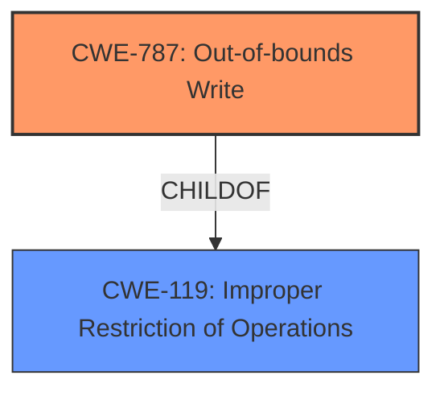

# Raw Analyzer Response for CVE-2021-40780

# Summary
| CWE ID | CWE Name | Confidence | CWE Abstraction Level | CWE Vulnerability Mapping Label | CWE-Vulnerability Mapping Notes |
|---|---|---|---|---|---|
| CWE-787 | Out-of-bounds Write | 0.9 | Base | Primary | Allowed |
| CWE-119 | Improper Restriction of Operations within the Bounds of a Memory Buffer | 0.7 | Class | Secondary | Discouraged |

## Evidence and Confidence

*   **Confidence Score:** 0.9
*   **Evidence Strength:** HIGH

## Relationship Analysis
The primary CWE, CWE-787 **Out-of-bounds Write**, is a base-level CWE and a child of CWE-119 **Improper Restriction of Operations within the Bounds of a Memory Buffer**, which is a class-level CWE. The vulnerability description mentions **memory corruption** due to **insecure handling** which suggests an out-of-bounds write as the root cause, thus the more specific CWE-787 is chosen.

## Vulnerability Chain
The vulnerability chain starts with the **insecure handling** of a malicious file, leading to **memory corruption** due to an out-of-bounds write (CWE-787), which can result in arbitrary code execution.

## Summary of Analysis
The initial assessment identified CWE-787 **Out-of-bounds Write** as the primary candidate due to the description including **memory corruption** and **insecure handling**. The CVE Reference Links Content Summary confirms the presence of an "Out-of-bounds read" and "Access of Memory Location After End of Buffer (CWE-788)" which supports the selection of a CWE related to memory corruption. The retriever results also list CWE-787 as the top candidate with a score of 1.00. The relationship analysis shows that CWE-787 is a child of CWE-119, but CWE-787 is more specific. The mapping guidance for CWE-787 allows its use.

The selection of CWE-787 is based on the following evidence:

*   "**memory corruption** vulnerability due to **insecure handling** of a malicious file" - Vulnerability Description
*   "Root cause of vulnerability: Access of Memory Location After End of Buffer (CWE-788)" - CVE Reference Links Content Summary
*   "Weaknesses/vulnerabilities present: Out-of-bounds read" - CVE Reference Links Content Summary
*   CWE-787 is the top candidate in retriever results with a score of 1.00.

Other CWEs considered but not used:

*   CWE-119: **Improper Restriction of Operations within the Bounds of a Memory Buffer** - While related to CWE-787, it is a more general class. Since the description and CVE reference summary points to memory corruption due to out-of-bounds access, CWE-787 is more specific and appropriate.
*   CWE-788: **Access of Memory Location After End of Buffer** - The summary mentions this CWE but CWE-787 describes the write condition.
*   CWE-122: **Heap-based Buffer Overflow** - This is a variant of CWE-787, but the description does not specify if the buffer is allocated on the heap.
*   CWE-665: **Improper Initialization** - Although the retriever lists it, there is no evidence pointing towards this.
*   CWE-379: **Creation of Temporary File in Directory with Insecure Permissions** - Although the retriever lists it, there is no evidence pointing towards this.
*   CWE-172: **Encoding Error** - Although the retriever lists it, there is no evidence pointing towards this.
*   CWE-822: **Untrusted Pointer Dereference** - Although the retriever lists it, there is no evidence pointing towards this.
*   CWE-20: **Improper Input Validation** - Although the retriever lists it, there is no evidence pointing towards this.
*   CWE-457: **Use of Uninitialized Variable** - Although the retriever lists it, there is no evidence pointing towards this.
*   CWE-755: **Improper Handling of Exceptional Conditions** - Although the retriever lists it, there is no evidence pointing towards this.

The selected CWEs are at the optimal level of specificity as they accurately represent the root cause and nature of the vulnerability based on the provided evidence.