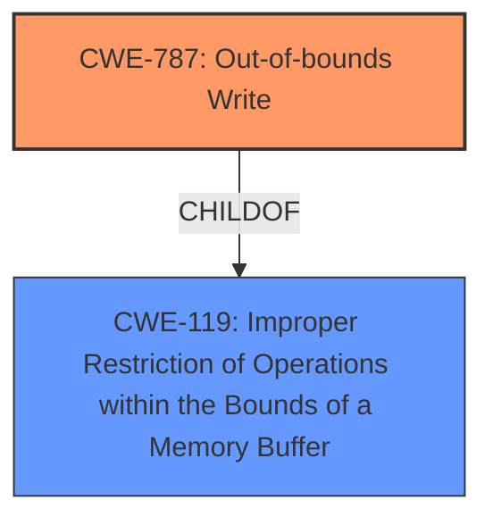

# Analysis for CVE-2021-40786

# Summary
| CWE ID | CWE Name | Confidence | CWE Abstraction Level | CWE Vulnerability Mapping Label | CWE-Vulnerability Mapping Notes |
|---|---|---|---|---|---|
| CWE-787 | Out-of-bounds Write | 0.9 | Base | Primary | Allowed |
| CWE-119 | Improper Restriction of Operations within the Bounds of a Memory Buffer | 0.7 | Class | Secondary | Discouraged |

## Evidence and Confidence

*   **Confidence Score:** 0.8
*   **Evidence Strength:** HIGH

## Relationship Analysis
The primary CWE is CWE-787, which is a Base level CWE and a child of CWE-119. CWE-119 is a Class level CWE. Since CWE-787 is more specific and accurately represents the vulnerability, it is selected as the primary CWE.

## Vulnerability Chain
The vulnerability chain starts with **insecure handling** of a malicious file leading to **memory corruption**, specifically an out-of-bounds write, and resulting in arbitrary code execution.

## Summary of Analysis
The initial analysis pointed towards CWE-119 due to the **memory corruption** and **insecure handling**. However, the CVE Reference Links Content Summary indicates an "Out-of-bounds write due to accessing memory locations beyond the allocated buffer". This aligns perfectly with CWE-787. The **Vulnerability Description Key Phrases** also point to **insecure handling** as the root cause and **memory corruption** as the weakness. The retriever results also lists CWE-787 as the top result. Therefore, CWE-787 is the more specific and appropriate choice.

The evidence from the CVE description includes: "Adobe Premiere Elements 20210809.daily.2242976 (and earlier) is affected by a **memory corruption** vulnerability due to **insecure handling** of a malicious file, potentially resulting in arbitrary code execution in the context of the current user."

The evidence from the CVE Reference Links Content Summary includes: "Root cause of vulnerability: Access of Memory Location After End of Buffer (CWE-788); Weaknesses/vulnerabilities present: Out-of-bounds write due to accessing memory locations beyond the allocated buffer."

Based on the evidence, CWE-787 is at the optimal level of specificity as it directly describes the out-of-bounds write condition.

Relevant CWE Information:

# Enhanced Context (25 CWEs)

## CWE-1289: Improper Validation of Unsafe Equivalence in Input
**Abstraction Level**: Base
**Similarity Score**: 0.78
**Source**: dense

**Description**:
The product receives an input value that is used as a resource identifier or other type of reference, but it does not validate or incorrectly validates that the input is equivalent to a potentially-unsafe value.
**Rationale for not selecting:** While there is **insecure handling**, there is no specific mention of validating unsafe equivalence.

## CWE-280: Improper Handling of Insufficient Permissions or Privileges 
**Abstraction Level**: Base
**Similarity Score**: 0.77
**Source**: dense

**Description**:
The product does not handle or incorrectly handles when it has insufficient privileges to access resources or functionality as specified by their permissions. This may cause it to follow unexpected code paths that may leave the product in an invalid state.
**Rationale for not selecting:** The vulnerability is due to **memory corruption** from **insecure handling** rather than permission issues.

## CWE-274: Improper Handling of Insufficient Privileges
**Abstraction Level**: Base
**Similarity Score**: 0.77
**Source**: dense

**Description**:
The product does not handle or incorrectly handles when it has insufficient privileges to perform an operation, leading to resultant weaknesses.
**Rationale for not selecting:** The vulnerability is due to **memory corruption** from **insecure handling** rather than permission issues.

## CWE-404: Improper Resource Shutdown or Release
**Abstraction Level**: Class
**Similarity Score**: 0.77
**Source**: dense

**Description**:
The product does not release or incorrectly releases a resource before it is made available for re-use.
**Rationale for not selecting:** The vulnerability is related to **memory corruption** due to **insecure handling**, not resource management.

## CWE-667: Improper Locking
**Abstraction Level**: Class
**Similarity Score**: 0.77
**Source**: dense

**Description**:
The product does not properly acquire or release a lock on a resource, leading to unexpected resource state changes and behaviors.
**Rationale for not selecting:** The vulnerability is related to **memory corruption** due to **insecure handling**, not locking mechanisms.

## CWE-266: Incorrect Privilege Assignment
**Abstraction Level**: Base
**Similarity Score**: 0.77
**Source**: dense

**Description**:
A product incorrectly assigns a privilege to a particular actor, creating an unintended sphere of control for that actor.
**Rationale for not selecting:** The vulnerability is due to **memory corruption** from **insecure handling** rather than privilege assignment.

## CWE-668: Exposure of Resource to Wrong Sphere
**Abstraction Level**: Class
**Similarity Score**: 0.77
**Source**: dense

**Description**:
The product exposes a resource to the wrong control sphere, providing unintended actors with inappropriate access to the resource.
**Rationale for not selecting:** The vulnerability is related to **memory corruption** due to **insecure handling**, not resource exposure.

## CWE-807: Reliance on Untrusted Inputs in a Security Decision
**Abstraction Level**: Base
**Similarity Score**: 0.77
**Source**: dense

**Description**:
The product uses a protection mechanism that relies on the existence or values of an input, but the input can be modified by an untrusted actor in a way that bypasses the protection mechanism.
**Rationale for not selecting:** While there is an untrusted input (malicious file), the core issue is **memory corruption** from **insecure handling**, rather than a bypassed protection mechanism.

## CWE-183: Permissive List of Allowed Inputs
**Abstraction Level**: Base
**Similarity Score**: 0.77
**Source**: dense

**Description**:
The product implements a protection mechanism that relies on a list of inputs (or properties of inputs) that are explicitly allowed by policy because the inputs are assumed to be safe, but the list is too permissive - that is, it allows an input that is unsafe, leading to resultant weaknesses.
**Rationale for not selecting:** The root cause is **insecure handling** leading to **memory corruption**, not a overly permissive input list.

## CWE-267: Privilege Defined With Unsafe Actions
**Abstraction Level**: Base
**Similarity Score**: 0.77
**Source**: dense

**Description**:
A particular privilege, role, capability, or right can be used to perform unsafe actions that were not intended, even when it is assigned to the correct entity.
**Rationale for not selecting:** The vulnerability is due to **memory corruption** from **insecure handling** rather than an unsafe privilege definition.

## CWE-190: Integer Overflow or Wraparound
**Abstraction Level**: Base
**Similarity Score**: 6016.46
**Source**: sparse

**Description**:
The product performs a calculation that can
         produce an integer overflow or wraparound when the logic
         assumes that the resulting value will always be larger than
         the original value. This occurs when an integer value is
         incremented to a value that is too large to store in the
         associated representation. When this occurs, the value may
         become a very small or negative number.
**Rationale for not selecting:** The description does not contain any information to suggest an integer overflow.

## CWE-125: Out-of-bounds Read
**Abstraction Level**: Base
**Similarity Score**: 5941.13
**Source**: sparse

**Description**:
The product reads data past the end, or before the beginning, of the intended buffer.
**Rationale for not selecting:** The CVE Reference Links Content Summary indicates an out-of-bounds *write*, not an out-of-bounds read.

## CWE-1284: Improper Validation of Specified Quantity in Input
**Abstraction Level**: Base
**Similarity Score**: 5858.88
**Source**: sparse

**Description**:
The product receives input that is expected to specify a quantity (such as size or length), but it does not validate or incorrectly validates that the quantity has the required properties.
**Rationale for not selecting:** While **insecure handling** may involve improper validation of input, this is not the primary issue described. The core issue is **memory corruption** due to writing beyond the bounds of a buffer.

## CWE-119: Improper Restriction of Operations within the Bounds of