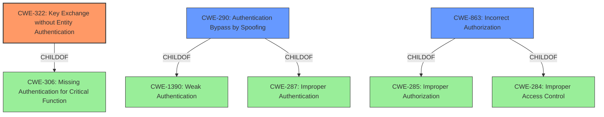

# Analysis for CVE-2021-40823

# Summary

| CWE ID  | CWE Name                                       | Confidence | CWE Abstraction Level | CWE Vulnerability Mapping Label | CWE-Vulnerability Mapping Notes |
|---------|------------------------------------------------|------------|-----------------------|---------------------------------|-----------------------------------|
| CWE-322 | Key Exchange without Entity Authentication | 0.85       | Base                  | Allowed                         | Primary CWE                      |
| CWE-290 | Authentication Bypass by Spoofing            | 0.7        | Base                  | Allowed                         | Secondary Candidate            |
| CWE-863 | Incorrect Authorization                        | 0.6        | Class                 | Allowed-with-Review             | Secondary Candidate            |

## Evidence and Confidence

*   **Confidence Score:** 0.8
*   **Evidence Strength:** HIGH

## Relationship Analysis

The primary relationship that influenced the selection was the ChildOf relationship, primarily related to Authentication issues.

*   CWE-322 (Key Exchange without Entity Authentication) is a child of CWE-306 (Missing Authentication for Critical Function) and focuses on the specific weakness of not verifying the identity during key exchange.
*   CWE-290 (Authentication Bypass by Spoofing) is a child of CWE-1390 (Weak Authentication) and CWE-287 (Improper Authentication)
*   CWE-863 (Incorrect Authorization) is a child of CWE-285 (Improper Authorization) and CWE-284 (Improper Access Control).

The abstraction levels were considered to choose the most specific CWE possible. CWE-322, being a Base level CWE, was preferred over its Class-level parents.

## Vulnerability Chain

The vulnerability chain starts with the **logic error in the room key sharing functionality**, leading to **insufficient device verification** during key exchange. This allows a **malicious homeserver** to **steal room encryption keys** and ultimately **decrypt end-to-end encrypted messages**.

Root Cause:
*   **Logic Error/Insufficient Device Verification**

Weakness:
*   **Key Exchange without Entity Authentication (CWE-322)**

Impact:
*   **Steal room encryption keys**
*   **Decrypt end-to-end encrypted messages**

## Summary of Analysis

The initial assessment focused on the core weakness: the **logic error in room key sharing functionality**. The key aspect of the vulnerability is that the client does not properly verify the identity of the device requesting the shared encryption keys. The primary CWE, CWE-322 (Key Exchange without Entity Authentication), was selected because it directly addresses the **lack of proper identity verification during key exchange**.

The choice of CWE-322 is further supported by the "CVE Reference Links Content Summary," which highlights the **insufficient device verification** as the primary vulnerability. The summary explicitly mentions that clients "did not sufficiently verify the identity of the device requesting the key share."

The retriever results also indicated that CWE-290 (Authentication Bypass by Spoofing) was a potential candidate, which aligns with the idea of impersonating a legitimate device. However, CWE-322 was favored because it more specifically addresses the key exchange process.

CWE-863 (Incorrect Authorization) was considered, but it's a more general class and less specific than CWE-322. The **logic error** specifically relates to key exchange and device identity, making CWE-322 the more appropriate choice.

The selected CWEs are at the optimal level of specificity. CWE-322 is a Base-level CWE, as recommended by MITRE's mapping guidance, and it directly reflects the vulnerability's root cause.

Relevant CWE Information:
*   CWE-322 (Key Exchange without Entity Authentication): "The product performs a key exchange with an actor without verifying the identity of that actor." This perfectly matches the vulnerability where the client does not verify the requesting device's identity.
*   CWE-290 (Authentication Bypass by Spoofing): "This attack-focused weakness is caused by incorrectly implemented authentication schemes that are subject to spoofing attacks." This is relevant as a malicious homeserver spoofs a legitimate device.
*   CWE-863 (Incorrect Authorization): "The product performs an authorization check when an actor attempts to access a resource or perform an action, but it does not correctly perform the check." This could apply, but it's less specific than CWE-322 as it's more about general authorization failures.