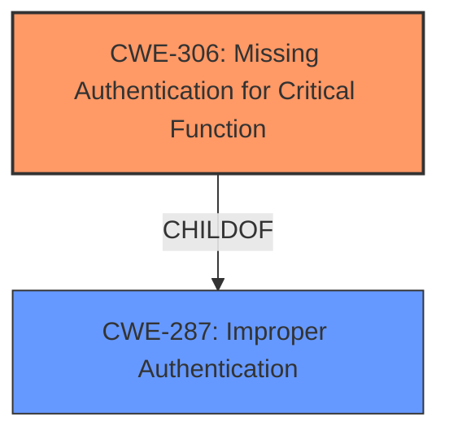

# Analysis for CVE-2021-40866

# Summary
| CWE ID | CWE Name | Confidence | CWE Abstraction Level | CWE Vulnerability Mapping Label | CWE-Vulnerability Mapping Notes |
|---|---|---|---|---|---|
| CWE-306 | Missing Authentication for Critical Function | 1.0 | Base | Allowed | Primary CWE |
| CWE-287 | Improper Authentication | 0.7 | Class | Discouraged | Secondary Candidate |

## Evidence and Confidence

*   **Confidence Score:** 1.0
*   **Evidence Strength:** HIGH

## Relationship Analysis
The primary CWE is CWE-306, which is a Base-level CWE. CWE-306 is a child of CWE-287. CWE-287 is a Class-level CWE and is discouraged when a more specific CWE can be identified. Therefore, CWE-306 is more specific and a better choice.



## Vulnerability Chain
The vulnerability chain starts with the **failure to check authentication** in the `/sqfs/bin/sccd` daemon, leading to a remote admin password change by an unauthenticated attacker. The root cause is the **missing authentication** check.

## Summary of Analysis
The vulnerability description clearly states that the `/sqfs/bin/sccd` daemon **fails to check authentication** when the authentication TLV is missing from a received NSDP packet. This allows an unauthenticated attacker to change the admin password. This directly aligns with CWE-306: Missing Authentication for Critical Function.

The "CVE Reference Links Content Summary" confirms that the `sccd` daemon does not require the type 10 "password authentication" TLV to be present in the NSDP datagram before processing "set" commands. This permits an attacker to execute privileged operations, such as changing the administrator password, without authentication.

Therefore, CWE-306 is the most appropriate mapping.

CWE-287: Improper Authentication was considered, as it is a parent of CWE-306. However, CWE-287 is a Class-level CWE and is discouraged when a more specific CWE can be identified. Since the vulnerability description specifically mentions **missing authentication**, CWE-306 is a more accurate and specific choice.
Relevant CWE Information:

## CWE-303: Incorrect Implementation of Authentication Algorithm
**Abstraction Level**: Base
**Similarity Score**: 0.77
**Source**: dense

**Description**:
The requirements for the product dictate the use of an established authentication algorithm, but the implementation of the algorithm is incorrect.
**Rationale:** This CWE is about *incorrect* implementation, but the vulnerability is about *missing* authentication, so this is not the right fit.

## CWE-807: Reliance on Untrusted Inputs in a Security Decision
**Abstraction Level**: Base
**Similarity Score**: 0.76
**Source**: dense

**Description**:
The product uses a protection mechanism that relies on the existence or values of an input, but the input can be modified by an untrusted actor in a way that bypasses the protection mechanism.
**Rationale:** While the vulnerability involves untrusted inputs, the core issue is the lack of authentication, not the reliance on the input itself.

## CWE-1391: Use of Weak Credentials
**Abstraction Level**: Class
**Similarity Score**: 0.76
**Source**: dense

**Description**:
The product uses weak credentials (such as a default key or hard-coded password) that can be calculated, derived, reused, or guessed by an attacker.
**Rationale:** This vulnerability doesn't involve weak credentials, but rather a complete bypass of authentication.

## CWE-1390: Weak Authentication
**Abstraction Level**: Class
**Similarity Score**: 0.76
**Source**: dense

**Description**:
The product uses an authentication mechanism to restrict access to specific users or identities, but the mechanism does not sufficiently prove that the claimed identity is correct.
**Rationale:** This is a valid candidate but less specific than CWE-306. The description does state that authentication is missing.

## CWE-288: Authentication Bypass Using an Alternate Path or Channel
**Abstraction Level**: Base
**Similarity Score**: 0.75
**Source**: dense

**Description**:
The product requires authentication, but the product has an alternate path or channel that does not require authentication.
**Rationale:** This vulnerability does not use an alternate path, but the primary path.

## CWE-291: Reliance on IP Address for Authentication
**Abstraction Level**: Variant
**Similarity Score**: 0.75
**Source**: dense

**Description**:
The product uses an IP address for authentication.
**Rationale:** This vulnerability does not use IP addresses for authentication.

## CWE-1289: Improper Validation of Unsafe Equivalence in Input
**Abstraction Level**: Base
**Similarity Score**: 0.75
**Source**: dense

**Description**:
The product receives an input value that is used as a resource identifier or other type of reference, but it does not validate or incorrectly validates that the input is equivalent to a potentially-unsafe value.
**Rationale:** While input validation might be related, the core issue is missing authentication.

## CWE-305: Authentication Bypass by Primary Weakness
**Abstraction Level**: Base
**Similarity Score**: 0.74
**Source**: dense

**Description**:
The authentication algorithm is sound, but the implemented mechanism can be bypassed as the result of a separate weakness that is primary to the authentication error.
**Rationale:** The vulnerability is due to a *missing* authentication check, not a bypass of an existing algorithm.

## CWE-307: Improper Restriction of Excessive Authentication Attempts
**Abstraction Level**: Base
**Similarity Score**: 0.74
**Source**: dense

**Description**:
The product does not implement sufficient measures to prevent multiple failed authentication attempts within a short time frame.
**Rationale:** This vulnerability is not about limiting authentication attempts, but a complete absence of authentication.

## CWE-798: Use of Hard-coded Credentials
**Abstraction Level**: Base
**Similarity Score**: 0.74
**Source**: dense

**Description**:
The product contains hard-coded credentials, such as a password or cryptographic key.
**Rationale:** This vulnerability does not have to do with hardcoded credentials.

## CWE-259: Use of Hard-coded Password
**Abstraction Level**: Variant
**Similarity Score**: 6059.99
**Source**: sparse

**Description**:
The product contains a hard-coded password, which it uses for its own inbound authentication or for outbound communication to external components.
**Rationale:** This vulnerability does not have to do with hardcoded credentials.

## CWE-184: Incomplete List of Disallowed Inputs
**Abstraction Level**: Base
**Similarity Score**: 6053.98
**Source**: sparse

**Description**:
The product implements a protection mechanism that relies on a list of inputs (or properties of inputs) that are not allowed by policy or otherwise require other action to neutralize before additional processing takes place, but the list is incomplete.
**Rationale:** This vulnerability does not have to do with disallowed inputs.

## CWE-863: Incorrect Authorization
**Abstraction Level**: Class
**Similarity Score**: 5985.81
**Source**: sparse

**Description**:
The product performs an authorization check when an actor attempts to access a resource or perform an action, but it does not correctly perform the check.
**Rationale:** Authorization comes after authentication. Since authentication is missing, it is not an authorization issue.

## CWE-434: Unrestricted Upload of File with Dangerous Type
**Abstraction Level**: base
**Similarity Score**: 4.33
**Source**: graph

**Description**:
CWE-434: Unrestricted Upload of File with Dangerous Type
**Rationale:** This vulnerability does not involve unrestricted uploads.

## CWE-79: Improper Neutralization of Input During Web Page Generation ('Cross-site Scripting')
**Abstraction Level**: base
**Similarity Score**: 4.33
**Source**: graph

**Description**:
CWE-79: Improper Neutralization of Input During Web Page Generation ('Cross-site Scripting')
**Rationale:** This vulnerability does not involve cross-site scripting.

## CWE-93: Improper Neutralization of CRLF Sequences ('CRLF Injection')
**Abstraction Level**: base
**Similarity Score**: 4.33
**Source**: graph

**Description**:
CWE-93: Improper Neutralization of CRLF Sequences ('CRLF Injection')
**Rationale:** This vulnerability does not involve CRLF injection.

## CWE-117: Improper Output Neutralization for Logs
**Abstraction Level**: base
**Similarity Score**: 4.33
**Source**: graph

**Description**:
CWE-117: Improper Output Neutralization for Logs
**Rationale:** This vulnerability does not involve improper output neutralization for logs.

# Enhanced Query for CVE-2021-40866

## Vulnerability Description
Certain NETGEAR smart switches are affected by a remote admin password change by an unauthenticated attacker via the (disabled by default) /sqfs/bin/sccd daemon, which **fails to check authentication** when the authentication TLV is missing from a received NSDP packet. This affects GC108P before 1.0.8.2, GC108PP before 1.0.8.2, GS108Tv3 before 7.0.7.2, GS110TPP before 7.0.7.2, GS110TPv3 before 7.0.7.2, GS110TUP before 1.0.5.3, GS308T before 1.0.3.2, GS310TP before 1.0.3.2, GS710TUP before 1.0.5.3, GS716TP before 1.0.4.2, GS716TPP before 1.0.4.2, GS724TPP before 2.0.6.3, GS724TPv2 before 2.0.6.3, GS728TPPv2 before 6.0.8.2, GS728TPv2 before 6.0.8.2, GS750E before 1.0.1.10, GS752TPP before 6.0.8.2, GS752TPv2 before 6.0.8.2, MS510TXM before 1.0.4.2, and MS510TXUP before 1.0.4.2.

### Vulnerability Description Key Phrases
- **rootcause:** **fails to check authentication**
- **impact:** remote admin password change
- **vector:** NSDP packet
- **attacker:** unauthenticated attacker
- **product:** GC108P and GC108PP and GS108Tv3 and GS110TPP and GS110TPv3 and GS110TUP and GS308T and GS310TP and GS710TUP and GS716TP and GS716TPP and GS724TPP and GS724TPv2 and GS728TPPv2 and GS728TPv2 and GS750E and GS752TPP and GS752TPv2 and MS510TXM and MS510TXUP
- **version:** before 1.0.8.2 and before 1.0.8.2 and before 7.0.7.2 and before 7.0.7.2 and before 7.0.7.2 and before 1.0.5.3 and before 1.0.3.2 and before 1.0.3.2 and before 1.0.5.3 and before 1.0.4.2 and before 1.0.4.2 and before 2.0.6.3 and before 2.0.6.3 and before 6.0.8.2 and before 6.0.8.2 and before 1.0.1.10 and before 6.0.8.2 and before 6.0.8.2 and before 1.0.4.2 and before 1.0.4.2
- **component:** /sqfs/bin/sccd daemon

## CVE Reference Links Content Summary
Based on the provided content, here's a breakdown of the vulnerability:

**Vulnerability Name:** Demon's Cries

**CVE:** CVE-2021-40866

**Affected Devices:** Multiple NETGEAR smart switches (GC108P, GC108PP, GS108Tv3, GS110TPP, GS110TPv3, GS110TUP, GS308T, GS310TP, GS710TUP, GS716TP, GS716TPP, GS724TPP, GS724TPv2, GS728TPPv2, GS728TPv2, GS750E, GS752TPP, GS752TPv2, MS510TXM, MS510TXUP)

**Root Cause:** The vulnerability stems from the NETGEAR Smart Control Center (SCC) implementation within the `sccd` daemon, which handles the Netgear Switch Discovery Protocol (NSDP). Specifically, the `sccd` daemon does not properly enforce authentication for "set" commands.

**Weaknesses/Vulnerabilities:**
1.  **Authentication Bypass:** The sccd daemon does not require the type 10 "password authentication" TLV to be present in the NSDP datagram before processing "set" commands. This allows an attacker to execute privileged operations, like changing the administrator password without prior authentication.
2.  **Password Obfuscation Logic Bug:** The password is XORed with "NtgrSmartSwitchRock", but `strlen()` is used on the obfuscated password in the TLV type 10 handler. This causes incorrect password deobfuscation if the actual password has a character that is the same as the obfuscating string in the same position (resulting in a null byte after XOR).
3.  **Buffer Overflow:** In the TLV type 10 handler (even when SCC is disabled), the entire password from the TLV is copied to a 65-byte buffer without any bounds check. Sending a larger password can cause a stack buffer overflow, crashing the `sccd` daemon.

**Impact of Exploitation:**
*   **Full Device Compromise:** By exploiting the authentication bypass vulnerability, an attacker can change the administrator password, leading to full control of the device.
*   **Denial of Service:** The buffer overflow vulnerability can cause the `sccd` daemon to crash, leading to a denial of service.

**Attack Vectors:**
*   The primary attack vector is over the network using the Netgear Switch Discovery Protocol (NSDP) on UDP port 63324.

**Required Attacker Capabilities/Position:**
*   The attacker must be on the same local network (intranet) as the vulnerable device.
*   The attacker needs to send specifically crafted UDP packets containing NSDP commands.
*   The SCC Control feature must be enabled for the authentication bypass to lead to a full compromise. However, the buffer overflow is triggerable even if SCC Control is disabled.

**Additional Details:**
*   The vulnerability is similar to one found in 2012 in GS108E and GS105E devices.
*   The advisory from Netgear states the CVSS score is 8.8, while the blog post argues for a 9.8 score, as the attack vector should be "Network" instead of "Adjacent".
*   A Proof-of-Concept (PoC) exploit is provided, which can change the administrator password to "AlaMaKota1234".
*   The issue is present in firmware version V7.0.6.3 (and likely other versions) of affected devices.

**Proposed Fixes (as per the blog post):**
*   Require TLV type 10 (authentication) to be present and succeed before processing "set" commands. This needs to be verified on each UDP datagram.
*   Do not use `strlen()` on obfuscated passwords, instead rely on the known password size.
*   Reject authentication attempts where the password size exceeds the buffer size and limit the number of copied bytes in the memcpy operation.

This information provides significantly more detail than the basic CVE description and outlines specific weaknesses and attack vectors.

## Retriever Results

### Top Combined Results

| Rank | CWE ID | Name | Abstraction | Usage  | Retrievers | Individual Scores |
|------|--------|------|-------------|-------|------------|-------------------|
| 1 | 230 | Improper Handling of Missing Values | Variant | Allowed | sparse | 1.296 |
| 2 | 291 | Reliance on IP Address for Authentication | Variant | Allowed | sparse | 1.004 |
| 3 | 93 | Improper Neutralization of CRLF Sequences ('CRLF Injection') | Base | Allowed | sparse | 0.865 |
| 4 | 77 | Improper Neutralization of Special Elements used in a Command ('Command Injection') | Class | Allowed-with-Review | sparse | 0.701 |
| 5 | 306 | Missing Authentication for Critical Function | Base | Allowed | sparse | 0.655 |
| 6 | 259 | Use of Hard-coded Password | Variant | Allowed | dense | 0.650 |
| 7 | 184 | Incomplete List of Disallowed Inputs | Base | Allowed | graph | 0.002 |
| 8 | 863 | Incorrect Authorization | Class | Allowed-with-Review | sparse | 0.635 |
| 9 | 287 | Improper Authentication | Class | Discouraged | sparse | 0.632 |
| 10 | 1390 | Weak Authentication | Class | Allowed-with-Review | sparse | 0.628 |


# Complete CWE Specifications


## CWE-230: Improper Handling of Missing Values
**Abstraction:** Variant
**Status:** Draft

### Description
The product does not handle or incorrectly handles when a parameter, field, or argument name is specified, but the associated value is missing, i.e. it is empty, blank, or null.

### Extended Description
Not provided

### Alternative Terms
None

### Relationships
ChildOf -> CWE-229

### Mapping Guidance
**Usage:** Allowed
**Rationale:** This CWE entry is at the Variant level of abstraction, which is a preferred level of abstraction for mapping to the root causes of vulnerabilities.
**Comments:** Carefully read both the name and description to ensure that this mapping is an appropriate fit. Do not try to 'force' a mapping to a lower-level Base/Variant simply to comply with this preferred level of abstraction.
**Reasons:**
- Acceptable-Use


### Additional Notes
**[Research Gap]** Some "crash by port scan" bugs are probably due to this, but lack of diagnosis makes it difficult to be certain.


### Observed Examples
- **CVE-2002-0422:** Blank Host header triggers resultant infoleak.
- **CVE-2000-1006:** Blank "charset" attribute in MIME header triggers crash.
- **CVE-2004-1504:** Blank parameter causes external error infoleak.


## CWE-291: Reliance on IP Address for Authentication
**Abstraction:** Variant
**Status:** Incomplete

### Description
The product uses an IP address for authentication.

### Extended Description
IP addresses can be easily spoofed. Attackers can forge the source IP address of the packets they send, but response packets will return to the forged IP address. To see the response packets, the attacker has to sniff the traffic between the victim machine and the forged IP address. In order to accomplish the required sniffing, attackers typically attempt to locate themselves on the same subnet as the victim machine. Attackers may be able to circumvent this requirement by using source routing, but source routing is disabled across much of the Internet today. In summary, IP address verification can be a useful part of an authentication scheme, but it should not be the single factor required for authentication.

### Alternative Terms
None

### Relationships
ChildOf -> CWE-290
ChildOf -> CWE-923
ChildOf -> CWE-471

### Mapping Guidance
**Usage:** Allowed
**Rationale:** This CWE entry is at the Variant level of abstraction, which is a preferred level of abstraction for mapping to the root causes of vulnerabilities.
**Comments:** Carefully read both the name and description to ensure that this mapping is an appropriate fit. Do not try to 'force' a mapping to a lower-level Base/Variant simply to comply with this preferred level of abstraction.
**Reasons:**
- Acceptable-Use


### Observed Examples
- **CVE-2022-30319:** S-bus functionality in a home automation product performs access control using an IP allowlist, which can be bypassed by a forged IP address.


## CWE-93: Improper Neutralization of CRLF Sequences ('CRLF Injection')
**Abstraction:** Base
**Status:** Draft

### Description
The product uses CRLF (carriage return line feeds) as a special element, e.g. to separate lines or records, but it does not neutralize or incorrectly neutralizes CRLF sequences from inputs.

### Extended Description
Not provided

### Alternative Terms
None

### Relationships
ChildOf -> CWE-74
CanPrecede -> CWE-117

### Mapping Guidance
**Usage:** Allowed
**Rationale:** This CWE entry is at the Base level of abstraction, which is a preferred level of abstraction for mapping to the root causes of vulnerabilities.
**Comments:** Carefully read both the name and description to ensure that this mapping is an appropriate fit. Do not try to 'force' a mapping to a lower-level Base/Variant simply to comply with this preferred level of abstraction.
**Reasons:**
- Acceptable-Use


### Observed Examples
- **CVE-2002-1771:** CRLF injection enables spam proxy (add mail headers) using email address or name.
- **CVE-2002-1783:** CRLF injection in API function arguments modify headers for outgoing requests.
- **CVE-2004-1513:** Spoofed entries in web server log file via carriage returns


## CWE-77: Improper Neutralization of Special Elements used in a Command ('Command Injection')
**Abstraction:** Class
**Status:** Draft

### Description
The product constructs all or part of a command using externally-influenced input from an upstream component, but it does not neutralize or incorrectly neutralizes special elements that could modify the intended command when it is sent to a downstream component.

### Extended Description


Many protocols and products have their own custom command language. While OS or shell command strings are frequently discovered and targeted, developers may not realize that these other command languages might also be vulnerable to attacks.


### Alternative Terms
Command injection: an attack-oriented phrase for this weakness. Note: often used when "OS command injection" (CWE-78) was intended.

### Relationships
ChildOf -> CWE-74
ChildOf -> CWE-74

### Mapping Guidance
**Usage:** Allowed-with-Review
**Rationale:** CWE-77 is often misused when OS command injection (CWE-78) was intended instead [REF-1287].
**Comments:** Ensure that the analysis focuses on the root-cause error that allows the execution of commands, as there are many weaknesses that can lead to this consequence. See Terminology Notes. If the weakness involves a command language besides OS shell invocation, then CWE-77 could be used.
**Reasons:**
- Frequent Misuse
**Suggested Alternatives:**
- CWE-78: OS Command Injection


### Additional Notes
**[Terminology]** 

The "command injection" phrase carries different meanings, either as an attack or as a technical impact. The most common usage of "command injection" refers to the more-accurate OS command injection (CWE-78), but there are many command languages.


In vulnerability-focused analysis, the phrase may refer to any situation in which the adversary can execute commands of their own choosing, i.e., the focus is on the risk and/or technical impact of exploitation. Many proof-of-concept exploits focus on the ability to execute commands and may emphasize "command injection." However, there are dozens of weaknesses that can allow execution of commands. That is, the ability to execute commands could be resultant from another weakness.


To some, "command injection" can include cases in which the functionality intentionally allows the user to specify an entire command, which is then executed. In this case, the root cause weakness might be related to missing or incorrect authorization, since an adversary should not be able to specify arbitrary commands, but some users or admins are allowed.


CWE-77 and its descendants are specifically focused on behaviors in which the product is intentionally building a command to execute, and the adversary can inject separators into the command or otherwise change the command being executed.


**[Other]** 

Command injection is a common problem with wrapper programs.


### Observed Examples
- **CVE-2022-1509:** injection of sed script syntax ("sed injection")
- **CVE-2024-5184:** API service using a large generative AI model allows direct prompt injection to leak hard-coded system prompts or execute other prompts.
- **CVE-2020-11698:** anti-spam product allows injection of SNMP commands into confiuration file


## CWE-306: Missing Authentication for Critical Function
**Abstraction:** Base
**Status:** Draft

### Description
The product does not perform any authentication for functionality that requires a provable user identity or consumes a significant amount of resources.

### Extended Description
Not provided

### Alternative Terms
None

### Relationships
ChildOf -> CWE-287
ChildOf -> CWE-287

### Mapping Guidance
**Usage:** Allowed
**Rationale:** This CWE entry is at the Base level of abstraction, which is a preferred level of abstraction for mapping to the root causes of vulnerabilities.
**Comments:** Carefully read both the name and description to ensure that this mapping is an appropriate fit. Do not try to 'force' a mapping to a lower-level Base/Variant simply to comply with this preferred level of abstraction.
**Reasons:**
- Acceptable-Use


### Observed Examples
- **CVE-2022-31260:** Chain: a digital asset management program has an undisclosed backdoor in the legacy version of a PHP script (CWE-912) that could allow an unauthenticated user to export metadata (CWE-306)
- **CVE-2022-29951:** TCP-based protocol in Programmable Logic Controller (PLC) has no authentication.
- **CVE-2022-29952:** Condition Monitor firmware uses a protocol that does not require authentication.


## CWE-259: Use of Hard-coded Password
**Abstraction:** Variant
**Status:** Draft

### Description
The product contains a hard-coded password, which it uses for its own inbound authentication or for outbound communication to external components.

### Extended Description


A hard-coded password typically leads to a significant authentication failure that can be difficult for the system administrator to detect. Once detected, it can be difficult to fix, so the administrator may be forced into disabling the product entirely. There are two main variations:

```
		Inbound: the product contains an authentication mechanism that checks for a hard-coded password.
		Outbound: the product connects to another system or component, and it contains hard-coded password for connecting to that component.
```
In the Inbound variant, a default administration account is created, and a simple password is hard-coded into the product and associated with that account. This hard-coded password is the same for each installation of the product, and it usually cannot be changed or disabled by system administrators without manually modifying the program, or otherwise patching the product. If the password is ever discovered or published (a common occurrence on the Internet), then anybody with knowledge of this password can access the product. Finally, since all installations of the product will have the same password, even across different organizations, this enables massive attacks such as worms to take place.

The Outbound variant applies to front-end systems that authenticate with a back-end service. The back-end service may require a fixed password which can be easily discovered. The programmer may simply hard-code those back-end credentials into the front-end product. Any user of that program may be able to extract the password. Client-side systems with hard-coded passwords pose even more of a threat, since the extraction of a password from a binary is usually very simple.


### Alternative Terms
None

### Relationships
ChildOf -> CWE-798
ChildOf -> CWE-798
ChildOf -> CWE-798
PeerOf -> CWE-321
PeerOf -> CWE-257

### Mapping Guidance
**Usage:** Allowed
**Rationale:** This CWE entry is at the Variant level of abstraction, which is a preferred level of abstraction for mapping to the root causes of vulnerabilities.
**Comments:** Carefully read both the name and description to ensure that this mapping is an appropriate fit. Do not try to 'force' a mapping to a lower-level Base/Variant simply to comply with this preferred level of abstraction.
**Reasons:**
- Acceptable-Use


### Additional Notes
**[Maintenance]** This entry could be split into multiple variants: an inbound variant (as seen in the second demonstrative example) and an outbound variant (as seen in the first demonstrative example). These variants are likely to have different consequences, detectability, etc. More importantly, from a vulnerability theory perspective, they could be characterized as different behaviors.


### Observed Examples
- **CVE-2022-29964:** Distributed Control System (DCS) has hard-coded passwords for local shell access
- **CVE-2021-37555:** Telnet service for IoT feeder for dogs and cats has hard-coded password [REF-1288]
- **CVE-2021-35033:** Firmware for a WiFi router uses a hard-coded password for a BusyBox shell, allowing bypass of authentication through the UART port


## CWE-184: Incomplete List of Disallowed Inputs
**Abstraction:** Base
**Status:** Draft

### Description
The product implements a protection mechanism that relies on a list of inputs (or properties of inputs) that are not allowed by policy or otherwise require other action to neutralize before additional processing takes place, but the list is incomplete.

### Extended Description
Not provided

### Alternative Terms
Denylist / Deny List: This is used by CWE and CAPEC instead of other commonly-used terms. Its counterpart is allowlist.
Blocklist / Block List: This is often used by security tools such as firewalls, email or web gateways, proxies, etc.
Blacklist / Black List: This term is frequently used, but usage has been declining as organizations have started to adopt other terms.

### Relationships
ChildOf -> CWE-693
ChildOf -> CWE-1023
CanPrecede -> CWE-79
CanPrecede -> CWE-78
CanPrecede -> CWE-434
CanPrecede -> CWE-98

### Mapping Guidance
**Usage:** Allowed
**Rationale:** This CWE entry is at the Base level of abstraction, which is a preferred level of abstraction for mapping to the root causes of vulnerabilities.
**Comments:** Carefully read both the name and description to ensure that this mapping is an appropriate fit. Do not try to 'force' a mapping to a lower-level Base/Variant simply to comply with this preferred level of abstraction.
**Reasons:**
- Acceptable-Use


### Additional Notes
**[Relationship]** 

Multiple interpretation errors can indirectly introduce inputs that should be disallowed. For example, a list of dangerous shell metacharacters might not include a metacharacter that only has meaning in one particular shell, not all of them; or a check for XSS manipulations might ignore an unusual construct that is supported by one web browser, but not others.


### Observed Examples
- **CVE-2024-4315:** Chain: API for text generation using Large Language Models (LLMs) does not include the "\" Windows folder separator in its denylist (CWE-184) when attempting to prevent Local File Inclusion via path traversal (CWE-22), allowing deletion of arbitrary files on Windows systems.
- **CVE-2008-2309:** product uses a denylist to identify potentially dangerous content, allowing attacker to bypass a warning
- **CVE-2005-2782:** PHP remote file inclusion in web application that filters "http" and "https" URLs, but not "ftp".


## CWE-863: Incorrect Authorization
**Abstraction:** Class
**Status:** Incomplete

### Description
The product performs an authorization check when an actor attempts to access a resource or perform an action, but it does not correctly perform the check.

### Extended Description
Not provided

### Alternative Terms
AuthZ: "AuthZ" is typically used as an abbreviation of "authorization" within the web application security community. It is distinct from "AuthN" (or, sometimes, "AuthC") which is an abbreviation of "authentication." The use of "Auth" as an abbreviation is discouraged, since it could be used for either authentication or authorization.

### Relationships
ChildOf -> CWE-285
ChildOf -> CWE-284

### Mapping Guidance
**Usage:** Allowed-with-Review
**Rationale:** This CWE entry is a Class and might have Base-level children that would be more appropriate
**Comments:** Examine children of this entry to see if there is a better fit
**Reasons:**
- Abstraction


### Additional Notes
**[Terminology]** 

Assuming a user with a given identity, authorization is the process of determining whether that user can access a given resource, based on the user's privileges and any permissions or other access-control specifications that apply to the resource.


### Observed Examples
- **CVE-2021-39155:** Chain: A microservice integration and management platform compares the hostname in the HTTP Host header in a case-sensitive way (CWE-178, CWE-1289), allowing bypass of the authorization policy (CWE-863) using a hostname with mixed case or other variations.
- **CVE-2019-15900:** Chain: sscanf() call is used to check if a username and group exists, but the return value of sscanf() call is not checked (CWE-252), causing an uninitialized variable to be checked (CWE-457), returning success to allow authorization bypass for executing a privileged (CWE-863).
- **CVE-2009-2213:** Gateway uses default "Allow" configuration for its authorization settings.


## CWE-287: Improper Authentication
**Abstraction:** Class
**Status:** Draft

### Description
When an actor claims to have a given identity, the product does not prove or insufficiently proves that the claim is correct.

### Extended Description
Not provided

### Alternative Terms
authentification: An alternate term is "authentification", which appears to be most commonly used by people from non-English-speaking countries.
AuthN: "AuthN" is typically used as an abbreviation of "authentication" within the web application security community. It is also distinct from "AuthZ," which is an abbreviation of "authorization." The use of "Auth" as an abbreviation is discouraged, since it could be used for either authentication or authorization.
AuthC: "AuthC" is used as an abbreviation of "authentication," but it appears to used less frequently than "AuthN."

### Relationships
ChildOf -> CWE-284
ChildOf -> CWE-284

### Mapping Guidance
**Usage:** Discouraged
**Rationale:** This CWE entry might be misused when lower-level CWE entries are likely to be applicable. It is a level-1 Class (i.e., a child of a Pillar).
**Comments:** Consider children or descendants, beginning with CWE-1390: Weak Authentication or CWE-306: Missing Authentication for Critical Function.
**Reasons:**
- Frequent Misuse
**Suggested Alternatives:**
- CWE-1390: Weak Authentication
- CWE-306: Missing Authentication for Critical Function


### Additional Notes
**[Relationship]** This can be resultant from SQL injection vulnerabilities and other issues.

**[Maintenance]** The Taxonomy_Mappings to ISA/IEC 62443 were added in CWE 4.10, but they are still under review and might change in future CWE versions. These draft mappings were performed by members of the "Mapping CWE to 62443" subgroup of the CWE-CAPEC ICS/OT Special Interest Group (SIG), and their work is incomplete as of CWE 4.10. The mappings are included to facilitate discussion and review by the broader ICS/OT community, and they are likely to change in future CWE versions.


### Observed Examples
- **CVE-2022-35248:** Chat application skips validation when Central Authentication Service (CAS) is enabled, effectively removing the second factor from two-factor authentication
- **CVE-2022-36436:** Python-based authentication proxy does not enforce password authentication during the initial handshake, allowing the client to bypass authentication by specifying a 'None' authentication type.
- **CVE-2022-30034:** Chain: Web UI for a Python RPC framework does not use regex anchors to validate user login emails (CWE-777), potentially allowing bypass of OAuth (CWE-1390).


## CWE-1390: Weak Authentication
**Abstraction:** Class
**Status:** Incomplete

### Description
The product uses an authentication mechanism to restrict access to specific users or identities, but the mechanism does not sufficiently prove that the claimed identity is correct.

### Extended Description


Attackers may be able to bypass weak authentication faster and/or with less effort than expected.


### Alternative Terms
None

### Relationships
ChildOf -> CWE-287

### Mapping Guidance
**Usage:** Allowed-with-Review
**Rationale:** This CWE entry is a Class and might have Base-level children that would be more appropriate
**Comments:** Examine children of this entry to see if there is a better fit
**Reasons:**
- Abstraction


### Observed Examples
- **CVE-2022-30034:** Chain: Web UI for a Python RPC framework does not use regex anchors to validate user login emails (CWE-777), potentially allowing bypass of OAuth (CWE-1390).
- **CVE-2022-35248:** Chat application skips validation when Central Authentication Service (CAS) is enabled, effectively removing the second factor from two-factor authentication
- **CVE-2021-3116:** Chain: Python-based HTTP Proxy server uses the wrong boolean operators (CWE-480) causing an incorrect comparison (CWE-697) that identifies an authN failure if all three conditions are met instead of only one, allowing bypass of the proxy authentication (CWE-1390)

