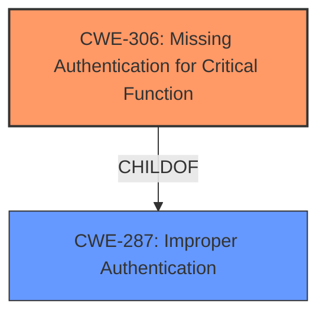

# Analysis Report for CVE-2021-40866

# Vulnerability Analysis Report: CVE-2021-40866

## Description


## Analysis (with Relationship Data)

# Summary
| CWE ID | CWE Name | Confidence | CWE Abstraction Level | CWE Vulnerability Mapping Label | CWE-Vulnerability Mapping Notes |
|---|---|---|---|---|---|
| CWE-306 | Missing Authentication for Critical Function | 1.0 | Base | Allowed | Primary CWE |
| CWE-287 | Improper Authentication | 0.7 | Class | Discouraged | Secondary Candidate |

## Evidence and Confidence

*   **Confidence Score:** 1.0
*   **Evidence Strength:** HIGH

## Relationship Analysis
The primary CWE is CWE-306, which is a Base-level CWE. CWE-306 is a child of CWE-287. CWE-287 is a Class-level CWE and is discouraged when a more specific CWE can be identified. Therefore, CWE-306 is more specific and a better choice.



## Vulnerability Chain
The vulnerability chain starts with the **failure to check authentication** in the `/sqfs/bin/sccd` daemon, leading to a remote admin password change by an unauthenticated attacker. The root cause is the **missing authentication** check.

## Summary of Analysis
The vulnerability description clearly states that the `/sqfs/bin/sccd` daemon **fails to check authentication** when the authentication TLV is missing from a received NSDP packet. This allows an unauthenticated attacker to change the admin password. This directly aligns with CWE-306: Missing Authentication for Critical Function.

The "CVE Reference Links Content Summary" confirms that the `sccd` daemon does not require the type 10 "password authentication" TLV to be present in the NSDP datagram before processing "set" commands. This permits an attacker to execute privileged operations, such as changing the administrator password, without authentication.

Therefore, CWE-306 is the most appropriate mapping.

CWE-287: Improper Authentication was considered, as it is a parent of CWE-306. However, CWE-287 is a Class-level CWE and is discouraged when a more specific CWE can be identified. Since the vulnerability description specifically mentions **missing authentication**, CWE-306 is a more accurate and specific choice.
Relevant CWE Information:

## CWE-303: Incorrect Implementation of Authentication Algorithm
**Abstraction Level**: Base
**Similarity Score**: 0.77
**Source**: dense

**Description**:
The requirements for the product dictate the use of an established authentication algorithm, but the implementation of the algorithm is incorrect.
**Rationale:** This CWE is about *incorrect* implementation, but the vulnerability is about *missing* authentication, so this is not the right fit.

## CWE-807: Reliance on Untrusted Inputs in a Security Decision
**Abstraction Level**: Base
**Similarity Score**: 0.76
**Source**: dense

**Description**:
The product uses a protection mechanism that relies on the existence or values of an input, but the input can be modified by an untrusted actor in a way that bypasses the protection mechanism.
**Rationale:** While the vulnerability involves untrusted inputs, the core issue is the lack of authentication, not the reliance on the input itself.

## CWE-1391: Use of Weak Credentials
**Abstraction Level**: Class
**Similarity Score**: 0.76
**Source**: dense

**Description**:
The product uses weak credentials (such as a default key or hard-coded password) that can be calculated, derived, reused, or guessed by an attacker.
**Rationale:** This vulnerability doesn't involve weak credentials, but rather a complete bypass of authentication.

## CWE-1390: Weak Authentication
**Abstraction Level**: Class
**Similarity Score**: 0.76
**Source**: dense

**Description**:
The product uses an authentication mechanism to restrict access to specific users or identities, but the mechanism does not sufficiently prove that the claimed identity is correct.
**Rationale:** This is a valid candidate but less specific than CWE-306. The description does state that authentication is missing.

## CWE-288: Authentication Bypass Using an Alternate Path or Channel
**Abstraction Level**: Base
**Similarity Score**: 0.75
**Source**: dense

**Description**:
The product requires authentication, but the product has an alternate path or channel that does not require authentication.
**Rationale:** This vulnerability does not use an alternate path, but the primary path.

## CWE-291: Reliance on IP Address for Authentication
**Abstraction Level**: Variant
**Similarity Score**: 0.75
**Source**: dense

**Description**:
The product uses an IP address for authentication.
**Rationale:** This vulnerability does not use IP addresses for authentication.

## CWE-1289: Improper Validation of Unsafe Equivalence in Input
**Abstraction Level**: Base
**Similarity Score**: 0.75
**Source**: dense

**Description**:
The product receives an input value that is used as a resource identifier or other type of reference, but it does not validate or incorrectly validates that the input is equivalent to a potentially-unsafe value.
**Rationale:** While input validation might be related, the core issue is missing authentication.

## CWE-305: Authentication Bypass by Primary Weakness
**Abstraction Level**: Base
**Similarity Score**: 0.74
**Source**: dense

**Description**:
The authentication algorithm is sound, but the implemented mechanism can be bypassed as the result of a separate weakness that is primary to the authentication error.
**Rationale:** The vulnerability is due to a *missing* authentication check, not a bypass of an existing algorithm.

## CWE-307: Improper Restriction of Excessive Authentication Attempts
**Abstraction Level**: Base
**Similarity Score**: 0.74
**Source**: dense

**Description**:
The product does not implement sufficient measures to prevent multiple failed authentication attempts within a short time frame.
**Rationale:** This vulnerability is not about limiting authentication attempts, but a complete absence of authentication.

## CWE-798: Use of Hard-coded Credentials
**Abstraction Level**: Base
**Similarity Score**: 0.74
**Source**: dense

**Description**:
The product contains hard-coded credentials, such as a password or cryptographic key.
**Rationale:** This vulnerability does not have to do with hardcoded credentials.

## CWE-259: Use of Hard-coded Password
**Abstraction Level**: Variant
**Similarity Score**: 6059.99
**Source**: sparse

**Description**:
The product contains a hard-coded password, which it uses for its own inbound authentication or for outbound communication to external components.
**Rationale:** This vulnerability does not have to do with hardcoded credentials.

## CWE-184: Incomplete List of Disallowed Inputs
**Abstraction Level**: Base
**Similarity Score**: 6053.98
**Source**: sparse

**Description**:
The product implements a protection mechanism that relies on a list of inputs (or properties of inputs) that are not allowed by policy or otherwise require other action to neutralize before additional processing takes place, but the list is incomplete.
**Rationale:** This vulnerability does not have to do with disallowed inputs.

## CWE-863: Incorrect Authorization
**Abstraction Level**: Class
**Similarity Score**: 5985.81
**Source**: sparse

**Description**:
The product performs an authorization check when an actor attempts to access a resource or perform an action, but it does not correctly perform the check.
**Rationale:** Authorization comes after authentication. Since authentication is missing, it is not an authorization issue.

## CWE-434: Unrestricted Upload of File with Dangerous Type
**Abstraction Level**: base
**Similarity Score**: 4.33
**Source**: graph

**Description**:
CWE-434: Unrestricted Upload of File with Dangerous Type
**Rationale:** This vulnerability does not involve unrestricted uploads.

## CWE-79: Improper Neutralization of Input During Web Page Generation ('Cross-site Scripting')
**Abstraction Level**: base
**Similarity Score**: 4.33
**Source**: graph

**Description**:
CWE-79: Improper Neutralization of Input During Web Page Generation ('Cross-site Scripting')
**Rationale:** This vulnerability does not involve cross-site scripting.

## CWE-93: Improper Neutralization of CRLF Sequences ('CRLF Injection')
**Abstraction Level**: base
**Similarity Score**: 4.33
**Source**: graph

**Description**:
CWE-93: Improper Neutralization of CRLF Sequences ('CRLF Injection')
**Rationale:** This vulnerability does not involve CRLF injection.

## CWE-117: Improper Output Neutralization for Logs
**Abstraction Level**: base
**Similarity Score**: 4.33
**Source**: graph

**Description**:
CWE-117: Improper Output Neutralization for Logs
**Rationale:** This vulnerability does not involve improper output neutralization for logs.


## CWE Relationship Analysis

Current CWEs represent these abstraction levels: .


### Vulnerability Chain Analysis

**Chain starting from CWE-807:**
- 807 (Reliance on Untrusted Inputs in a Security Decision) - ROOT


**Chain starting from CWE-259:**
- 259 (Use of Hard-coded Password) - ROOT


### CWE Relationship Diagram

```mermaid
graph TD
    classDef primary fill:#f96,stroke:#333,stroke-width:2px
    classDef secondary fill:#69f,stroke:#333
    classDef tertiary fill:#9e9,stroke:#333
```


*Report generated on 2025-03-31 05:00:29*
