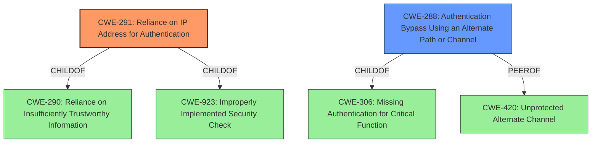

# Analysis for CVE-2021-40867

# Summary
| CWE ID | CWE Name | Confidence | CWE Abstraction Level | CWE Vulnerability Mapping Label | CWE-Vulnerability Mapping Notes |
|---|---|---|---|---|---|
| CWE-291 | Reliance on IP Address for Authentication | 0.9 | Variant | Allowed | Primary CWE. The authentication mechanism relies solely on the IP address, which can be spoofed. |
| CWE-288 | Authentication Bypass Using an Alternate Path or Channel | 0.7 | Base | Allowed | Secondary CWE. The race condition creates an alternate channel to bypass authentication by hijacking the session information. |

## Evidence and Confidence

*   **Confidence Score:** 0.8
*   **Evidence Strength:** HIGH

## Relationship Analysis
The primary CWE is CWE-291 (Reliance on IP Address for Authentication), which is a Variant of CWE-290 (Reliance on Insufficiently Trustworthy Information) and CWE-923 (Improperly Implemented Security Check). CWE-288 (Authentication Bypass Using an Alternate Path or Channel) is a Base CWE and a peer of CWE-420 (Unprotected Alternate Channel). It is also a ChildOf CWE-306 (Missing Authentication for Critical Function). The relationship analysis shows that the primary weakness is relying on an easily spoofable factor for authentication. The race condition allows an attacker to bypass authentication leading to full device compromise.

## Vulnerability Chain
The vulnerability chain starts with the **reliance on the IP address for authentication (CWE-291)**. This leads to a **race condition (no CWE)**, where an attacker can hijack the authentication process by flooding the `/cgi/get.cgi` endpoint. The successful exploitation results in an **authentication bypass (CWE-288)** and ultimately, **full device compromise (no CWE)**.

## Summary of Analysis
The initial analysis identified the **authentication hijacking race-condition** as the primary weakness. The vulnerability description and CVE reference links content summary clearly point to the **reliance on the client's IP address as the sole factor for authentication**, making CWE-291 the most appropriate primary CWE. The race condition allows an attacker to bypass the authentication process, which is best captured by CWE-288.

The selection is heavily based on the evidence provided in the "CVE Reference Links Content Summary" section, which states, "the `get.cgi` handler, which is responsible for providing session bootstrapping information, relies solely on the client IP and a guessable browser type number for verification." This aligns perfectly with the description of CWE-291, "The product uses an IP address for authentication."

The graph relationships support the decision by showing how CWE-291 is related to more general authentication issues (CWE-290) and security check implementation (CWE-923). The relationship between CWE-288 and CWE-306 highlights the authentication bypass aspect of the vulnerability.

The selected CWEs are at the optimal level of specificity, with CWE-291 being a Variant that directly addresses the reliance on IP addresses for authentication, and CWE-288 being a Base CWE that explains the bypass via an alternate path.

Other CWEs Considered:

*   CWE-287 (Improper Authentication): This is too general, as it doesn't specify the type of authentication error. The description suggests using more specific children.
*   CWE-306 (Missing Authentication for Critical Function): While related, this is less specific than CWE-291, as there is authentication, but it's flawed.
*   CWE-1390 (Weak Authentication): This is a class and not as specific as relying on the IP address.
*   CWE-863 (Incorrect Authorization): This is not about incorrect authorization, but about incorrect authentication.
*   CWE-230 (Improper Handling of Missing Values): Does not apply, since the IP is not missing.
*   CWE-93 (Improper Neutralization of CRLF Sequences ('CRLF Injection')): Does not apply
*   CWE-77 (Improper Neutralization of Special Elements used in a Command ('Command Injection')): Does not apply.

# Enhanced Query for CVE-2021-40867

## Vulnerability Description
Certain NETGEAR smart switches are affected by an **authentication hijacking race-condition** vulnerability by an unauthenticated attacker who uses the same source IP address as an admin in the process of logging in (e.g., behind the same NAT device, or already in possession of a foothold on an admins machine). This occurs because the multi-step HTTP authentication process is effectively tied only to the source IP address. This affects GC108P before 1.0.8.2, GC108PP before 1.0.8.2, GS108Tv3 before 7.0.7.2, GS110TPP before 7.0.7.2, GS110TPv3 before 7.0.7.2, GS110TUP before 1.0.5.3, GS308T before 1.0.3.2, GS310TP before 1.0.3.2, GS710TUP before 1.0.5.3, GS716TP before 1.0.4.2, GS716TPP before 1.0.4.2, GS724TPP before 2.0.6.3, GS724TPv2 before 2.0.6.3, GS728TPPv2 before 6.0.8.2, GS728TPv2 before 6.0.8.2, GS750E before 1.0.1.10, GS752TPP before 6.0.8.2, GS752TPv2 before 6.0.8.2, MS510TXM before 1.0.4.2, and MS510TXUP before 1.0.4.2.

### Vulnerability Description Key Phrases
- **rootcause:** **authentication hijacking race-condition**
- **impact:** unauthenticated admin login
- **vector:** same source IP address
- **attacker:** unauthenticated attacker
- **product:** NETGEAR smart switches
- **version:** multiple versions

## CVE Reference Links Content Summary
Based on the provided content, here's a breakdown of the vulnerability information related to CVE-2021-40867:

**Root Cause of Vulnerability:**

The vulnerability lies in the web UI authentication logic of certain NETGEAR smart switches. Specifically, the `get.cgi` handler, which is responsible for providing session bootstrapping information, relies solely on the client IP and a guessable browser type number for verification. This lack of proper session management and reliance on easily spoofable data allows an attacker to hijack the authentication process.

**Weaknesses/Vulnerabilities Present:**

*   **Insecure Session Handling:** The vulnerability stems from a lack of a secure session identifier. Instead of using a cryptographically secure token, the system relies on the client's IP address and user-agent type which is insufficient for securing the session.
*   **Race Condition:** The vulnerability is exploitable due to a race condition between the legitimate admin's browser and the attacker's requests to the `/cgi/get.cgi` endpoint. The attacker can flood the endpoint to gain session information before the legitimate user.
*   **Lack of Input Validation:** The lack of proper input validation when polling for the session status allows an attacker to send repeated requests without having to authenticate or prove they are the intended user.

**Impact of Exploitation:**

*   **Full Device Compromise:** A successful exploitation allows the attacker to hijack the session bootstrapping information. This grants the attacker full administrative access to the device's web UI and thus complete control of the switch.
*   **Data Manipulation:** With admin access, the attacker can manipulate switch configurations, potentially disrupting network operations or redirecting traffic.

**Attack Vectors:**

*   **Same IP Requirement:** The primary attack vector requires the attacker to have the same IP address as the admin who is logging in. This can be achieved by:
    *   Compromising a machine on the same network as the admin with limited privileges.
    *   Sharing the same source NAT IP
    *   Spoofing the IP address, potentially requiring low-level network manipulation.
*   **Race Condition:** The attacker needs to win a race condition with a 1-second window during the admin's login process.

**Required Attacker Capabilities/Position:**

*   **Network Proximity:** The attacker needs to be on the same network as the victim and ideally have the same IP address as the admin.
*   **Technical Knowledge:** The attacker needs technical knowledge to craft HTTP requests to flood `/cgi/get.cgi` and potentially spoof IP addresses.
*   **Timing:** Exploitation requires an attacker to be active while a legitimate administrator is logging into the web UI.

**Additional Notes:**

*   The vulnerability was identified as "Draconian Fear" by Gynvael Coldwind and reported to NETGEAR.
*   NETGEAR assigned this vulnerability the identifier PSV-2021-0144.
*   The advisory mentions a "90-day policy", indicating that the vulnerability was disclosed publicly 90 days after it was initially reported.
*   The provided proof-of-concept exploit (PoC) demonstrates how an attacker can successfully exploit this vulnerability.
*   The advisory also lists multiple other vulnerabilities that were addressed by these patches (PSV-2021-0140, PSV-2021-0145), but the details for "Draconian Fear" are the most detailed.
*  The suggested fix is to use a cryptographically secure random value for the result file name, which should then be passed as a token and used for subsequent get.cgi requests

This information is more detailed than a typical CVE description, providing insights into the technical aspects of the vulnerability and how it can be exploited.

## Retriever Results

### Top Combined Results

| Rank | CWE ID | Name | Abstraction | Usage  | Retrievers | Individual Scores |
|------|--------|------|-------------|-------|------------|-------------------|
| 1 | 291 | Reliance on IP Address for Authentication | Variant | Allowed | sparse | 1.440 |
| 2 | 230 | Improper Handling of Missing Values | Variant | Allowed | sparse | 1.169 |
| 3 | 93 | Improper Neutralization of CRLF Sequences ('CRLF Injection') | Base | Allowed | sparse | 1.015 |
| 4 | 77 | Improper Neutralization of Special Elements used in a Command ('Command Injection') | Class | Allowed-with-Review | sparse | 0.804 |
| 5 | 287 | Improper Authentication | Class | Discouraged | sparse | 0.777 |
| 6 | 288 | Authentication Bypass Using an Alternate Path or Channel | Base | Allowed | dense | 0.600 |
| 7 | 184 | Incomplete List of Disallowed Inputs | Base | Allowed | graph | 0.002 |
| 8 | 1390 | Weak Authentication | Class | Allowed-with-Review | sparse | 0.777 |
| 9 | 863 | Incorrect Authorization | Class | Allowed-with-Review | sparse | 0.770 |
| 10 | 306 | Missing Authentication for Critical Function | Base | Allowed | sparse | 0.768 |

# Complete CWE Specifications

## CWE-291: Reliance on IP Address for Authentication
**Abstraction:** Variant
**Status:** Incomplete

### Description
The product uses an IP address for authentication.

### Extended Description
IP addresses can be easily spoofed. Attackers can forge the source IP address of the packets they send, but response packets will return to the forged IP address. To see the response packets, the attacker has to sniff the traffic between the victim machine and the forged IP address. In order to accomplish the required sniffing, attackers typically attempt to locate themselves on the same subnet as the victim machine. Attackers may be able to circumvent this requirement by using source routing, but source routing is disabled across much of the Internet today. In summary, IP address verification can be a useful part of an authentication scheme, but it should not be the single factor required for authentication.

### Alternative Terms
None

### Relationships
ChildOf -> CWE-290
ChildOf -> CWE-923
ChildOf -> CWE-471

### Mapping Guidance
**Usage:** Allowed
**Rationale:** This CWE entry is at the Variant level of abstraction, which is a preferred level of abstraction for mapping to the root causes of vulnerabilities.
**Comments:** Carefully read both the name and description to ensure that this mapping is an appropriate fit. Do not try to 'force' a mapping to a lower-level Base/Variant simply to comply with this preferred level of abstraction.
**Reasons:**
- Acceptable-Use

### Observed Examples
- **CVE-2022-30319:** S-bus functionality in a home automation product performs access control using an IP allowlist, which can be bypassed by a forged IP address.

## CWE-230: Improper Handling of Missing Values
**Abstraction:** Variant
**Status:** Draft

### Description
The product does not handle or incorrectly handles when a parameter, field, or argument name is specified, but the associated value is missing, i.e. it is empty, blank, or null.

### Extended Description
Not provided

### Alternative Terms
None

### Relationships
ChildOf -> CWE-229

### Mapping Guidance
**Usage:** Allowed
**Rationale:** This CWE entry is at the Variant level of abstraction, which is a preferred level of abstraction for mapping to the root causes of vulnerabilities.
**Comments:** Carefully read both the name and description to ensure that this mapping is an appropriate fit. Do not try to 'force' a mapping to a lower-level Base/Variant simply to comply with this preferred level of abstraction.
**Reasons:**
- Acceptable-Use

### Additional Notes
**[Research Gap]** Some "crash by port scan" bugs are probably due to this, but lack of diagnosis makes it difficult to be certain.

### Observed Examples
- **CVE-2002-0422:** Blank Host header triggers resultant infoleak.
- **CVE-2000-1006:** Blank "charset" attribute in MIME header triggers crash.
- **CVE-2004-1504:** Blank parameter causes external error infoleak.

## CWE-93: Improper Neutralization of CRLF Sequences ('CRLF Injection')
**Abstraction:** Base
**Status:** Draft

### Description
The product uses CRLF (carriage return line feeds) as a special element, e.g. to separate lines or records, but it does not neutralize or incorrectly neutralizes CRLF sequences from inputs.

### Extended Description
Not provided

### Alternative Terms
None

### Relationships
ChildOf -> CWE-74
CanPrecede -> CWE-117

### Mapping Guidance
**Usage:** Allowed
**Rationale:** This CWE entry is at the Base level of abstraction, which is a preferred level of abstraction for mapping to the root causes of vulnerabilities.
**Comments:** Carefully read both the name and description to ensure that this mapping is an appropriate fit. Do not try to 'force' a mapping to a lower-level Base/Variant simply to comply with this preferred level of abstraction.
**Reasons:**
- Acceptable-Use

### Observed Examples
- **CVE-2002-1771:** CRLF injection enables spam proxy (add mail headers) using email address or name.
- **CVE-2002-1783:** CRLF injection in API function arguments modify headers for outgoing requests.
- **CVE-2004-1513:** Spoofed entries in web server log file via carriage returns

## CWE-77: Improper Neutralization of Special Elements used in a Command ('Command Injection')
**Abstraction:** Class
**Status:** Draft

### Description
The product constructs all or part of a command using externally-influenced input from an upstream component, but it does not neutralize or incorrectly neutralizes special elements that could modify the intended command when it is sent to a downstream component.

### Extended Description

Many protocols and products have their own custom command language. While OS or shell command strings are frequently discovered and targeted, developers may not realize that these other command languages might also be vulnerable to attacks.

### Alternative Terms
Command injection: an attack-oriented phrase for this weakness. Note: often used when "OS command injection" (CWE-78) was intended.

### Relationships
ChildOf -> CWE-74
ChildOf -> CWE-74

### Mapping Guidance
**Usage:** Allowed-with-Review
**Rationale:** CWE-77 is often misused when OS command injection (CWE-78) was intended instead [REF-1287].
**Comments:** Ensure that the analysis focuses on the root-cause error that allows the execution of commands, as there are many weaknesses that can lead to this consequence. See Terminology Notes. If the weakness involves a command language besides OS shell invocation, then CWE-77 could be used.
**Reasons:**
- Frequent Misuse
**Suggested Alternatives:**
- CWE-78: OS Command Injection

### Additional Notes
**[Terminology]** 

The "command injection" phrase carries different meanings, either as an attack or as a technical impact. The most common usage of "command injection" refers to the more-accurate OS command injection (CWE-78), but there are many command languages.

In vulnerability-focused analysis, the phrase may refer to any situation in which the adversary can execute commands of their own choosing, i.e., the focus is on the risk and/or technical impact of exploitation. Many proof-of-concept exploits focus on the ability to execute commands and may emphasize "command injection." However, there are dozens of weaknesses that can allow execution of commands. That is, the ability to execute commands could be resultant from another weakness.

To some, "command injection" can include cases in which the functionality intentionally allows the user to specify an entire command, which is then executed. In this case, the root cause weakness might be related to missing or incorrect authorization, since an adversary should not be able to specify arbitrary commands, but some users or admins are allowed.

CWE-77 and its descendants are specifically focused on behaviors in which the product is intentionally building a command to execute, and the adversary can inject separators into the command or otherwise change the command being executed.

**[Other]** 

Command injection is a common problem with wrapper programs.

### Observed Examples
- **CVE-2022-1509:** injection of sed script syntax ("sed injection")
- **CVE-2024-5184:** API service using a large generative AI model allows direct prompt injection to leak hard-coded system prompts or execute other prompts.
- **CVE-2020-11698:** anti-spam product allows injection of SNMP commands into confiuration file

## CWE-287: Improper Authentication
**Abstraction:** Class
**Status:** Draft

### Description
When an actor claims to have a given identity, the product does not prove or insufficiently proves that the claim is correct.

### Extended Description
Not provided

### Alternative Terms
authentification: An alternate term is "authentification", which appears to be most commonly used by people from non-English-speaking countries.
AuthN: "AuthN" is typically used as an abbreviation of "authentication" within the web application security community. It is also distinct from "AuthZ," which is an abbreviation of "authorization." The use of "Auth" as an abbreviation is discouraged, since it could be used for either authentication or authorization.
AuthC: "AuthC" is used as an abbreviation of "authentication," but it appears to used less frequently than "AuthN."

### Relationships
ChildOf -> CWE-284
ChildOf -> CWE-284

### Mapping Guidance
**Usage:** Discouraged
**Rationale:** This CWE entry might be misused when lower-level CWE entries are likely to be applicable. It is a level-1 Class (i.e., a child of a Pillar).
**Comments:** Consider children or descendants, beginning with CWE-1390: Weak Authentication or CWE-306: Missing Authentication for Critical Function.
**Reasons:**
- Frequent Misuse
**Suggested Alternatives:**
- CWE-1390: Weak Authentication
- CWE-306: Missing Authentication for Critical Function

### Additional Notes
**[Relationship]** This can be resultant from SQL injection vulnerabilities and other issues.

**[Maintenance]** The Taxonomy_Mappings to ISA/IEC 62443 were added in CWE 4.10, but they are still under review and might change in future CWE versions. These draft mappings were performed by members of the "Mapping CWE to 62443" subgroup of the CWE-CAPEC ICS/OT Special Interest Group (SIG), and their work is incomplete as of CWE 4.10. The mappings are included to facilitate discussion and review by the broader ICS/OT community, and they are likely to change in future CWE versions.

### Observed Examples
- **CVE-2022-35248:** Chat application skips validation when Central Authentication Service (CAS) is enabled, effectively removing the second factor from two-factor authentication
- **CVE-2022-36436:** Python-based authentication proxy does not enforce password authentication during the initial handshake, allowing the client to bypass authentication by specifying a 'None' authentication type.
- **CVE-2022-30034:** Chain: Web UI for a Python RPC framework does not use regex anchors to validate user login emails (CWE-777), potentially allowing bypass of OAuth (CWE-1390).

## CWE-288: Authentication Bypass Using an Alternate Path or Channel
**Abstraction:** Base
**Status:** Incomplete

### Description
The product requires authentication, but the product has an alternate path or channel that does not require authentication.

### Extended Description
Not provided

### Alternative Terms
None

### Relationships
ChildOf -> CWE-306
ChildOf -> CWE-284
PeerOf -> CWE-420

### Mapping Guidance
**Usage:** Allowed
**Rationale:** This CWE entry is at the Base level of abstraction, which is a preferred level of abstraction for mapping to the root causes of vulnerabilities.
**Comments:** Carefully read both the name and description to ensure that this mapping is an appropriate fit. Do not try to 'force' a mapping to a lower-level Base/Variant simply to comply with this preferred level of abstraction.
**Reasons:**
- Acceptable-Use

### Additional Notes
**[Relationship]** overlaps Unprotected Alternate Channel

### Observed Examples
- **CVE-2000-1179:** Router allows remote attackers to read system logs without authentication by directly connecting to the login screen and typing certain control characters.
- **CVE-1999-1454:** Attackers with physical access to the machine may bypass the password prompt by pressing the ESC (Escape) key.
- **CVE-1999-1077:** OS allows local attackers to bypass the password protection of idled sessions via the programmer's switch or CMD-PWR keyboard sequence, which brings up a debugger that the attacker can use to disable the lock.

## CWE-184: Incomplete List of Disallowed Inputs
**Abstraction:** Base
**Status:** Draft

### Description
The product implements a protection mechanism that relies on a list of inputs (or properties of inputs) that are not allowed by policy or otherwise require other action to neutralize before additional processing takes place, but the list is incomplete.

### Extended Description
Not provided

### Alternative Terms
Denylist / Deny List: This is used by CWE and CAPEC instead of other commonly-used terms. Its counterpart is allowlist.
Blocklist / Block List: This is often used by security tools such as firewalls, email or web gateways, proxies, etc.
Blacklist / Black List: This term is frequently used, but usage has been declining as organizations have started to adopt other terms.

### Relationships
ChildOf -> CWE-693
ChildOf -> CWE-1023
CanPrecede -> CWE-79
CanPrecede -> CWE-78
CanPrecede -> CWE-434
CanPrecede -> CWE-98

### Mapping Guidance
**Usage:** Allowed
**Rationale:** This CWE entry is at the Base level of abstraction, which is a preferred level of abstraction for mapping to the root causes of vulnerabilities.
**Comments:** Carefully read both the name and description to ensure that this mapping is an appropriate fit. Do not try to 'force' a mapping to a lower-level Base/Variant simply to comply with this preferred level of abstraction.
**Reasons:**
- Acceptable-Use

### Additional Notes
**[Relationship]** 

Multiple interpretation errors can indirectly introduce inputs that should be disallowed. For example, a list of dangerous shell metacharacters might not include a metacharacter that only has meaning in one particular shell, not all of them; or a check for XSS manipulations might ignore an unusual construct that is supported by one web browser, but not others.

### Observed Examples
- **CVE-2024-4315:** Chain: API for text generation using Large Language Models (LLMs) does not include the "\" Windows folder separator in its denylist (CWE-184) when attempting to prevent Local File Inclusion via path traversal (CWE-22), allowing deletion of arbitrary files on Windows systems.
- **CVE-2008-2309:** product uses a denylist to identify potentially dangerous content, allowing attacker to bypass a warning
- **CVE-2005-2782:** PHP remote file inclusion in web application that filters "http" and "https" URLs, but not "ftp".

## CWE-1390: Weak Authentication
**Abstraction:** Class
**Status:** Incomplete

### Description
The product uses an authentication mechanism to restrict access to specific users or identities, but the mechanism does not sufficiently prove that the claimed identity is correct.

### Extended Description

Attackers may be able to bypass weak authentication faster and/or with less effort than expected.

### Alternative Terms
None

### Relationships
ChildOf -> CWE-287

### Mapping Guidance
**Usage:** Allowed-with-Review
**Rationale:** This CWE entry is a Class and might have Base-level children that would be more appropriate
**Comments:** Examine children of this entry to see if there is a better fit
**Reasons:**
- Abstraction

### Observed Examples
- **CVE-2022-30034:** Chain: Web UI for a Python RPC framework does not use regex anchors to validate user login emails (CWE-777), potentially allowing bypass of OAuth (CWE-1390).
- **CVE-2022-35248:** Chat application skips validation when Central Authentication Service (CAS) is enabled, effectively removing the second factor from two-factor authentication
- **CVE-2021-3116:** Chain: Python-based HTTP Proxy server uses the wrong boolean operators (CWE-480) causing an incorrect comparison (CWE-697) that identifies an authN failure if all three conditions are met instead of only one, allowing bypass of the proxy authentication (CWE-1390)

## CWE-863: Incorrect Authorization
**Abstraction:** Class
**Status:** Incomplete

### Description
The product performs an authorization check when an actor attempts to access a resource or perform an action, but it does not correctly perform the check.

### Extended Description
Not provided

### Alternative Terms
AuthZ: "AuthZ" is typically used as an abbreviation of "authorization" within the web application security community. It is distinct from "AuthN" (or, sometimes, "AuthC") which is an abbreviation of "authentication." The use of "Auth" as an abbreviation is discouraged, since it could be used for either authentication or authorization.

### Relationships
ChildOf -> CWE-285
ChildOf -> CWE-284

### Mapping Guidance
**Usage:** Allowed-with-Review
**Rationale:** This CWE entry is a Class and might have Base-level children that would be more appropriate
**Comments:** Examine children of this entry to see if there is a better fit
**Reasons:**
- Abstraction

### Additional Notes
**[Terminology]** 

Assuming a user with a given identity, authorization is the process of determining whether that user can access a given resource, based on the user's privileges and any permissions or other access-control specifications that apply to the resource.

### Observed Examples
- **CVE-2021-39155:** Chain: A microservice integration and management platform compares the hostname in the HTTP Host header in a case-sensitive way (CWE-178, CWE-1289), allowing bypass of the authorization policy (CWE-863) using a hostname with mixed case or other variations.
- **CVE-2019-15900:** Chain: sscanf() call is used to check if a username and group exists, but the return value of sscanf() call is not checked (CWE-252), causing an uninitialized variable to be checked (CWE-457), returning success to allow authorization bypass for executing a privileged (CWE-863).
- **CVE-2009-2213:** Gateway uses default "Allow" configuration for its authorization settings.

## CWE-306: Missing Authentication for Critical Function
**Abstraction:** Base
**Status:** Draft

### Description
The product does not perform any authentication for functionality that requires a provable user identity or consumes a significant amount of resources.

### Extended Description
Not provided

### Alternative Terms
None

### Relationships
ChildOf -> CWE-287
ChildOf -> CWE-287

### Mapping Guidance
**Usage:** Allowed
**Rationale:** This CWE entry is at the Base level of abstraction, which is a preferred level of abstraction for mapping to the root causes of vulnerabilities.
**Comments:** Carefully read both the name and description to ensure that this mapping is an appropriate fit. Do not try to 'force' a mapping to a lower-level Base/Variant simply to comply with this preferred level of abstraction.
**Reasons:**
- Acceptable-Use

### Observed Examples
- **CVE-2022-31260:** Chain: a digital asset management program has an undisclosed backdoor in the legacy version of a PHP script (CWE-912) that could allow an unauthenticated user to export metadata (CWE-306)
- **CVE-2022-29951:** TCP-based protocol in Programmable Logic Controller (PLC) has no authentication.
- **CVE-2022-29952:** Condition Monitor firmware uses a protocol that does not require authentication.

