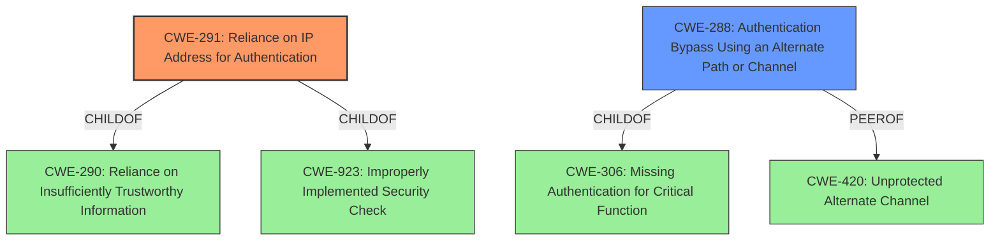

# Analysis Report for CVE-2021-40867

# Vulnerability Analysis Report: CVE-2021-40867

## Description


## Analysis (with Relationship Data)

# Summary
| CWE ID | CWE Name | Confidence | CWE Abstraction Level | CWE Vulnerability Mapping Label | CWE-Vulnerability Mapping Notes |
|---|---|---|---|---|---|
| CWE-291 | Reliance on IP Address for Authentication | 0.9 | Variant | Allowed | Primary CWE. The authentication mechanism relies solely on the IP address, which can be spoofed. |
| CWE-288 | Authentication Bypass Using an Alternate Path or Channel | 0.7 | Base | Allowed | Secondary CWE. The race condition creates an alternate channel to bypass authentication by hijacking the session information. |

## Evidence and Confidence

*   **Confidence Score:** 0.8
*   **Evidence Strength:** HIGH

## Relationship Analysis
The primary CWE is CWE-291 (Reliance on IP Address for Authentication), which is a Variant of CWE-290 (Reliance on Insufficiently Trustworthy Information) and CWE-923 (Improperly Implemented Security Check). CWE-288 (Authentication Bypass Using an Alternate Path or Channel) is a Base CWE and a peer of CWE-420 (Unprotected Alternate Channel). It is also a ChildOf CWE-306 (Missing Authentication for Critical Function). The relationship analysis shows that the primary weakness is relying on an easily spoofable factor for authentication. The race condition allows an attacker to bypass authentication leading to full device compromise.



## Vulnerability Chain
The vulnerability chain starts with the **reliance on the IP address for authentication (CWE-291)**. This leads to a **race condition (no CWE)**, where an attacker can hijack the authentication process by flooding the `/cgi/get.cgi` endpoint. The successful exploitation results in an **authentication bypass (CWE-288)** and ultimately, **full device compromise (no CWE)**.

## Summary of Analysis
The initial analysis identified the **authentication hijacking race-condition** as the primary weakness. The vulnerability description and CVE reference links content summary clearly point to the **reliance on the client's IP address as the sole factor for authentication**, making CWE-291 the most appropriate primary CWE. The race condition allows an attacker to bypass the authentication process, which is best captured by CWE-288.

The selection is heavily based on the evidence provided in the "CVE Reference Links Content Summary" section, which states, "the `get.cgi` handler, which is responsible for providing session bootstrapping information, relies solely on the client IP and a guessable browser type number for verification." This aligns perfectly with the description of CWE-291, "The product uses an IP address for authentication."

The graph relationships support the decision by showing how CWE-291 is related to more general authentication issues (CWE-290) and security check implementation (CWE-923). The relationship between CWE-288 and CWE-306 highlights the authentication bypass aspect of the vulnerability.

The selected CWEs are at the optimal level of specificity, with CWE-291 being a Variant that directly addresses the reliance on IP addresses for authentication, and CWE-288 being a Base CWE that explains the bypass via an alternate path.

Other CWEs Considered:

*   CWE-287 (Improper Authentication): This is too general, as it doesn't specify the type of authentication error. The description suggests using more specific children.
*   CWE-306 (Missing Authentication for Critical Function): While related, this is less specific than CWE-291, as there is authentication, but it's flawed.
*   CWE-1390 (Weak Authentication): This is a class and not as specific as relying on the IP address.
*   CWE-863 (Incorrect Authorization): This is not about incorrect authorization, but about incorrect authentication.
*   CWE-230 (Improper Handling of Missing Values): Does not apply, since the IP is not missing.
*   CWE-93 (Improper Neutralization of CRLF Sequences ('CRLF Injection')): Does not apply
*   CWE-77 (Improper Neutralization of Special Elements used in a Command ('Command Injection')): Does not apply.


## CWE Relationship Analysis

Current CWEs represent these abstraction levels: .


### Vulnerability Chain Analysis

**Chain starting from CWE-290:**
- 290 (Authentication Bypass by Spoofing) - ROOT


**Chain starting from CWE-923:**
- 923 (Improper Restriction of Communication Channel to Intended Endpoints) - ROOT


### CWE Relationship Diagram

```mermaid
graph TD
    classDef primary fill:#f96,stroke:#333,stroke-width:2px
    classDef secondary fill:#69f,stroke:#333
    classDef tertiary fill:#9e9,stroke:#333
```


*Report generated on 2025-03-30 20:11:03*
