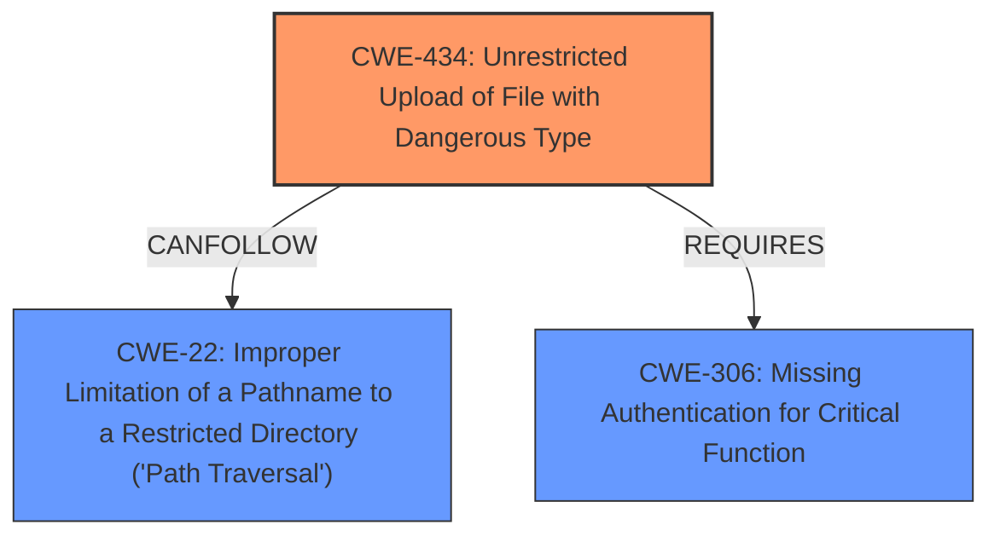

# Raw Analyzer Response for CVE-2021-40870

# Summary
| CWE ID | CWE Name | Confidence | CWE Abstraction Level | CWE Vulnerability Mapping Label | CWE-Vulnerability Mapping Notes |
|---|---|---|---|---|---|
| CWE-434 | Unrestricted Upload of File with Dangerous Type | 1.0 | Base | Allowed | Primary CWE |
| CWE-22 | Improper Limitation of a Pathname to a Restricted Directory ('Path Traversal') | 0.8 | Base | Allowed | Secondary CWE |
| CWE-306 | Missing Authentication for Critical Function | 0.7 | Base | Allowed | Secondary CWE |

## Evidence and Confidence

*   **Confidence Score:** 0.8
*   **Evidence Strength:** HIGH

## Relationship Analysis
The primary weakness is CWE-434, which allows for the upload of dangerous file types. This can be compounded by CWE-22, where the file can be placed due to **improper limitation of a pathname**. Furthermore, contributing to the root cause is CWE-306, **missing authentication**, which permits an unauthenticated user to perform the upload.

## Vulnerability Chain
The vulnerability chain starts with **missing authentication** (CWE-306), which allows an **unauthenticated user** to perform an **unrestricted upload of a file with a dangerous type** (CWE-434) and leverage a **path traversal** (CWE-22) to place the file in an exploitable location, eventually leading to **arbitrary code execution**.
  - CWE-306: Missing Authentication for Critical Function (Root Cause)
  - CWE-434: Unrestricted Upload of File with Dangerous Type (Weakness)
  - CWE-22: Improper Limitation of a Pathname to a Restricted Directory ('Path Traversal') (Weakness)
  - Arbitrary code execution (Impact)

## Summary of Analysis
Based on the provided vulnerability description and the supporting evidence, the primary weakness is CWE-434 (**Unrestricted Upload of File with Dangerous Type**). The **root cause** is the **unrestricted file upload**, which enables an **unauthenticated user to execute arbitrary code via directory traversal**. This is further supported by the CVE Reference Links Content Summary, which states the root cause is an **insufficient access control check**, allowing unauthenticated users to upload arbitrary files.

CWE-22 (**Improper Limitation of a Pathname to a Restricted Directory ('Path Traversal')**) is included because the vulnerability involves directory traversal to place the uploaded file. The "Vulnerability Description" mentions "directory traversal," and the "CVE Reference Links Content Summary" clarifies that the lack of validation on file paths allows attackers to upload files to the filesystem.

CWE-306 (**Missing Authentication for Critical Function**) is included because the CVE Reference Links Content Summary explicitly states that the **root cause** includes **unauthenticated API access**. This allows **unauthenticated users** to make requests to the system, including uploading files.

The retriever results also support these findings. CWE-434 is the top result, with a score of 1.0. CWE-22 is also listed, further validating these choices. The relationship analysis also indicates that CWE-434 can precede CWE-22, as the unrestricted file upload enables the path traversal. Also, CWE-434 requires CWE-306 in order to occur.

The selected CWEs are at the optimal level of specificity because they directly address the **root cause** and contributing factors described in the vulnerability. CWE-434 accurately represents the dangerous file upload, CWE-22 captures the path traversal aspect, and CWE-306 highlights the missing authentication. These CWEs are all at the Base level, which is the preferred level of abstraction.