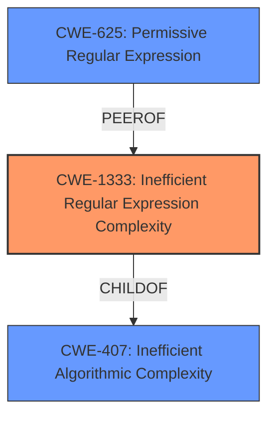

# Analysis for CVE-2021-40894

# Summary
| CWE ID | CWE Name | Confidence | CWE Abstraction Level | CWE Vulnerability Mapping Label | CWE-Vulnerability Mapping Notes |
|---|---|---|---|---|---|
| CWE-1333 | Inefficient Regular Expression Complexity | 1.0 | Base | Allowed | Primary CWE |
| CWE-625 | Permissive Regular Expression | 0.5 | Base | Allowed | Secondary Candidate |

## Evidence and Confidence

*   **Confidence Score:** 0.9
*   **Evidence Strength:** HIGH

## Relationship Analysis
The primary relationship that influenced the decision was the parent-child relationship between CWE-407 (Inefficient Algorithmic Complexity) and CWE-1333 (Inefficient Regular Expression Complexity). CWE-1333 is a more specific instance of CWE-407, focusing specifically on regular expressions. The description aligns directly with CWE-1333. CWE-625 (Permissive Regular Expression) was considered as a secondary weakness since the regular expression may be too permissive, but the primary issue is the inefficiency, not that it's too permissive.

## Vulnerability Chain
The vulnerability chain starts with the **inefficient regular expression** (CWE-1333). This leads to excessive CPU consumption when processing certain inputs, resulting in a **Denial of Service**. The initial flaw is the inefficient regular expression, and the final impact is the denial of service.

## Summary of Analysis
The initial analysis correctly identified CWE-1333 as the primary weakness. The vulnerability description explicitly states that the underscore-99xp library is vulnerable to **Regular Expression Denial of Service (ReDoS)** due to an **inefficient regular expression** used in the `deepValueSearch` function. The CVE Reference Links Content Summary also confirms this, stating: "The underscore-99xp library is vulnerable to Regular Expression Denial of Service (ReDoS) due to an **inefficient regular expression** used in the `deepValueSearch` function."

The selection of CWE-1333 is at the optimal level of specificity because it directly addresses the root cause: the inefficient regular expression. While CWE-407 (Inefficient Algorithmic Complexity) is a parent, CWE-1333 provides a more precise classification. The evidence is strong and directly supports this classification, resulting in high confidence.

Relevant CWE Information:

# Enhanced Context (25 CWEs)

## CWE-1333: Inefficient Regular Expression Complexity
**Abstraction:** Base
**Status:** Draft

### Description
The product uses a regular expression with an **inefficient**, possibly exponential worst-case computational complexity that consumes excessive CPU cycles.

### Extended Description
Some regular expression engines have a feature called "backtracking". If the token cannot match, the engine "backtracks" to a position that may result in a different token that can match.
 Backtracking becomes a **weakness** if all of these conditions are met:

  - The number of possible backtracking attempts are exponential relative to the length of the input.
  - The input can fail to match the regular expression.
  - The input can be long enough.

 Attackers can create crafted inputs that intentionally cause the regular expression to use excessive backtracking in a way that causes the CPU consumption to spike. 

### Alternative Terms
ReDoS: ReDoS is an abbreviation of "**Regular expression Denial of Service**".
**Regular Expression Denial of Service**: While this term is attack-focused, this is commonly used to describe the **weakness**.
Catastrophic backtracking: This term is used to describe the behavior of the regular expression as a negative technical impact.

### Relationships
ChildOf -> CWE-407

### Mapping Guidance
**Usage:** Allowed
**Rationale:** This CWE entry is at the Base level of abstraction, which is a preferred level of abstraction for mapping to the root causes of vulnerabilities.

## CWE-625: Permissive Regular Expression
**Abstraction:** Base
**Status:** Draft

### Description
The product uses a regular expression that does not sufficiently restrict the set of allowed values.

### Extended Description
This effectively causes the regexp to accept substrings that match the pattern, which produces a partial comparison to the target. In some cases, this can lead to other **weaknesses**. Common errors include:

  - not identifying the beginning and end of the target string
  - using wildcards instead of acceptable character ranges
  - others

### Relationships
ChildOf -> CWE-185
PeerOf -> CWE-187
PeerOf -> CWE-184
PeerOf -> CWE-183