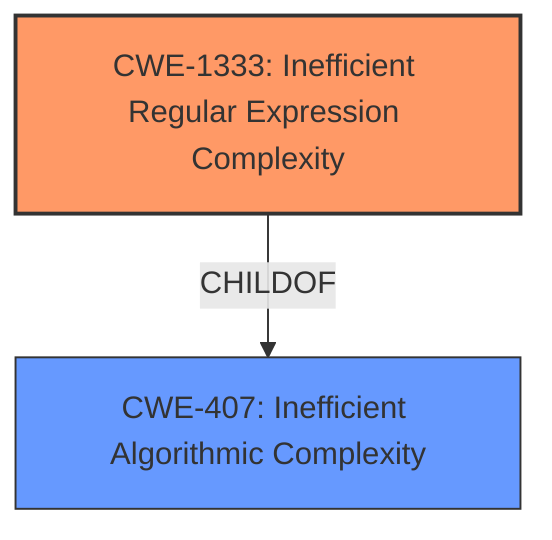

# Analysis Report for CVE-2021-40895

# Vulnerability Analysis Report: CVE-2021-40895

## Description


## Analysis (with Relationship Data)

# Summary
| CWE ID | CWE Name | Confidence | CWE Abstraction Level | CWE Vulnerability Mapping Label | CWE-Vulnerability Mapping Notes |
|---|---|---|---|---|---|
| CWE-1333 | Inefficient Regular Expression Complexity | 1.0 | Base | Allowed | Primary CWE |

## Evidence and Confidence

*   **Confidence Score:** 1.0
*   **Evidence Strength:** HIGH

## Relationship Analysis
The primary relationship influencing the decision is that CWE-1333 is a child of CWE-407, providing a more specific classification for the inefficient algorithmic complexity related to regular expressions.



## Vulnerability Chain
The vulnerability chain is relatively simple: a **poorly written regular expression** (CWE-1333) leads to excessive CPU consumption, resulting in a denial of service.

## Summary of Analysis
The analysis is based on the clear evidence provided in the vulnerability description and CVE reference summary. The vulnerability is a **Regular Expression Denial of Service (ReDoS)** due to a **poorly written regular expression**. The `todo-regex` package is vulnerable because a crafted input string can cause the regular expression matching to take an extremely long time, leading to a denial of service.

The retriever results strongly suggest CWE-1333 (Inefficient Regular Expression Complexity) as the most relevant CWE. The evidence directly supports this classification.

Relevant CWE Information:

# Enhanced Context (25 CWEs)

## CWE-1333: Inefficient Regular Expression Complexity
**Abstraction Level**: Base
**Similarity Score**: 5171.95
**Source**: sparse

**Description**:
The product uses a regular expression with an inefficient, possibly exponential worst-case computational complexity that consumes excessive CPU cycles.

**Mapping Guidance**:
- Usage: Allowed
- Rationale: This CWE entry is at the Base level of abstraction, which is a preferred level of abstraction for mapping to the root causes of vulnerabilities.

### Not Used:
*   CWE-777: Regular Expression without Anchors - While regular expression related, the description focuses on missing anchors which is not the described weakness.
*   CWE-674: Uncontrolled Recursion - While potentially related to denial of service, it is not specific to regular expression complexity.
*   CWE-625: Permissive Regular Expression - The problem isn't that the expression is too permissive, but rather that it is inefficient.
*   CWE-617: Reachable Assertion - This is not related to assertions.
*   CWE-185: Incorrect Regular Expression - Too generic of a class for the rootcause.
*   CWE-187: Partial String Comparison - This is not a string comparison issue.
*   CWE-626: Null Byte Interaction Error (Poison Null Byte) - This is not related to null byte handling.
*   CWE-407: Inefficient Algorithmic Complexity - While related, CWE-1333 is a more specific child.
*   CWE-770: Allocation of Resources Without Limits or Throttling - This is not about allocating resources without limits.


## CWE Relationship Analysis

Current CWEs represent these abstraction levels: .


### Vulnerability Chain Analysis

**Chain starting from CWE-626:**
- 626 (Null Byte Interaction Error (Poison Null Byte)) - ROOT


**Chain starting from CWE-777:**
- 777 (Regular Expression without Anchors) - ROOT


### CWE Relationship Diagram

```mermaid
graph TD
    classDef primary fill:#f96,stroke:#333,stroke-width:2px
    classDef secondary fill:#69f,stroke:#333
    classDef tertiary fill:#9e9,stroke:#333
```


*Report generated on 2025-03-30 19:00:55*
